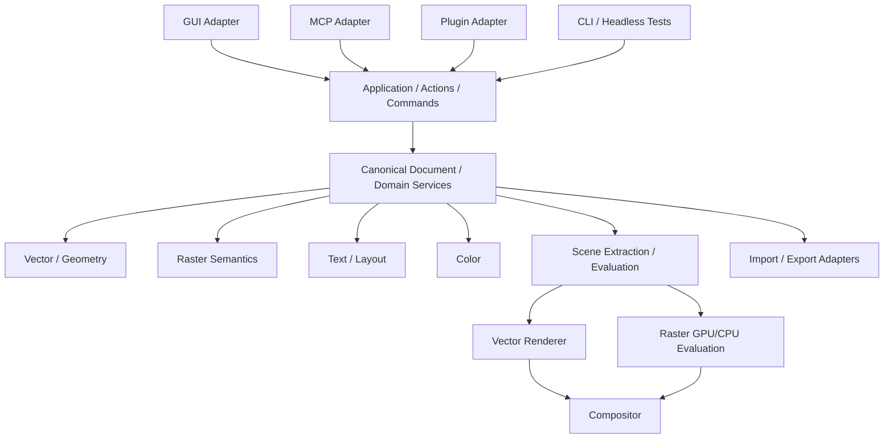

# 01 — Architecture, GUI Boundary & Canonical Document

# Regra arquitetural

O core deve compilar e ser testado **sem qualquer toolkit GUI instalado**.



The arrows describe **allowed semantic/data flow**, not crate ownership alone: adapters invoke application ports; canonical state feeds evaluation; evaluated fragments feed renderers/compositor. Importers stage validated data before committing Commands, and exporters read canonical/evaluated state without becoming document owners.

# GUI Boundary Contract

Nenhum tipo de Floem, Slint, GPUI, Qt, WebView, React, Python ou Go cruza para `aubrieta_document`, `aubrieta_geometry`, `aubrieta_color`, `aubrieta_text`, `aubrieta_raster` ou `aubrieta_commands`.

A UI recebe apenas DTOs/view models/event streams estáveis e envia `ActionRequest`/`CommandRequest`.

A fronteira deve poder ser implementada por:

- adapter Rust in-process;
- C ABI/UniFFI quando outra linguagem hospeda a shell;
- IPC local para protótipos ou shells isoladas;
- bindings WASM quando necessário.

# Documento canônico

`DocumentStore` contém dados persistentes e semanticamente relevantes. `DocumentDerivedData` contém caches reconstruíveis: bounds, footprints, outlines, hit targets, text layout cache, thumbnail state e indexes.

Estados de sessão separados: `SelectionState`, `ViewportState`, `ToolState`, `WorkspaceState` e `RenderCache`.

# Identidade

IDs estáveis e tipados: `ObjectId`, `SurfaceId`, `ResourceId`, `StyleId`, `EffectId`, `SymbolId`, `DataSourceId`.

Índice de `Vec`, pointer ou handle de framework nunca é identidade persistente.

# Mutação autoritativa

```
UI / Shortcut / MCP / Plugin
            ↓
          Action
            ↓
          Command
            ↓
      DocumentMutator
            ↓
        ChangeSet
```

Nenhum subsystem modifica storage interno diretamente.

# Surface

Uma entidade canônica `Surface` representa artboard/page/export region conforme contexto. Pode portar tamanho, posição, background, bleed, guides, margins, columns e metadata extensível.

# Não destrutividade

EffectChain/Modifier stack é ordenada, tipada e independente da UI. Operações como Live Boolean, perspective/projective transform, adjustments e filters preservam source objects. `Bake`, `Expand`, `Rasterize` e `Convert to Curves` são explícitos.

# Perspectiva

- `ProjectiveTransform` — homografia aplicável a subtree híbrida;
- `PerspectivePlane/Grid` — horizonte/vanishing points/planes;
- `Warp/Envelope` — deformação distinta de perspectiva geométrica.

# Primary GUI adapter

The canonical first implementation of `AubrietaGuiBridge` is **GPUI-first**:

```
GPUI / gpui-kit
      ↓
gpui-base
      ↓
Aubrieta Design System
      ↓
AubrietaGuiBridge
      ↓
Application / Actions / Commands
```

This does **not** weaken the GUI boundary. GPUI entities, actions, elements, component state, icon types and asset paths remain adapter concerns. Alternative shells only need to implement the same coarse-grained bridge if GPUI later proves structurally insufficient.

# Modularity is a product invariant

Aubrieta must be **composable by construction**. Tools, panels, actions, inspectors, importers, exporters, effects, data sources and optional subsystems must register through stable contribution contracts instead of direct cross-module calls. A feature may be disabled, replaced or moved without forcing unrelated modules to change.

Rules:

- no feature crate may reach into another feature crate's private storage;
- dependencies point toward small domain/service contracts, never sideways through UI objects;
- optional features contribute capabilities through registries;
- missing capability is a normal runtime state, not a panic or compile-time assumption;
- Personas/workspaces are compositions of registered capabilities, not hard-coded monoliths;
- every detachable module declares dependencies, provided capabilities, actions, panels/tools/effects it contributes, persistence keys, migration responsibility and unload/disable behavior;
- plugin contributions and built-in contributions use the same semantic registries wherever practical.

This principle is detailed in the Architecture & Implementation Atlas.