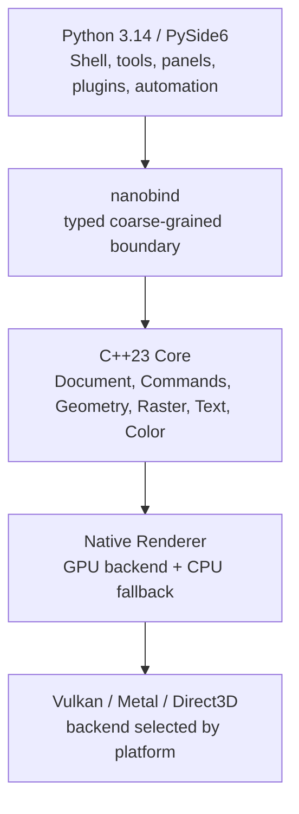

# Petunia Design Studio — Python/C++ Canonical Notebook

<aside>
🌺

**Caderno canônico Python/C++ — 2026-10-06.** Esta é uma reconstrução em paridade funcional do caderno anterior [Petunia Design Studio](https://app.notion.com/p/Petunia-Design-Studio-3db9bb7d023f811192aff85b2efa8698?pvs=21), preservando seus invariantes de produto, formato .PTND, Design + Photo, edição não destrutiva, modularidade, Actions/Commands, qualidade e automação — mas substituindo completamente a implementação Rust/Slint por **Python 3.14 + PySide6/Qt 6.12 LTS + C++23**.

</aside>

# Decisão arquitetural

**Petunia Design Studio** continua sendo um editor criativo desktop híbrido de vetor + raster + layout leve/profissional no mesmo documento. A aplicação é dividida em três níveis:

1. **Python/PySide6** — shell desktop, menus, docking, painéis, tool controllers, workspaces, preferências, automação, plugin SDK de alto nível e integração MCP;
2. **Bindings nativos** — **nanobind** como fronteira principal Python↔C++; Shiboken apenas quando um adapter Qt/C++ realmente exigir tipos Qt;
3. **C++23 core** — documento canônico, IDs, Actions/Commands, undo/redo, geometry, raster, brush engine, typography, color, render scene, compositor, jobs, serialization, import/export, preflight e performance-critical code.

# Princípios não negociáveis

- **Document is truth; renderer is projection.**
- GUI é adapter substituível. O core C++ não depende de PySide6, widgets ou estado visual.
- Python não executa loops por pixel, tessellation, composição, filtros pesados ou travessia de scene graph por frame.
- Toda operação de usuário é **Action → Command → Transaction → ChangeSet**.
- IDs estáveis são identidade; endereços, índices de vetor e ponteiros não são.
- Estado canônico, estado derivado, seleção, viewport e cache são separados.
- Raster e vetor coexistem sem conversão ao trocar Persona.
- Edição é não destrutiva por padrão; Rasterize/Expand/Bake/Convert to Curves são comandos explícitos.
- Color management é semântico: RGB, CMYK, Lab, Gray, Spot e perfis ICC não são reduzidos à cor de monitor.
- Ferramentas, painéis, importers, exporters, efeitos e data sources são contribuições registradas, removíveis e testáveis isoladamente.
- Plugins e MCP nunca contornam Commands, validação, permissões ou histórico.
- O formato **.PTND** permanece aberto, versionado, recuperável e independente da GUI.
- Implementação e documentação devem permanecer verificáveis por testes, benchmarks, fuzzing, visual regression e evidence bundles.

# Referência de interface 2026

A referência externa contemporânea é o Affinity unificado de 2025/2026: um único app combina vetor, pixel e layout, com Studios configuráveis, edição não destrutiva, export por slices e scripting. Petunia traduz essa ergonomia sem copiar branding, assets, ícones ou trade dress. A decisão de produto permanece:

- **Design Persona** = vetor + tipografia + artboards/surfaces + layout + publishing selecionado + data merge;
- **Photo Persona** = raster + pintura + seleção + máscaras + ajustes + filtros + retoque;
- Export é um **workspace/mode transversal**, não um terceiro documento;
- Layout profissional vive em Design; não há Publisher Persona separada.

# Stack baseline

| Camada | Baseline | Responsabilidade |
| --- | --- | --- |
| Runtime de aplicação | Python 3.14.x | Shell, orchestration, tools, plugins confiáveis, automação |
| GUI | PySide6 / Qt 6.12 LTS | Qt Widgets, docking, menus, dialogs, accessibility, input, multi-window |
| Core nativo | C++23 | Documento, engines, IO, render scene, jobs, performance |
| Bindings | nanobind | API Python tipada e coarse-grained; GIL release em trabalho nativo |
| Build C++ | CMake + Ninja | Targets modulares, presets, sanitizers, packaging |
| Build Python | uv + pyproject.toml | Lock, environments, packaging, tooling |
| Qualidade Python | Pyright strict + Ruff + pytest | Tipagem, lint, testes, contracts |
| Qualidade C++ | Clang/GCC + clang-tidy + ASan/UBSan/TSan | Safety, warnings-as-errors, lifetime e race evidence |
| Rendering | backend abstraction C++ | GPU-first, CPU fallback, renderer independente de Qt |
| Color | LittleCMS/OpenColorIO adapters | ICC, proofing, conversions e oracle differential tests |
| Text | HarfBuzz + FreeType/Qt font discovery adapter | shaping, OpenType, fallback, metrics e layout |
| Images | libvips/libjpeg-turbo/libpng/libtiff adapters | decode/encode e imagens grandes sem contaminar o modelo canônico |

# Organização deste caderno

O caderno replica a cobertura do anterior e adiciona autoridade específica para Python/C++, bindings, GIL, ownership, ABI, plugin isolation e GUI Qt:

- 00 — Product Charter & Scope
- 01 — Architecture, Core/UI Boundary & Canonical Document
- 02 — Design Persona
- 03 — Photo Persona
- 04 — Canonical Python/C++ Stack & Engine Boundaries
- 05 — PySide6/Qt GUI Architecture & Desktop Integration
- 06 — Reference Projects & Adopt/Adapt/Avoid
- 07 — Quality, Plugins, MCP & AI Development
- 08 — Interface Atlas & Petunia Design System
- 09 — Architecture & Implementation Atlas
- 10 — Functional Tool & Engine Atlas
- 11 — Naming, Brand & Identity
- 12 — Code Agent Handbook & Living Documentation
- 13 — Conformance Ledger
- 14 — Evidence, Performance, Security & AgentOps
- 15 — Python/C++ Migration & Total Assurance Program
- 16 — Prumo Workforce: Required Agents, Skills & Recipes
- 17 — Implementation Blueprint & Executable Goals
- 18 — Individual Tool Specifications
- 19 — Individual Panel Specifications
- 20 — Print & Prepress
- 21 — Effects & Adjustments Specifications
- 22 — Presets, Libraries & Reusable Resources
- 23 — Numeric Performance Budgets & SLOs
- 24 — Plugin/MCP Wire Schemas
- 25 — Import/Export Capability Matrices
- 26 — Default Shortcuts, Input Profiles & Modifiers
- 27 — Platform Support, GPU/Driver Matrix & Deployment
- 28 — Advanced Features, Deferred Scope & Research Roadmap

# Definition of parity

“Paridade total” significa preservar **capacidade e contrato**, não copiar a antiga tecnologia:

- cada feature do caderno anterior deve mapear para **preservada**, **substituída**, **expandida**, **deferred** ou **removida com ADR**;
- nenhum item Rust/Slint pode permanecer como dependência acidental;
- Surface, .PTND, Actions/Commands, DocumentDerivedData, Plugin/MCP parity, export preflight, recovery e evidence gates permanecem;
- pages de interface e tools devem especificar comportamento visível, entrada, modificadores, contexto, HUD, painel, Command, undo, serialização, performance, acessibilidade, erros e testes.

# Regra de implementação

Uma feature só é “implementada” quando:

1. o contrato está documentado;
2. a boundary Python/C++ está definida;
3. o código respeita dependency direction;
4. testes de unidade/integrados existem;
5. UI e atalhos exercitam o mesmo Action/Command;
6. MCP/plugin usam o mesmo semantic path quando aplicável;
7. performance budgets foram medidos onde há hot path;
8. save/load/migration preservam o estado;
9. accessibility e visual evidence foram verificadas;
10. documentação é atualizada na mesma mudança.

# Fontes

- [Affinity atual](https://www.affinity.studio/)
- [Qt 6.12](https://www.qt.io/blog/qt-6.12-released)
- [Qt for Python](https://doc.qt.io/qtforpython-6/)
- [Prumo workforce](https://github.com/poppy-team/prumo/tree/main/src/prumo/resources/workforce)

[00 — Product Charter & Scope](00%20%E2%80%94%20Product%20Charter%20&%20Scope%203f19bb7d023f81aba941d2b4c43433e1.md)

[01 — Architecture, Core/UI Boundary & Canonical Document](01%20%E2%80%94%20Architecture,%20Core%20UI%20Boundary%20&%20Canonical%20Do%203f19bb7d023f81948a32fb6761a11621.md)

[02 — Design Persona: Vector, Layout & Variable Data](02%20%E2%80%94%20Design%20Persona%20Vector,%20Layout%20&%20Variable%20Data%203f19bb7d023f81998cd7cd356d6ed96a.md)

[03 — Photo Persona: Raster, Masks & Nondestructive Imaging](03%20%E2%80%94%20Photo%20Persona%20Raster,%20Masks%20&%20Nondestructive%20%203f19bb7d023f81bc872cd3899a90c530.md)

[04 — Canonical Python/C++ Stack & Engine Boundaries](04%20%E2%80%94%20Canonical%20Python%20C++%20Stack%20&%20Engine%20Boundarie%203f19bb7d023f81bd8deaeff723911cd8.md)

[05 — PySide6/Qt GUI Architecture & Desktop Integration](05%20%E2%80%94%20PySide6%20Qt%20GUI%20Architecture%20&%20Desktop%20Integra%203f19bb7d023f81b4bcacc1a58d63c988.md)

[06 — Reference Projects: Adopt / Adapt / Avoid](06%20%E2%80%94%20Reference%20Projects%20Adopt%20Adapt%20Avoid%203f19bb7d023f81ebaddbe54fe29d8860.md)

[07 — Quality, Plugins, MCP & AI Development](07%20%E2%80%94%20Quality,%20Plugins,%20MCP%20&%20AI%20Development%203f19bb7d023f818c9fead6a270d4ba6d.md)

[08 — Interface Atlas & Petunia Design System](08%20%E2%80%94%20Interface%20Atlas%20&%20Petunia%20Design%20System%203f19bb7d023f81a6b6cbde5c00a3b767.md)

[09 — Architecture & Implementation Atlas](09%20%E2%80%94%20Architecture%20&%20Implementation%20Atlas%203f19bb7d023f81bba03ee680c5075eaf.md)

[10 — Functional Tool & Engine Atlas](10%20%E2%80%94%20Functional%20Tool%20&%20Engine%20Atlas%203f19bb7d023f81ce8196f76b661e1f01.md)

[11 — Naming, Brand & Identity Contract](11%20%E2%80%94%20Naming,%20Brand%20&%20Identity%20Contract%203f19bb7d023f81129924ee4d281e98c9.md)

[12 — Code Agent Implementation Handbook & Living Documentation](12%20%E2%80%94%20Code%20Agent%20Implementation%20Handbook%20&%20Living%20D%203f19bb7d023f81c78d07fc03cc2f2882.md)

[13 — Full Notebook Audit & Parity Ledger](13%20%E2%80%94%20Full%20Notebook%20Audit%20&%20Parity%20Ledger%203f19bb7d023f8196acf9d2840cf0b1bd.md)

[14 — Implementation Evidence, Performance, Security & AgentOps](14%20%E2%80%94%20Implementation%20Evidence,%20Performance,%20Securit%203f19bb7d023f811195a8e3e05183928f.md)

[15 — Python/C++ Migration & Total Assurance Program](15%20%E2%80%94%20Python%20C++%20Migration%20&%20Total%20Assurance%20Progra%203f19bb7d023f81b8b041d37813d78e23.md)

[16 — Prumo Workforce: Required Agents, Skills & Recipes](16%20%E2%80%94%20Prumo%20Workforce%20Required%20Agents,%20Skills%20&%20Rec%203f19bb7d023f817b9a80c807668635c7.md)

[17 — Implementation Blueprint: Repository, Targets, Ownership, Milestones & First Execution Plan](17%20%E2%80%94%20Implementation%20Blueprint%20Repository,%20Targets,%203f19bb7d023f8135b95df93ca2644db9.md)

[18 — Individual Tool Specifications](18%20%E2%80%94%20Individual%20Tool%20Specifications%203f19bb7d023f81349292cd14c79c380e.md)

[19 — Individual Panel & Window Specifications](19%20%E2%80%94%20Individual%20Panel%20&%20Window%20Specifications%203f19bb7d023f81bfaebbdb1b293ae163.md)

[20 — Print, Prepress & Professional Output](20%20%E2%80%94%20Print,%20Prepress%20&%20Professional%20Output%203f19bb7d023f818cbac5ce2270500f34.md)

[21 — Effects, Adjustments & Filter Specifications](21%20%E2%80%94%20Effects,%20Adjustments%20&%20Filter%20Specifications%203f19bb7d023f810cbe16c1c90ae7afee.md)

[22 — Presets, Libraries, Shared Resources & User Content](22%20%E2%80%94%20Presets,%20Libraries,%20Shared%20Resources%20&%20User%20C%203f19bb7d023f81c391b6e97383c593a9.md)

[18 — Individual Tool Specifications: State Machines, Commands, GUI & Tests](18%20%E2%80%94%20Individual%20Tool%20Specifications%20State%20Machines%203f19bb7d023f81eea34df6e166e8a02a.md)

[19 — Individual Panel Specifications: Models, Commands, Keyboard, Scale & Accessibility](19%20%E2%80%94%20Individual%20Panel%20Specifications%20Models,%20Comma%203f19bb7d023f81ceb931d589420f37b5.md)

[20 — Print, Prepress, PDF/X, Separations, Overprint & Professional Output](20%20%E2%80%94%20Print,%20Prepress,%20PDF%20X,%20Separations,%20Overprin%203f19bb7d023f810db738de56cfa09572.md)

[21 — Effects & Adjustments Specifications: Parameter Schemas, Math, ROI, CPU/GPU & Fidelity](21%20%E2%80%94%20Effects%20&%20Adjustments%20Specifications%20Paramete%203f19bb7d023f81bba653eed408b04bd0.md)

[22 — Presets, Libraries & Reusable Resources Architecture](22%20%E2%80%94%20Presets,%20Libraries%20&%20Reusable%20Resources%20Archi%203f19bb7d023f81ea9568fbde4e76a0d3.md)

[23 — Numeric Performance Budgets, Hardware Tiers & Release SLOs](23%20%E2%80%94%20Numeric%20Performance%20Budgets,%20Hardware%20Tiers%20&%203f19bb7d023f81718910e87cf4699f8d.md)

[24 — Plugin/MCP Wire Schemas, Versioned Protocols & Generated Contracts](24%20%E2%80%94%20Plugin%20MCP%20Wire%20Schemas,%20Versioned%20Protocols%20%203f19bb7d023f81c29960f330cbb4a1fa.md)

[25 — Import/Export Capability Matrices, Fidelity Grades & Format Roadmap](25%20%E2%80%94%20Import%20Export%20Capability%20Matrices,%20Fidelity%20G%203f19bb7d023f81f0b1d9db03cb8e1572.md)

[26 — Default Shortcuts, Input Profiles, Modifiers & Accessibility Alternatives](26%20%E2%80%94%20Default%20Shortcuts,%20Input%20Profiles,%20Modifiers%20%203f19bb7d023f81f1a090d3d5970e0304.md)

[27 — Platform Support, OS Integration, GPU/Driver Matrix & Deployment Contract](27%20%E2%80%94%20Platform%20Support,%20OS%20Integration,%20GPU%20Driver%20%203f19bb7d023f816e8058efe41d84bee2.md)

[28 — Advanced Features, Deferred Scope, Research Backlog & Affinity-Class Roadmap](28%20%E2%80%94%20Advanced%20Features,%20Deferred%20Scope,%20Research%20B%203f19bb7d023f811a93d7c1333273f019.md)

[29 — Canonical Object & Data Schema Catalog](29%20%E2%80%94%20Canonical%20Object%20&%20Data%20Schema%20Catalog%203f19bb7d023f81bda87ddee44904b264.md)

[30 — Action, Property, Capability & Semantic ID Registry Catalog](30%20%E2%80%94%20Action,%20Property,%20Capability%20&%20Semantic%20ID%20Re%203f19bb7d023f81369ad4d6952ae1d9fe.md)

[31 — Data Merge Expression Language: Grammar, Types, Functions, Safety & Evaluation](31%20%E2%80%94%20Data%20Merge%20Expression%20Language%20Grammar,%20Types%203f19bb7d023f8164838afbc8db197378.md)

[32 — UI Component Design System Catalog & State Specifications](32%20%E2%80%94%20UI%20Component%20Design%20System%20Catalog%20&%20State%20Sp%203f19bb7d023f81bf907af4add16d7825.md)

[33 — Error Codes, Diagnostics, User Recovery & Support Taxonomy](33%20%E2%80%94%20Error%20Codes,%20Diagnostics,%20User%20Recovery%20&%20Sup%203f19bb7d023f8119bbe9d87b5b00b9d1.md)

[18 — Individual Tool Specifications](18%20%E2%80%94%20Individual%20Tool%20Specifications%203f19bb7d023f817fbf5edd03509a074a.md)

[19 — Individual Panel & Dialog Specifications](19%20%E2%80%94%20Individual%20Panel%20&%20Dialog%20Specifications%203f19bb7d023f8187a07aeef250bcafe2.md)

[20 — Print, Prepress, Separations & Professional PDF Output](20%20%E2%80%94%20Print,%20Prepress,%20Separations%20&%20Professional%20P%203f19bb7d023f811bacdec227be07b800.md)

[21 — History, Undo/Redo, Transactions, Snapshots & Recovery Semantics](21%20%E2%80%94%20History,%20Undo%20Redo,%20Transactions,%20Snapshots%20&%203f19bb7d023f8106934cc99ccb6dd453.md)

[22 — Presets, Libraries, User Resources & Shared Asset Architecture](22%20%E2%80%94%20Presets,%20Libraries,%20User%20Resources%20&%20Shared%20A%203f19bb7d023f81269b08ff41addb312f.md)

[23 — Effect, Adjustment & Generator Parameter Specifications](23%20%E2%80%94%20Effect,%20Adjustment%20&%20Generator%20Parameter%20Spec%203f19bb7d023f81328823f03b69277e22.md)

[24 — Import/Export Capability Matrices & Interchange Fidelity](24%20%E2%80%94%20Import%20Export%20Capability%20Matrices%20&%20Interchan%203f19bb7d023f812ab4d3ce6bce58d577.md)

[25 — Performance Budgets, Reference Hardware & Responsiveness SLOs](25%20%E2%80%94%20Performance%20Budgets,%20Reference%20Hardware%20&%20Res%203f19bb7d023f81df8641fe7807345ff8.md)

# Extended normative specification chapters

The implementation-depth expansion adds:

- **18 — Individual Tool Specifications**
- **19 — Individual Panel & Dialog Specifications**
- **20 — Print, Prepress, Separations & Professional PDF Output**
- **21 — History, Undo/Redo, Transactions, Snapshots & Recovery**
- **22 — Presets, Libraries & User Resources**
- **23 — Effect, Adjustment & Generator Parameter Specifications**
- **24 — Import/Export Capability Matrices & Interchange Fidelity**
- **25 — Performance Budgets, Reference Hardware & Responsiveness SLOs**

See 13.6–13.7 for the depth audit and the small set of decisions intentionally left open for benchmark/ADR.