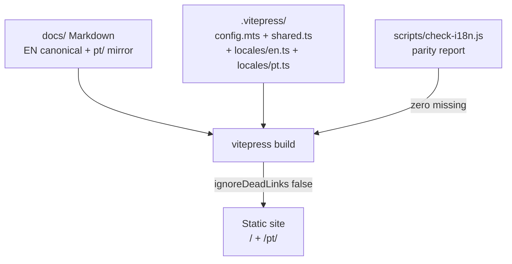

# SPEC-001: Living documentation pipeline

- **ID:** SPEC-001
- **Status:** Accepted
- **Scope:** V1 Required
- **Owner:** Documentation architect
- **Verifies:** Constitution §VI (docs change with contracts, zero drift)

## 1. Purpose

This specification makes the living-documentation pipeline build-enforced: the VitePress site, the i18n parity checker and the dead-link gate together guarantee that public docs cannot silently rot.

## 2. Requirements

| ID | Requirement | Verification |
| -- | ----------- | ------------ |
| SPEC-001-R1 | Site generates with VitePress + Mermaid from `docs/` | `cd docs && npm run build` green |
| SPEC-001-R2 | English at `/` is canonical; pt-BR mirrors 1:1 under `/pt/` | `node scripts/check-i18n.js` reports zero missing |
| SPEC-001-R3 | New languages register via one `locales/<lang>.ts` + `config.mts` entry + mirrored tree | [Translations guide](/contributing/translations) 3-step procedure |
| SPEC-001-R4 | Zero broken links in any locale fail the build | `cleanUrls: true`, `ignoreDeadLinks: false`, build green |
| SPEC-001-R5 | Frontmatter technical keys, Mermaid node IDs/logic, code commands are preserved across translations | Human review checklist in Translations guide |
| SPEC-001-R6 | Legacy notebook pages at `docs/` root are excluded from routing and link checking | `srcExclude` in `shared.ts`; build unaffected by them |

## 3. Architecture

## 4. Acceptance criteria

1. `node scripts/check-i18n.js` exits 0 with every canonical page mirrored in `docs/pt/` (also enforced by `cargo xtask docs`).
2. `cd docs && npm run build` exits 0 — no dead links in EN or PT (also enforced by `cargo xtask docs` when docs dependencies are installed).
3. Removing any `docs/pt/**` page makes the checker fail; breaking any intra-site link makes the build fail.
4. Adding a language per the Translations guide requires no changes to existing locale files.

## 5. History

| Date | Change |
| ---- | ------ |
| 2026-09-25 | Accepted. Initial bilingual launch (EN + pt-BR), 16 pages per locale. |
