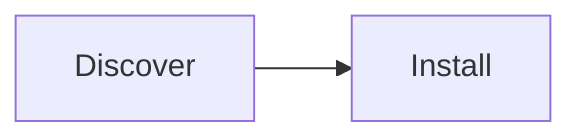

# Translating the docs into a new language

Official 3-step guide. Adding Spanish, French or any language follows the exact pattern English → Portuguese used at launch.

## Step 1 — Duplicate the tree

```bash
# From the repo root. Replace <lang> with the VitePress locale code (es, fr, …)
mkdir -p docs/<lang>
# Mirror every canonical file 1:1, preserving relative paths:
#   docs/index.md                    -> docs/<lang>/index.md
#   docs/tools/index.md              -> docs/<lang>/tools/index.md
#   docs/developers/adr/ADR-001-*.md -> docs/<lang>/developers/adr/ADR-001-*.md
cp docs/index.md docs/<lang>/index.md
```

Parity is strict: for each English file at the root there must be a replica under `<lang>/`. The checker enforces it:

```bash
# Reports missing/untranslated pages for every configured locale
node scripts/check-i18n.js
```

## Step 2 — Register the locale

1. Copy `docs/.vitepress/locales/pt.ts` to `docs/.vitepress/locales/<lang>.ts`.
2. Translate `nav`, `sidebar`, footer, search and UI labels (keep `editLink.pattern` pointing at `docs/:path`).
3. Import and register it in `docs/.vitepress/config.mts`:

```ts
// Only this hunk changes when a language is added:
import { esConfig } from './locales/es'

export default withMermaid(
  defineConfig({
    ...shared,
    locales: {
      root: enConfig,
      pt: ptConfig,
      es: esConfig, // <-- new language
    },
  }),
)
```

The top-bar language switcher then keys the current page to its translated equivalent automatically.

## Step 3 — Translate with technical preservation

1. **Frontmatter keys stay** — `layout: home`, `theme: brand` and other technical values never change; only titles, text and descriptions are translated.
2. **Mermaid: translate labels, keep IDs and logic** — node ids (`A`, `B`, `DOC`) and edges stay identical; only the visible text changes:



becomes labels in the target language with the same `A --> B` structure.

3. **Contextual relative links** — English links point at canonical paths (`[Quickstart](/getting-started/quickstart)`); translated pages point at their locale prefix (`[Quickstart](/es/getting-started/quickstart)`).
4. **Code snippets stay consistent** — terminal commands and code blocks are identical across languages; only explanatory comments are translated.
5. **Product names and IDs never translate** — Petunia Design Studio, `.ptnd`, `ObjectId`, `ChangeSet`, `Gauntlet`, action ids.

## Verification

```bash
# 1. Parity report must show zero missing pages
node scripts/check-i18n.js

# 2. Full build must pass with zero broken links in ALL locales
cd docs && npm run build
```

`ignoreDeadLinks: false` is intentional: a broken link in any language fails the build.
