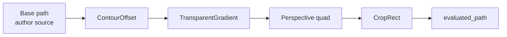

# ADR-001: Non-destructive editing via typed ordered EffectChain

- **Status:** Accepted
- **Date:** 2026-09-22
- **Scope:** V1 Required
- **Affects:** `petunia_design_document`, `petunia_design_geometry`, all canvas tools, render/export/hit-test

## Context

Petunia edits vector artwork that must survive print preflight, boolean synthesis, text-on-path and homography warps. Editing base paths in place destroys the author's source on every drag: corners cannot be re-radiused, offsets cannot be re-tuned, transparency vectors cannot be re-aimed. Affinity, Photoshop and CorelDRAW all converge on live, reorderable, freezable adjustments — Petunia needs the same foundation with Rust-level explicitness.

## Decision

Every `DocumentObject` carries a typed ordered `ModifierKind` chain evaluated over immutable base geometry:

- **Identity** — each modifier has a stable id; **order = vec order**; evaluation cost is linear.
- **Base vs. evaluated** — tools edit `to_path()`; render, hit-test, selection, booleans and export read `evaluated_path()`.
- **Serde default** — v1 files open without migration; the chain defaults to empty.
- **Bake is explicit** — `bake_contour`, `bake_transparency`, `BakeGeometry` freeze modifiers into the base; there is no silent bake, ever.

## Consequences

- Tools (Corner, Contour, Transparency, Perspective, Crop) ship live previews with one-undo commits.
- Export stays honest: where mask infrastructure is absent, the exporter samples the documented scalar (`sampled_opacity`) and logs the degradation.
- UI owes a chain list (enable/disable/remove/reorder) — accepted as known debt with `SetModifiers` API already in place.
- Envelope-mesh warps reuse `warp_path` + `Homography` later without model churn.

## Alternatives rejected

- **In-place path mutation** — loses source; rejected (destructive by default).
- **Per-effect parallel stacks** — order ambiguity across domains; rejected (single ordered vec).
- **Implicit auto-bake on save** — violates explicit-bake doctrine; rejected.
