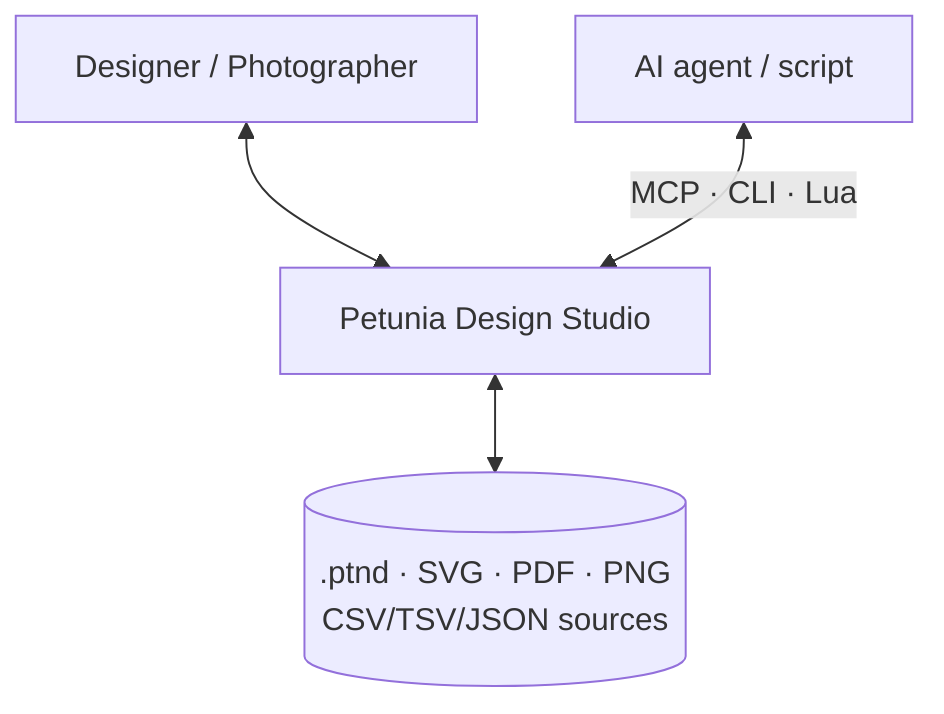
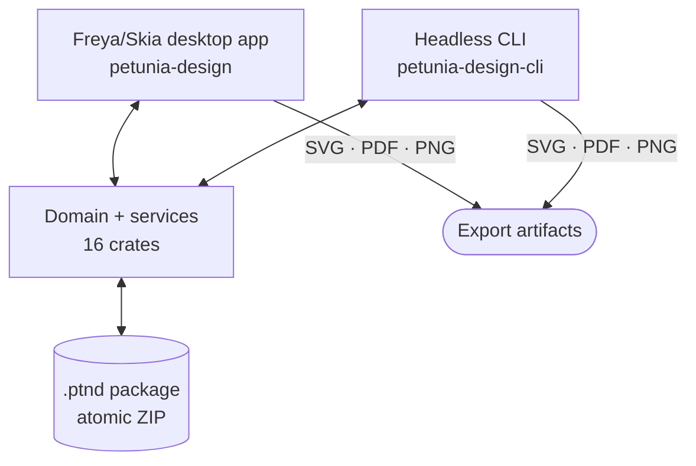

# Architecture

C4-style view of Petunia Design Studio: contexts, containers, components and the code-level mutation path.

Current persistence and publication contract: [ADR-002](/developers/adr/ADR-002-local-path-and-integrity), with [generated source/test reference](/implementation/contracts.json). The [execution ledger](/developers/implementation-progress) distinguishes implemented corrections from pending milestones.

Shared rendering/presentation: [ADR-006](/developers/adr/ADR-006-shaped-text-and-canvas-preview) connects shaped glyph outlines and immutable source-keyed workers to the canvas. See ADR-010 for the current text/analysis/color/export contract and its bounded verification scope.

## Level 1 — System context



Humans drive the Freya/Skia shell; agents and scripts drive the identical capability surface through MCP, CLI and Lua — no parallel privileged API.

## Level 2 — Containers



## Level 3 — Components (the bridge boundary)


Rules:

- **Single mutation lane** — `DocumentSession` owns a private `document`/`history`; the GUI never holds a mutable handle.
- **DTOs cross the bridge** — view-models and `TransformPreview` are toolkit-neutral; overlay pixels never leak domain types.
- **Capability registries** — tools, panels, effects, importers and data sources compose through registries; a missing capability is a normal disabled state with a reason, never a panic.

## Level 4 — Code path of one gesture

```ts
// Identical in every language binding; terminal commands stay the same,
// only comments are translated (see Translations guide).
PointerDown  // hit-test, capture revision, preview only
PointerMove  // update TransformPreview DTO (no history write)
PointerUp    // transact: Action -> Command -> DocumentMutator -> ChangeSet
Undo         // History rolls back the single ChangeSet (one gesture = one undo)
```

## Key invariants

1. Domain crates never import GUI toolkit types (CI-enforced).
2. Typed stable IDs only (`ObjectId`, `SurfaceId`, `ResourceId`…) — never Vec indices or pointers.
3. Base vs. evaluated: tools edit base paths; render/hit/selection read `evaluated_path()` (EffectChain applied).
4. No fake UI: undeclared behavior is implemented, disabled-with-reason, hidden, or marked experimental.

Decisions behind this shape: [ADR index](/developers/adr/) · [ADR-001](/developers/adr/ADR-001-effect-chain).

## 2026-10-03 contract update

[ADR-010](/developers/adr/ADR-010-text-histogram-icc-and-pdf) governs draft text, composition histograms, immutable ICC resources (schema 5), guarded profile assignment and faithful subset PDF. Professional print and hardware acceptance remain open.

[ADR-011](/developers/adr/ADR-011-native-cmyk-raster) extends color/raster persistence to schema 6/index 3 and native five-lane ink storage. Disposable ICC display tiles stay outside canonical documents. Native layer TIFF and ICC CMYK PDF preserve original samples; direct native page proof remains disabled.
