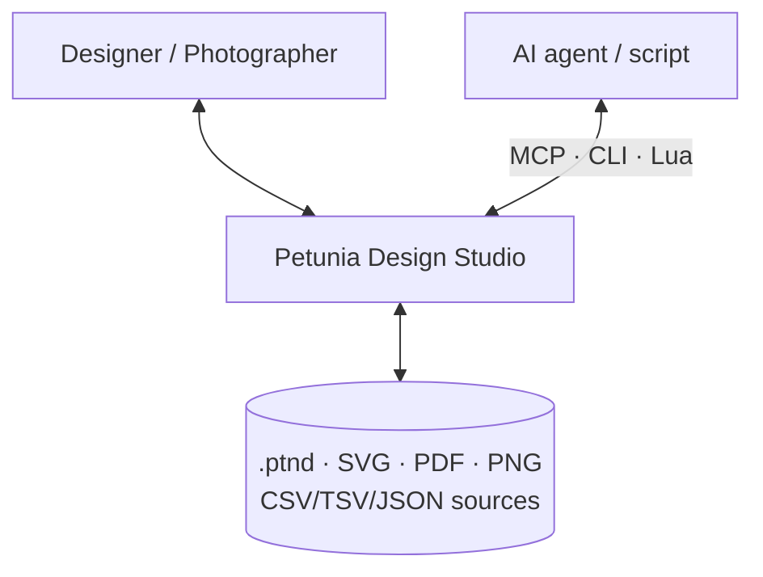
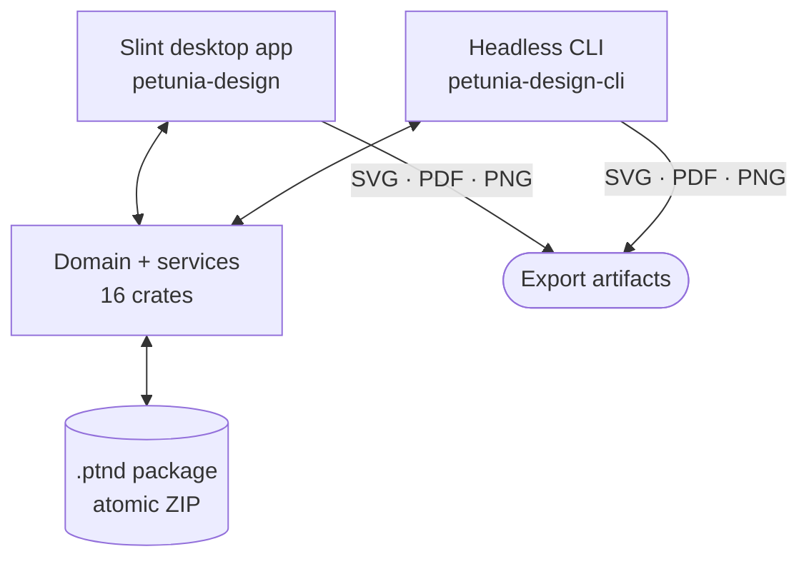
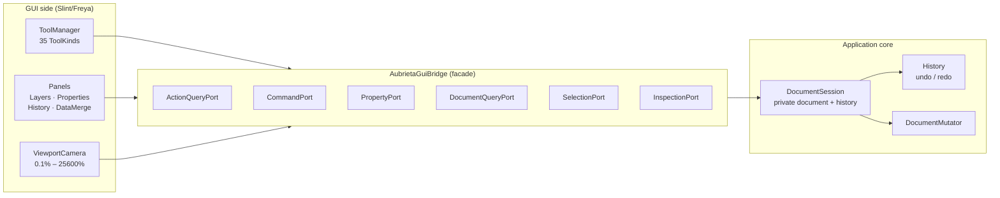

# Architecture

C4-style view of Petunia Design Studio: contexts, containers, components and the code-level mutation path.

## Level 1 — System context



Humans drive the Slint shell; agents and scripts drive the identical capability surface through MCP, CLI and Lua — no parallel privileged API.

## Level 2 — Containers



## Level 3 — Components (the bridge boundary)



Rules:

- **Single mutation lane** — `DocumentSession` owns a private `document`/`history`; the GUI never holds a mutable handle.
- **DTOs cross the bridge** — view-models and `TransformPreview` are toolkit-neutral; overlay pixels never leak domain types.
- **Capability registries** — tools, panels, effects, importers and data sources compose through registries; a missing capability is a normal disabled state with a reason, never a panic.

## Level 4 — Code path of one gesture

```ts
// Identical in every language binding; terminal commands stay the same,
// only comments are translated (see Translations guide).
PointerDown  // hit-test, capture revision, preview only
PointerMove  // update TransformPreview DTO (no history write)
PointerUp    // transact: Action -> Command -> DocumentMutator -> ChangeSet
Undo         // History rolls back the single ChangeSet (one gesture = one undo)
```

## Key invariants

1. Domain crates never import GUI toolkit types (CI-enforced).
2. Typed stable IDs only (`ObjectId`, `SurfaceId`, `ResourceId`…) — never Vec indices or pointers.
3. Base vs. evaluated: tools edit base paths; render/hit/selection read `evaluated_path()` (EffectChain applied).
4. No fake UI: undeclared behavior is implemented, disabled-with-reason, hidden, or marked experimental.

Decisions behind this shape: [ADR index](/developers/adr/) · [ADR-001](/developers/adr/ADR-001-effect-chain).
