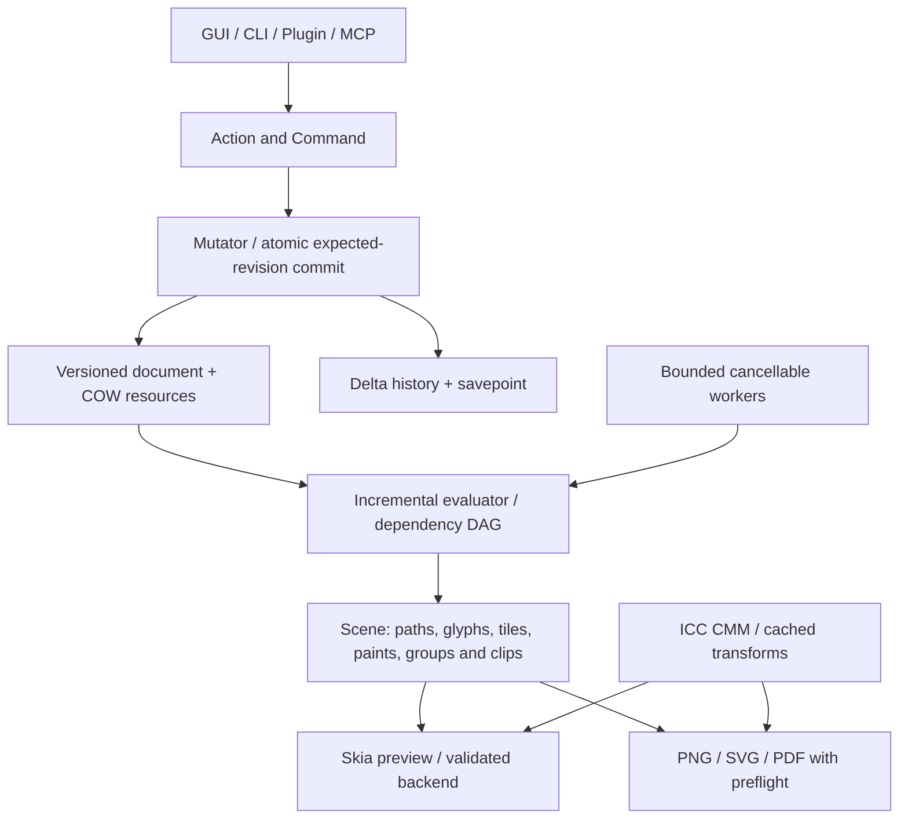

# Independent technical dossier — 2026-09-30

The audit started on September 30 and documentation completed on October 1, 2026; the identifier date fixes the examined baseline.

Petunia has a reusable modular Rust foundation, but **the audited baseline is not yet a functional vector/bitmap editor or a production-print V1**. The main gap is correctness and integration: canvas, exports and tools interpret the document differently. Paths disappear, pixels are incorrect, raster operations are disconnected and CMYK lacks actual ICC management.

This dossier supplements and challenges `DOSSIER_V1_2026-09-30.md`, `ESTADO_ATUAL.md`, `PERF_REPORT_2026-09-23.md`, atlases and ADRs. It audits a baseline; it does not announce completed features or change active contracts. The [implementation roadmap](./implementation-roadmap-2026-09-30) turns findings into MVP, V1 and future deliveries. True CMYK and professional PDF are explicitly V1 requirements following the user’s request.

## Scope, method and limits

- Repository `raillen/petunia-design-studio`, commit `73447647a34f5b4be209415c36e6965c5f71b9b9`, requested from main; platform checkout branch work. Pre-documentation inventory: **679 tracked files; 169 Rust files, 75,572 lines including tests; 318 Markdown files, 40,390 lines**. There are 152 Markdown files under docs, 129 in the exported petunia-design-studio directory, plus root files, agent instructions, artifacts and history. node_modules, target and dependency source are excluded.
- Whole-tree inventory and scanning; cross-cutting symbol, dependency, contract, comment, status and usage analysis; close reading of critical subsystem paths; compilation, lint, tests, external probes and PDF inspection. The table covers all 20 members; the [SHA-256 inventory](/audit/2026-09-30/inventory.json) fixes scope.
- This is not a formal line-by-line review of 75,000 lines or complete semantic reading of all 318 Markdown files. It does not establish absence of other defects, every tool combination or manual testing of every screen. Repeated/historical documentation was cataloged and compared on relevant contracts, not accepted as authority simply because it exists.
- **Reproduced:** a probe demonstrates baseline behavior. **STATIC:** a code-read flow still needs focused acceptance testing. **NOT VALIDATED:** hardware/integration or UX was not exercised. P0 blocks the indicated release through loss, invisibility, core-function failure or an incorrect professional promise; P1 addresses material risk; P2 organizes debt/evolution. A V1 priority does not imply inclusion in MVP.
- The environment is headless Linux, four CPU quota and 32 GiB RAM, Rust 1.98.1. Freya/Skia compiled; GUI smoke tests use a test adapter. Real Wayland/X11 sessions, GPU, tablet, IME, physical printing, RIP and calibrated monitors were not validated.
- Research consulted public Graphics Gems, One Euro Filter and LittleCMS source/documentation through Git. Network policy blocked several paper/specification and product-documentation sites. Additional bibliography is marked for consultation; no claim is made to have read blocked full texts or know proprietary Affinity/Adobe/Figma/Procreate internals.

## Baseline verification

| Check | Result | Interpretation |
| --- | --- | --- |
| cargo check --locked --workspace | Passed, including desktop | Compiles; does not establish fidelity |
| cargo fmt --all --check | Passed | Formatting |
| xtask architecture | Passed | Current domain/GUI boundary gate |
| xtask conformance | Passed | Save/reopen, undo/redo, export and automation exercised; probes expose additional gaps |
| Headless workspace tests, desktop excluded, --no-fail-fast | 555 passed; 1 failed; 0 ignored | compositor_performance_with_many_objects_and_masks fails its debug 50 ms limit |
| Desktop binary + click_smoke | 45 passed (32 + 13) | Freya harness behavior, not manual Linux validation |
| Same timing test, isolated release | Passed | Build/hardware sensitivity; does not repair the test or prove 60 fps |
| xtask verify / strict Clippy | Failed | Rust 1.98.1 reports chunks_exact_to_as_chunks and large_enum_variant |
| Full Clippy without -D warnings | Completed with 10 unique warning locations | 9 chunks_exact_to_as_chunks and 1 large_enum_variant; lib/test duplicates are not additional findings |
| Prior documentation build and i18n parity | Passed; 18 canonical pages mirrored | Symmetric trees and links/build, not semantic translation equivalence |
| Audit probes | 17 reproduced behavioral defects/gaps plus confirmed PDF dimensions | Assertions capture current bad behavior; after fixes convert them into correct-behavior regression tests |

The 600 passing tests sum the two distinct suites; the release test and probes are additional checks, not additions to that total. No repository warning or assertion was disabled to obtain a green result.

## Subsystem coverage

File/line counts include unit/integration tests. This table describes inspection and contract tracing, not executed code-coverage percentages.

| Member | Rust | Lines | Analyzed paths | Related findings |
| --- | ---: | ---: | --- | --- |
| foundation | 6 | 732 | IDs, namespaces, finiteness and diagnostics | F17, F22 |
| geometry | 12 | 3,122 | affine, Kurbo, booleans, cuts, offset, smooth, warp, measure | F18–F21 |
| color | 6 | 704 | values, display, intent, proofing, differential references | F16, F17, F36 |
| document | 13 | 8,028 | schema, hierarchy, mutator, changesets, appearance, modifiers, adjustments, data | F01, F04, F22–F24, F37 |
| application | 24 | 10,923 | session, commands/actions, tools, caches, services, masks, merge | F02, F03, F14, F23–F27 |
| evaluation | 1 | 137 | summary and fingerprint | F26 |
| raster | 4 | 555 | pixels, tiles, alpha and brush | F08–F10, F28 |
| render | 7 | 2,037 | blend, scene, composition, planner, CPU compositor | F05, F10, F11 |
| text | 7 | 1,640 | fonts, layout, story, on-path | F07 |
| io | 7 | 2,184 | package, image IO, PDF, SVG | F11–F15, F27, F37 |
| jobs | 4 | 264 | cancellation and lifecycle | F29 |
| resources | 6 | 2,028 | packs, tokens, i18n and aliases | F17, F33, F34 |
| platform | 6 | 434 | clipboard, dialogs, environment and errors | F32 |
| extension | 5 | 716 | manifest, broker, Lua host | F30 |
| mcp | 4 | 889 | protocol and internal server | F31 |
| shell | 43 | 24,166 | bridge, snapshot, tools, panels, menus, overlays and snapping | F01–F08, F25, F32, F33 |
| testkit | 2 | 363 | fixtures and benchmark | F35 |
| petunia-design | 10 | 15,829 | Freya, painting, docking, dialogs, actions, theme, smoke | F04, F06, F07, F29, F32, F33 |
| petunia-design-cli | 1 | 398 | conformance and headless integration | F35, F36 |
| xtask | 1 | 423 | verify, architecture, conformance, gates and CI | F35 |

## What to preserve and how to reorganize

GUI-free domain boundaries, stable IDs, Action→Command→Mutator→ChangeSet, live modifiers, Kurbo/i_overlay, Arc sharing, R-trees and headless testing are good foundations. Evidence does not justify replacing Freya, rewriting booleans from scratch or building a custom GPU renderer before fixing contracts and fidelity.

The recommended architecture uses a versioned canonical document, hash-addressed binary resources, ID indexes and incrementally evaluated scenes. Scenes carry local geometry + world matrices, typed paints, glyph runs, images/tiles, group/mask trees and visual bounds. Preview and export share evaluation; backends declare what they preserve, explicitly rasterize or cannot support. GPU acceleration operates on that representation without becoming document storage.

The scene tree describes order/composition; the dependency DAG invalidates geometry, resources, adjustments and effects. Caches must declare inputs, generations, tolerance, profile, color space, precision, region and budget. Camera/selection changes should not recompute all geometry. Correct alpha, clipping, topology and artboard origins before SIMD or GPU compute.

## Finding register

Code links pin the audited commit so later changes cannot silently change evidence. Findings can group symptoms sharing a cause; the 37 records are neither a CVE count nor all reproduced defects.

### F01 · Explicit paths become invisible

**P0 · MVP · PROBE-08** — [crates/petunia_design_document/src/document_object.rs:252](https://github.com/raillen/petunia-design-studio/blob/73447647a34f5b4be209415c36e6965c5f71b9b9/crates/petunia_design_document/src/document_object.rs#L252)

The local contract rejects every ShapeKind::Path as AmbiguousPath. The cache converts the error into a missing outline and the painter does not draw paths without outlines. A valid triangle exists in the snapshot but has no drawable geometry. Pen, pencil and operations producing Path depend on this contract too. Persist coordinate space and geometry version; migrate legacy files explicitly; update every producer and consumer. Acceptance: create, edit, transform, group, save, reopen and export paths with matching pixels and hit tests, including legacy fixtures.

### F02 · Reopened documents start with an empty spatial index

**P0 · MVP · PROBE-12** — [crates/petunia_design_application/src/spatial_index.rs:72](https://github.com/raillen/petunia-design-studio/blob/73447647a34f5b4be209415c36e6965c5f71b9b9/crates/petunia_design_application/src/spatial_index.rs#L72)

A new index and a restored document both have revision zero. Equality is treated as a valid cache although the tree is empty. Querying an ellipse center returns no candidates before the first mutation. Distinguish an uninitialized index from a valid empty index using an optional generation or explicit state. Acceptance: hit testing and selection work immediately after opening/importing, with empty trees, undo/redo and session switches.

### F03 · Derived caches accept polygons from an older revision

**P1 · MVP · PROBE-04** — [crates/petunia_design_application/src/geo_cache.rs:258](https://github.com/raillen/petunia-design-studio/blob/73447647a34f5b4be209415c36e6965c5f71b9b9/crates/petunia_design_application/src/geo_cache.rs#L258)

After moving a shape from x=10 to x=100, reading bounds refreshes the main entry without invalidating tolerance-specific polygons. The next read returns old geometry because it checks another entry’s revision. Key derived data by geometry generation and tolerance, or invalidate flats and world_flats atomically. Acceptance: permutations of bounds/path/polygon reads, ancestor transforms, undo/redo and multiple tolerances produce identical results.

### F04 · The appearance stack does not reach the canvas

**P0 · MVP · STATIC** — [crates/petunia_design_shell/src/canvas/snapshot.rs:213](https://github.com/raillen/petunia-design-studio/blob/73447647a34f5b4be209415c36e6965c5f71b9b9/crates/petunia_design_shell/src/canvas/snapshot.rs#L213)

The snapshot transfers legacy fill/stroke fields rather than the complete paint, opacity and blend stack. sync_legacy_from_stack removes legacy fill for gradients; the painter does not implement stack gradient shaders. Solid stroke painting exists: the issue is losing modern semantics, secondary fills/strokes and per-entry appearance. Build scene DTOs from AppearanceStack without parallel visual state. Acceptance: gradient, multiple-fill/stroke, dash, alignment, opacity and blend fixtures match preview and output.

### F05 · Empty clipping and group composition lack a shared contract

**P1 · MVP · PROBE-14 + STATIC** — [crates/petunia_design_render/src/composition.rs:98](https://github.com/raillen/petunia-design-studio/blob/73447647a34f5b4be209415c36e6965c5f71b9b9/crates/petunia_design_render/src/composition.rs#L98)

Two disjoint clips become None, which also means unclipped. This helper is currently disconnected from production paths: the reproduced defect is latent, not proof that every screen executes it. The flat snapshot also lacks a full isolation, mask and ancestor-visibility tree. Introduce Clip::Unbounded/Empty/Shape and render isolated groups into intermediate surfaces. Acceptance: disjoint clips draw no pixels; hiding a group hides its children; group opacity is not applied separately to overlapping children.

### F06 · Images decode during painting and ignore properties

**P1 · MVP · STATIC** — [apps/petunia-design/src/canvas_paint.rs:1343](https://github.com/raillen/petunia-design-studio/blob/73447647a34f5b4be209415c36e6965c5f71b9b9/apps/petunia-design/src/canvas_paint.rs#L1343)

Each paint copies and decodes bytes, or reads the external file. _opacity is unused, drawing uses a screen rectangle without the full transform and a 10-pixel minimum changes small images. Adjustments and proofing do not pass through this path. Resolve resources outside frames, cache decoded images by hash/profile, apply actual transforms and opacity and budget mipmaps. Acceptance: rotation, scale, opacity, adjustments and reopening match; unchanged image frames perform no file read or decode.

### F07 · Text layout, editing and painting diverge

**P0 · MVP · STATIC** — [apps/petunia-design/src/canvas_paint.rs:460](https://github.com/raillen/petunia-design-studio/blob/73447647a34f5b4be209415c36e6965c5f71b9b9/apps/petunia-design/src/canvas_paint.rs#L460)

The painter uses Font::default and draw_str rather than domain-computed families, lines and glyph runs; it also clamps screen size. Layout uses Basic shaping and scalar-based wrapping although an Advanced path exists. Weight/italic cache keys do not help if shaping attributes omit them. Use one shaping result with clusters, bidi, fallback, metrics and positions; implement grapheme caret/selection and IME. Acceptance: combining accents, ligatures, Arabic, emoji, CJK, multiline and path text, zoom and PDF preserve layout and caret behavior.

### F08 · The pixel pipeline is not yet a persistent editable layer

**P0 · MVP · STATIC** — [crates/petunia_design_shell/src/canvas/snapshot.rs:233](https://github.com/raillen/petunia-design-studio/blob/73447647a34f5b4be209415c36e6965c5f71b9b9/crates/petunia_design_shell/src/canvas/snapshot.rs#L233)

The snapshot always sends an empty raster_tiles vector. Photo refuses brush/eraser before the gesture because canonical pixel layers are missing. TileMap and tile painting exist, but do not establish integrated bitmap editing, saving or undo. Implement document-owned PixelLayer and MaskLayer resources with tile-delta commands; connect gestures, preview, history, packaging and export. Acceptance: brush, eraser, selection and masks change actual pixels; undo restores identical tiles; reopening preserves the result.

### F09 · The eraser does not erase

**P0 · MVP · PROBE-01** — [crates/petunia_design_raster/src/brush.rs:118](https://github.com/raillen/petunia-design-studio/blob/73447647a34f5b4be209415c36e6965c5f71b9b9/crates/petunia_design_raster/src/brush.rs#L118)

eraser_dab uses zero alpha and stamp_onto skips zero-alpha contributions. An opaque red pixel remains unchanged. Erasing requires DestinationOut: multiply destination premultiplied color and alpha by (1-coverage), independently of eraser color. Acceptance: partial/full erasing, pressure, hardness, masks/selections, Rgba8/Rgba16, negative coordinates and undo; compare against a reference compositor.

### F10 · Blending and alpha conventions are duplicated

**P1 · MVP · PROBE-02 + STATIC** — [crates/petunia_design_raster/src/brush.rs:30](https://github.com/raillen/petunia-design-studio/blob/73447647a34f5b4be209415c36e6965c5f71b9b9/crates/petunia_design_raster/src/brush.rs#L30)

Raster Multiply of opaque red over transparent black returns opaque black; the render compositor returns red. Duplicate implementations and conversions fail to preserve AlphaMode. The Skia adapter declares Premul: Straight bytes must be converted correctly. Consolidate Porter–Duff compositing and make alpha association and linear/perceptual operation spaces explicit. Acceptance: reference vectors with alpha 0/0.5/1, every supported mode, 8/16-bit round trips and halo-free edges.

### F11 · PNG uses rectangles and applies opacity twice

**P0 · MVP · PROBE-13, PROBE-16** — [crates/petunia_design_render/src/pixel_compositor.rs:517](https://github.com/raillen/petunia-design-studio/blob/73447647a34f5b4be209415c36e6965c5f71b9b9/crates/petunia_design_render/src/pixel_compositor.rs#L517)

The compositor used for export paints bounds instead of path coverage. A pixel outside a triangle becomes red. fill_color includes opacity and fill_rect receives that opacity again: a 50% object produces alpha 64, about 25%. Gradients become center samples; images/text also lack full fidelity in this engine. Share evaluated scenes and implement coverage/antialiasing, paints and alpha exactly once. Acceptance: compare PNG pixels against approved references for shapes, text, images, masks and effects.

### F12 · PDF ignores actual artboard size and export exclusion

**P0 · MVP / V1 · PROBE-10, PROBE-15** — [crates/petunia_design_io/src/pdf.rs:140](https://github.com/raillen/petunia-design-studio/blob/73447647a34f5b4be209415c36e6965c5f71b9b9/crates/petunia_design_io/src/pdf.rs#L140)

An 800×600 surface generates an A4 page of 595.28×841.89 pt; an export_enabled=false surface is still exported. MediaBox, origins, selection and pagination must derive from included surfaces. Separate empty-document fallback from explicitly defined dimensions. Acceptance: multiple artboards, negative origins, arbitrary dimensions, exclusion and ordering; V1 adds validated TrimBox/BleedBox/CropBox, units and bleed.

### F13 · PDF does not preserve professional content

**P0 · V1 · STATIC** — [crates/petunia_design_io/src/pdf.rs:240](https://github.com/raillen/petunia-design-studio/blob/73447647a34f5b4be209415c36e6965c5f71b9b9/crates/petunia_design_io/src/pdf.rs#L240)

Text/images without outlines fall back to placeholder rectangles; export uses legacy geometry and own rotation rather than the canvas’s complete ancestor transform. Center-sampled gradients, omitted effects, normal blend and primary appearance do not preserve the project. Quantized DeviceCMYK is not managed CMYK; this path has no ICC OutputIntent. Implement glyph/font embedding/subsetting, actual images, transforms, groups and paints. V1 acceptance: PDF/X-4 with profiles, fonts and transparency, preflight and independent rendering comparison; placeholders must never pass silently.

### F14 · Export reports and writing overstate reliability

**P1 · MVP · STATIC** — [crates/petunia_design_io/src/pdf.rs:120](https://github.com/raillen/petunia-design-studio/blob/73447647a34f5b4be209415c36e6965c5f71b9b9/crates/petunia_design_io/src/pdf.rs#L120)

allow_degradations=false blocks destructive/unsupported classes, not every visual approximation. An unknown token can become gray with EquivalentAppearance; passed does not prove fidelity. ExportService uses permissive defaults and direct fs::write. Define fidelity by capability and evidence, propagate UI options and write outputs through temporary files/rename. Acceptance: approximations follow explicit policy, losses are disclosed before export and failure/cancellation preserves existing files.

### F15 · SVG is a narrow lossy subset with fragile XML

**P1 · MVP · PROBE-19 + STATIC** — [crates/petunia_design_io/src/svg.rs:36](https://github.com/raillen/petunia-design-studio/blob/73447647a34f5b4be209415c36e6965c5f71b9b9/crates/petunia_design_io/src/svg.rs#L36)

The parser rejects valid compact SVG M0,0L10,20Z, lacks arcs and implicit repetitions, and Close does not restore the start point for subsequent relative commands. Export fixes viewBox at 1920×1080, samples gradients, substitutes text and loses ancestor transforms. textPath uses xlink:href without xmlns:xlink; comment names containing -- need XML handling too. Adopt an established SVG parser with explicit import scope, paint defs, geometry and XML serialization. Acceptance: real fixtures, fractional coordinates without destructive rounding and independent parsing/rendering.

### F16 · True CMYK and ICC proofing are absent

**P0 · V1 · PROBE-07 + STATIC** — [crates/petunia_design_color/src/transform.rs:25](https://github.com/raillen/petunia-design-studio/blob/73447647a34f5b4be209415c36e6965c5f71b9b9/crates/petunia_design_color/src/transform.rs#L25)

transform_via_profile returns CapabilityUnavailable. SWOP and FOGRA produce identical heuristics; names replace ICC parsing, display ignores intent, TAC is uniform and RGB distance is not ΔE00. Lab is described as D50 but displayed through D65 constants without explicit adaptation. The user requires ICC in V1, conflicting with current POST_V1 scope. Propose a scope ADR and validated CMM: byte/hash-addressed profiles, PCS, intents, BPC, proofing, monitor transforms, black preservation and DeviceLink where appropriate. Acceptance: preserve CMYK channels, compare against LittleCMS, test chromatic D50/D65 cases, spots/separations and correct PDF OutputIntent.

### F17 · Color parsing can panic and replace values

**P0 · MVP · PROBE-11 + STATIC** — [crates/petunia_design_document/src/appearance.rs:119](https://github.com/raillen/petunia-design-studio/blob/73447647a34f5b4be209415c36e6965c5f71b9b9/crates/petunia_design_document/src/appearance.rs#L119)

The #€abc token passes a byte-length check and is sliced inside UTF-8, causing a panic. Document, UI and PDF parsers differ and unknown tokens become gray. Typed ColorValue exists, but paints persist strings instead of a complete managed contract. Separate literals, swatch references and errors; migrate to profile-aware typed representations without writing display conversions back. Acceptance: malformed input never panics, bounded fuzzing, consistent diagnostics and identity-preserving round trips.

### F18 · Boolean difference with an empty operand destroys A

**P1 · MVP · PROBE-03** — [crates/petunia_design_geometry/src/boolean.rs:84](https://github.com/raillen/petunia-design-studio/blob/73447647a34f5b4be209415c36e6965c5f71b9b9/crates/petunia_design_geometry/src/boolean.rs#L84)

A−∅ returns empty although it must return A. Handle neutral/absorbing operands before the engine and define orientation, holes and fill rules. Acceptance: algebraic identities with empty/degenerate operands, self-intersections, tangencies, holes and varying coordinate scales; verify area/topology rather than only point counts.

### F19 · Simplification loses excursions with coincident endpoints

**P1 · MVP · PROBE-06** — [crates/petunia_design_geometry/src/smooth.rs:18](https://github.com/raillen/petunia-design-studio/blob/73447647a34f5b4be209415c36e6965c5f71b9b9/crates/petunia_design_geometry/src/smooth.rs#L18)

The sequence (0,0)→(20,0)→(0,0), tolerance 0.1, loses the distant point. A zero-length chord cannot imply zero distance for every point. Fix degenerate segments and separate polyline simplification from Bézier fitting. For pencil, consider bounded-error Schneider fitting and timestamp-aware One Euro filtering, preserving corners and pressure. Acceptance: coincident endpoints, loops, cusps, zoom and varying sample rates; measure error bounds rather than just node reduction.

### F20 · Offset drops disconnected components

**P1 · MVP · PROBE-17** — [crates/petunia_design_geometry/src/offset.rs:80](https://github.com/raillen/petunia-design-studio/blob/73447647a34f5b4be209415c36e6965c5f71b9b9/crates/petunia_design_geometry/src/offset.rs#L80)

Expansion selects only the largest contour of a stroke band. Two disconnected boxes become one component. This is not a general offset for compound paths and holes. Use topological union/erosion over all components with explicit fill rule, joins/caps and tolerance; keep the original in a live modifier. Acceptance: disconnected components, rings, concavities, inset collapse and open paths; expansion must not erase valid components.

### F21 · Geometry precision needs an error budget and corpus

**P2 · MVP / V1 · STATIC + CHECK-18** — [crates/petunia_design_geometry/src/warp.rs:48](https://github.com/raillen/petunia-design-studio/blob/73447647a34f5b4be209415c36e6965c5f71b9b9/crates/petunia_design_geometry/src/warp.rs#L48)

Fixed absolute tolerances, flattened cuts/warps and homography solving without explicit scale normalization require conditioning tests and error documentation, not indiscriminate replacement of Kurbo/i_overlay. The hypothesis that a distant segment cuts a box was tested and rejected (CHECK-18). Define document/pixel tolerances, numeric limits and robust predicates where necessary. Acceptance: extreme scales, near-collinearity, vanishing lines and holes; distinguish explicit destructive operations from live modifiers.

### F22 · Document loading accepts invalid hierarchy

**P0 · MVP · PROBE-09 + STATIC** — [crates/petunia_design_document/src/document.rs:421](https://github.com/raillen/petunia-design-studio/blob/73447647a34f5b4be209415c36e6965c5f71b9b9/crates/petunia_design_document/src/document.rs#L421)

A self-parented object passes the decoder; world_transform_checked rejects it later, but is_descendant walks parents without visited tracking. Late validation does not protect every consumer. Public surface_mut/find_object_mut also bypass Mutator and revision tracking. Validate unique IDs, references, cycles, finiteness, bounds, formats/sizes and resources at ingress; restrict production mutations. Acceptance: accepted files satisfy invariants, errors identify objects, invalid data cannot hang consumers and migrations have fixtures.

### F23 · Transaction commit can overwrite an intervening change

**P0 · MVP · PROBE-05** — [crates/petunia_design_application/src/transaction.rs:73](https://github.com/raillen/petunia-design-studio/blob/73447647a34f5b4be209415c36e6965c5f71b9b9/crates/petunia_design_application/src/transaction.rs#L73)

Transaction clones the document and commit replaces it without checking the base revision. A valid mutation between begin and commit disappears. Current synchronous flows reduce concurrency exposure; the public API defect becomes critical with workers/plugins. Use expected-revision commit with atomically validated changes; separate preview with COW/deltas and effect-free cancellation. Acceptance: stale commits are rejected or explicitly rebased, one gesture creates one undo entry and failure preserves document/history.

### F24 · Unbudgeted history and fallible replay threaten long sessions

**P1 · MVP · STATIC** — [crates/petunia_design_application/src/session.rs:165](https://github.com/raillen/petunia-design-studio/blob/73447647a34f5b4be209415c36e6965c5f71b9b9/crates/petunia_design_application/src/session.rs#L165)

Sessions use unlimited history. Changesets can carry cloned objects/geometry/images, transactions clone the whole document and bounded history removes from the front of Vec. Undo/redo pop entries before fallible replay without complete rollback guarantees. Monotonic revision-based dirty tracking does not represent returning to saved content. Use COW/deltas, byte budgets, VecDeque and atomic replay; track savepoints by history/content state. Acceptance: 10,000 gestures within budget, injected undo failure preserves stacks/state and returning to the savepoint clears dirty.

### F25 · Linear lookup and scene rebuild increase cache-miss cost

**P1 · MVP · STATIC + BENCH** — [crates/petunia_design_document/src/document.rs:227](https://github.com/raillen/petunia-design-studio/blob/73447647a34f5b4be209415c36e6965c5f71b9b9/crates/petunia_design_document/src/document.rs#L227)

find_object is linear; transforms walk ancestors with further searches. Building all entries can have a quadratic component and several reads clone GeoCacheEntry/GPath. Snapshots rebuild by revision/selection and filter every projection even on cache hits. Preserve existing Arc sharing and R-trees; add ID→location indexing, per-object/dependency generations and separate selection state. Acceptance: measure cold/warm, visible/total objects and single-object edits; cost follows affected regions instead of serializing/re-evaluating the entire scene.

### F26 · The evaluator serializes the document before recognizing a cache hit

**P2 · MVP · STATIC** — [crates/petunia_design_evaluation/src/lib.rs:81](https://github.com/raillen/petunia-design-studio/blob/73447647a34f5b4be209415c36e6965c5f71b9b9/crates/petunia_design_evaluation/src/lib.rs#L81)

Fingerprinting uses pretty JSON and scans every byte on each evaluate. Even cache hits allocate and traverse the document. This is a summary/evaluation path, not proven to run on every GUI frame. Use reliable structural revisions or incremental hashes, validated against out-of-pipeline mutation. Acceptance: unchanged summaries do not serialize, relevant changes invalidate and results match full recomputation.

### F27 · Exporting a distant artboard allocates the space up to its origin

**P1 · MVP · STATIC** — [crates/petunia_design_application/src/export_service.rs:265](https://github.com/raillen/petunia-design-studio/blob/73447647a34f5b4be209415c36e6965c5f71b9b9/crates/petunia_design_application/src/export_service.rs#L265)

PNG allocates (max(origin,0)+dimension) then crops. A small distant artboard can require an enormous buffer; negative origins lose content too. The path uses one pixel per point without selectable DPI. Buffer multiplication needs explicit overflow and budget checks. Render in artboard-local coordinates, scale by DPI/72, use checked arithmetic and tile when needed. Acceptance: origins ±10⁶, identical art at 72/150/300 DPI, memory limits, controlled errors and cancellation.

### F28 · Tiles lack budgeting, incremental persistence and a complete portable contract

**P1 · MVP / V1 · STATIC** — [crates/petunia_design_raster/src/tile.rs:243](https://github.com/raillen/petunia-design-studio/blob/73447647a34f5b4be209415c36e6965c5f71b9b9/crates/petunia_design_raster/src/tile.rs#L243)

TileMap lacks eviction/spill budgets; stamping performs per-pixel map access and commit visits tiles. Persisted 16-bit/alpha data needs explicit endianness; coordinates, extents and brush radius need limits. Use tile/scanline access, dirty-tile lists, COW and hash-addressed resource storage. SIMD follows correctness and profiling, retaining a scalar reference. Acceptance: large partial-zoom images without full decode, stroke-proportional dirty work, portable round trips and cancellation under memory limits.

### F29 · Background tasks are records, not a connected executor

**P1 · MVP · STATIC** — [crates/petunia_design_jobs/src/manager.rs:65](https://github.com/raillen/petunia-design-studio/blob/73447647a34f5b4be209415c36e6965c5f71b9b9/crates/petunia_design_jobs/src/manager.rs#L65)

spawn_job records Running state without executing work. The panel has synthetic + Simular, PDF 300 DPI and 65% progress. Synchronous import/export and decoding can block the UI; complete_job can overwrite Cancelled. Implement CPU/memory-bounded execution, valid transitions, real progress and expected-revision/Command result publication. Acceptance: large operations preserve interaction, cancellation leaves no partial output/document mutation, cancelled jobs cannot become successful and demos stay in examples/tests.

### F30 · Lua sandbox limits libraries, not CPU and memory

**P1 · V1 · STATIC** — [crates/petunia_design_extension/src/host.rs:96](https://github.com/raillen/petunia-design-studio/blob/73447647a34f5b4be209415c36e6965c5f71b9b9/crates/petunia_design_extension/src/host.rs#L96)

The host excludes OS/IO/package/debug and brokers permissions, which are good choices. No instruction budget, deadline or memory limit is configured; init/actions run synchronously. Authorized scripts can still hang or exhaust memory. No infinite-loop probe was executed. Configure hooks/quotas, worker isolation, cancellation, log limits and permission rollback on failed loads. Acceptance: adversarial scripts fail within bounds without freezing the GUI; no write bypasses Command.

### F31 · Internal JSON-RPC does not prove MCP interoperability

**P2 · V1 / Future · STATIC** — [crates/petunia_design_mcp/src/server.rs:14](https://github.com/raillen/petunia-design-studio/blob/73447647a34f5b4be209415c36e6965c5f71b9b9/crates/petunia_design_mcp/src/server.rs#L14)

Internal ptnd.* methods and tests do not establish standard MCP initialize, tools/list, tools/call or transport support. No exposed network server was identified in this path, so production remote vulnerability is not established. Keep domain APIs and add a versioned protocol adapter, authentication for remote transport and required expected revisions for concurrent writes. Acceptance: an independent MCP client discovers/calls tools with limits, cancellation and diagnostics. Basic CLI automation can ship in MVP.

### F32 · Linux needs real pen, IME, clipboard and accessibility validation

**P1 · MVP · STATIC / NOT VALIDATED** — [crates/petunia_design_application/src/interaction.rs:59](https://github.com/raillen/petunia-design-studio/blob/73447647a34f5b4be209415c36e6965c5f71b9b9/crates/petunia_design_application/src/interaction.rs#L59)

Pointer structures accept pressure, but inspected GUI events use normalized constructors without tablet pressure/tilt/timestamps. Headless clipboard/dialog services do not prove native integration. Freya smoke tests do not verify Wayland/X11, AT-SPI/Orca, IME or sandbox portals. Implement capability-based adapters and test real Linux hardware: fractional scaling, multiple monitors, software fallback, SVG/bitmap clipboard, IME and tablets. Acceptance: backend/device evidence and visible limitations where unsupported; preserve GUI-free domain crates.

### F33 · Large panels and silent states undermine usability

**P1 · MVP · STATIC / NOT VALIDATED** — [apps/petunia-design/src/dock.rs:2004](https://github.com/raillen/petunia-design-studio/blob/73447647a34f5b4be209415c36e6965c5f71b9b9/apps/petunia-design/src/dock.rs#L2004)

Many pt/en literals bypass catalogs, command errors are discarded with let _, demonstration controls remain and dock/main/canvas_paint concentrate logic. Panel presence does not establish a usable workflow. Separate view-model/command feedback, focus/pointer capture, mixed multiselection, units, shortcuts and capability reasons. Do not assume every shortcut/dialog fails: human evidence is missing. Acceptance: complete five fixture projects without workarounds, keyboard/screen-reader navigation, recoverable messages and no silently ignored actions.

### F34 · Active documentation contradicts stack and actual capabilities

**P1 · MVP · STATIC** — [docs/developers/index.md:41](https://github.com/raillen/petunia-design-studio/blob/73447647a34f5b4be209415c36e6965c5f71b9b9/docs/developers/index.md#L41)

Living docs describe Slint, code uses Freya/Skia and AUTHORITY_MAP still marks GPUI pages canonical. The petunia-design-studio directory contains 129 additional exported Markdown files beside docs/history. Wired/PROVEN may demonstrate dispatch or panel presence rather than pixel fidelity, ICC or export. Select one authority per contract, record migrations/ADRs and separate implemented, integrated, validated and unavailable. Acceptance: each requirement links owner, implementation, tests, release and limitations; i18n file parity is not claimed as semantic translation validation.

### F35 · Green gates do not measure fidelity and current verify fails

**P1 · MVP · CHECKS** — [xtask/src/main.rs:21](https://github.com/raillen/petunia-design-studio/blob/73447647a34f5b4be209415c36e6965c5f71b9b9/xtask/src/main.rs#L21)

architecture and conformance pass alongside the defects above. verify fails on Clippy -D warnings with Rust 1.98.1; floating stable changes the baseline. A <50 ms assertion fails in debug and passes in isolated release, without proving frame performance. ui-gauntlet/fuzz-smoke are stubs and security can fall back to manifest checks when cargo-audit is absent. canvas_benchmark ignores xtask arguments and measures snapshots, not painting. Pin a tested toolchain and implement actual pixel/file, bounded-fuzz, dependency and UX gates; do not disable warnings/assertions to announce success.

### F36 · Disconnected code needs an ownership decision

**P2 · MVP · STATIC** — [crates/petunia_design_color/src/transform.rs:30](https://github.com/raillen/petunia-design-studio/blob/73447647a34f5b4be209415c36e6965c5f71b9b9/crates/petunia_design_color/src/transform.rs#L30)

IsolationGroup/EffectiveContext are locally tested/re-exported but unused in production; empty raster_tiles disconnects tile painting; brush appears in CLI/tests rather than persistent PixelLayer; moxcms is a normal dependency but its current adapter is cfg(test). These are candidates, not proof that every public API is useless. Decide whether to integrate, move to dev/examples, deprecate or remove after public-API/detach checks. Acceptance: owned inventory and workflow tests; no deletion solely because rg found no caller.

### F37 · Native packaging has atomic rename but lacks durability and limits

**P1 · MVP · STATIC** — [crates/petunia_design_io/src/package.rs:258](https://github.com/raillen/petunia-design-studio/blob/73447647a34f5b4be209415c36e6965c5f71b9b9/crates/petunia_design_io/src/package.rs#L258)

Same-directory temporary writing and rename are a good base. A fixed .tmp name conflicts with concurrent saves without exclusive creation; this path lacks file/directory sync_all or recovery journaling. ZIP opening reads decompressed JSON without explicit budgets. JSON-embedded artwork multiplies buffers/clones. Use exclusive temporary files, flush/fsync and platform publication, entry/size/ratio limits and separate hash-addressed binary resources. Acceptance: crash/disk-full/rename failure, simultaneous saves, adversarial ZIP and recovery preserve the last valid document.

## Performance: evidence and decisions

The probe uses 500 and 2,000 identical, visible rectangles, one cold canvas_snapshot and an average of 50 warm calls. Document creation is outside timing. It does not measure Skia painting, input latency, GPU uploads, memory or export. [Debug](/audit/2026-09-30/probes-debug.txt) and [release](/audit/2026-09-30/probes-release.txt) logs record values/mode. This is a synthetic invalidation diagnostic without statistical isolation, not an FPS promise. Cold growth motivated F25 together with linear-lookup evidence.

| Visible objects | Release cold snapshot | Release warm mean (50 calls) |
| ---: | ---: | ---: |
| 500 | 1.853 ms | 52.830 µs |
| 2,000 | 11.476 ms | 208.591 µs |

One cold sample per scenario cannot establish asymptotic scaling; algorithm analysis and controlled benchmarks must confirm the cause and benefit of changes.

Optimize in this order: correct output → measure real cases → remove serialization/clone/I/O → index and invalidate affected dependencies → budget caches → process tiles/scanlines → consider SIMD/GPU. Never gain performance through silent visual approximations. Effects need expanded visual bounds, dirty regions and halo tiles; geometry-only culling can discard a visible blur/shadow.

| Area | Strategy | Required measurement |
| --- | --- | --- |
| Geometry | Indexed IDs, object/ancestor generations, zoom-dependent tolerance | Cold/warm, edits of 1/100/10,000 objects, p95/p99 hit test/snapping |
| Scene | Shared immutable geometry, separate selection/overlays, indexed visible region | Build time, allocations, 1%/100% visible cost |
| Raster | COW tiles, regional dirtiness, bounded decoded/mip cache, validated scanline/SIMD | MP/s, stroke bytes, RSS/VRAM, eviction, interaction during export |
| Text | Shared shape/layout, affected-run invalidation, byte-budgeted LRU | Long stories, fallback, grapheme edits, PDF consistency |
| Color | ICC transforms cached by hashes + formats + intents/flags | Reference accuracy, tile throughput, profile invalidation |
| History/IO | Deltas, separate blobs, streaming, checkpoint/recovery | Project/history size, large saves, errors/cancellation |

## Dead, orphaned and duplicated code

F36 records disconnected usages found by search, with public-API caveats. Other duplication to remove after regressions: color parsers, raster/render BlendMode, legacy/AppearanceStack state and exporter-specific evaluation. Do not automatically remove allow(dead_code) helpers, exported APIs, test adapters or POST_V1 code. Integrate composition and tiles in MVP; retain the ICC interface but replace unavailability in V1; move reference-only dependencies to dev where compatible; remove production UI demos. Every removal needs ownership, external-usage analysis and capability-detach evidence.

## Usability and product references

Affinity/Illustrator/Inkscape suggest node, handle, composition and precision expectations; Krita/GIMP/Photoshop suggest layers, masks, tiles, adjustments and color; Figma suggests alignment, components and onboarding; Procreate suggests pen latency/ergonomics. These are public behavioral references, not inferred proprietary architectures to copy.

Test tasks: (1) curved/boolean logo and SVG; (2) multiline poster with placed image; (3) brush/eraser/selection/mask painting with undo; (4) multiple artboards and chosen-DPI PNG; (5) V1 CMYK with pure black, spot, bleed and PDF/X-4. Measure completion, errors, cancellation, capability discovery, keyboard/focus/IME, 100–200% readability, multiselection and accessibility. Unavailable tools explain why; enabled buttons complete their end-to-end tasks.

## Research and references

| Source | Access in this audit | Appropriate use |
| --- | --- | --- |
| [Schneider, An Algorithm for Automatically Fitting Digitized Curves, Graphics Gems, 1990](https://github.com/erich666/GraphicsGems/blob/ca4898517a93b6b45444a9cda5fd50132694b864/gems/FitCurves.c) | Source consulted at pinned commit | Cubic least-squares fitting, reparameterization and error subdivision; evaluate pencil use without blindly copying error policy |
| [Casiez, Roussel, Vogel, 1 € Filter, CHI 2012](https://doi.org/10.1145/2207676.2208639) · [implementation](https://github.com/casiez/OneEuroFilter/tree/d78925584245597f2aa9c4c01a802eb0f0b77fb9) | README/citation and implementation consulted | Time/speed-adaptive filtering; compare jitter/lag, not a replacement for fitting or pressure acquisition |
| [LittleCMS](https://github.com/mm2/Little-CMS/tree/35cef8775e0ab46f0dda0b46aae1e69d27524432/doc) | Tutorial 2.19 and repository/source consulted | Actual profiles, three-profile proofing, intents, BPC, black preservation, CMYK; CMM/differential reference instead of name-based corrections |
| [Porter and Duff, Compositing Digital Images, 1984](https://doi.org/10.1145/800031.808606) | Bibliographic reference; full text not consulted this session | Alpha/operators; implement reference vectors and check [Compositing and Blending Level 1](https://www.w3.org/TR/compositing-1/) |
| [Guttman, R-Trees, 1984](https://doi.org/10.1145/602259.602266) | Further-reading bibliographic reference | rstar is already used; measure bulk loading/updates and effect bounds before replacement |
| [Shewchuk, Adaptive Precision Floating-Point Arithmetic and Fast Robust Geometric Predicates, 1997](https://doi.org/10.1007/PL00009321) | Further-reading bibliographic reference | Robust predicates where fixtures demonstrate instability; increasing epsilon is not a universal fix |
| [Sharma, Wu, Dalal, The CIEDE2000 Color-Difference Formula, 2005](https://doi.org/10.1002/col.20070) | Further-reading bibliographic reference | ΔE00 with reference data; do not use that name for RGB distance |
| ICC v4 / ISO 15076-1; PDF ISO 32000; PDF/X-4 ISO 15930-7; Unicode UAX #9/#14/#29 | Normative requirements to consult and validate during implementation; complete specifications not verified here | CMM/PCS/profiles, PDF/preflight, bidi/line breaking/graphemes; no conformity claims without independent checks |

LittleCMS shows black preservation is not multiplying channels by 0.98: it involves colorimetric tradeoffs and dedicated intents. ICC profiles or DeviceLinks may encode separation/GCR; TAC depends on the destination. Professional PDF must manage this with OutputIntent without converting original CMYK into RGB during editing. Choose a CMM using capability/licensing evidence and test vectors, not a generic preference for Rust or C.

## Reusable evidence and next decisions

Artifacts: [structured findings](/audit/2026-09-30/findings.json), [inventory](/audit/2026-09-30/inventory.json), [Rust probes](/audit/2026-09-30/probes.rs.txt), [external runner](/audit/2026-09-30/run-probes.sh.txt), [checks](/audit/2026-09-30/checks.json). The runner creates a temporary crate outside the workspace using local dependencies without changing project manifests/locks. Run `bash docs/public/audit/2026-09-30/run-probes.sh` with tools/dependencies installed; `--release` selects optimized builds. Cargo may update only the temporary lock; `--offline` requires cached dependencies. pdfinfo is optional. PROBE-10 dimensions are confirmed through PDF inspection; CHECK-18 is a positive control, not a finding.

In the configured environment, `source /workspace/.petunia-tools/activate.sh` activates tools/caches. Installation/start instructions were saved to the onboarding draft; publishing belongs to the onboarding interface. Complete build/test logs remain under `/workspace/.petunia-cache`; persisted annexes contain no artwork or credentials.

Proposed decisions without changing active contracts here: geometry frame/schema; shared scene/composition; atomic mutation/transaction; PixelLayer/MaskLayer/resources; cache/history budgets; V1 ICC/CMYK; PDF/X-4/fidelity policy; Linux adapters; capability matrix and document authority. Sequencing and gates are in the [roadmap](./implementation-roadmap-2026-09-30).
