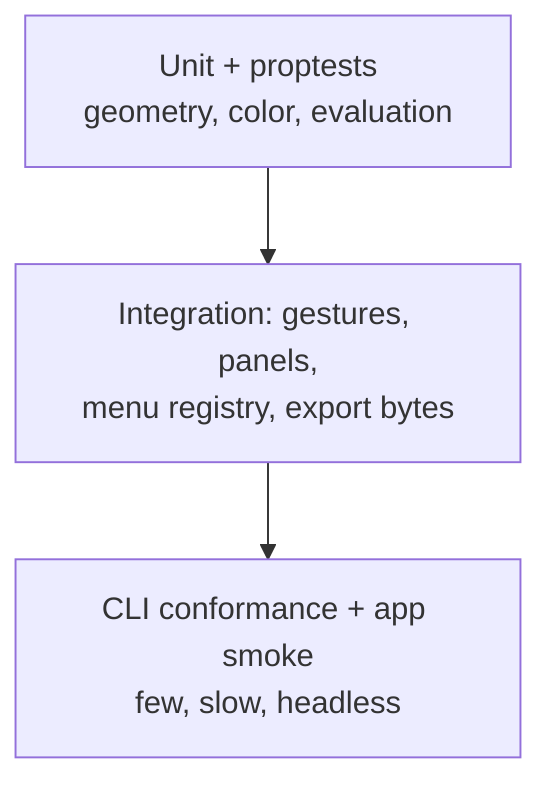

# Build & test

Reproducible local builds and the testing strategy, from one focused test to the full gauntlet.

## Toolchain

```bash
# Check formatting first (xtask verify runs fmt --check)
cargo fmt --all
```

| Tool | Command | What it proves |
| ---- | ------- | -------------- |
| Format | `cargo fmt --all -- --check` | Tree is formatted |
| Lint | `cargo clippy --workspace --all-targets -- -D warnings` | Zero warnings |
| Unit + integration | `cargo test --workspace` | ~300 tests green |
| Architecture | `cargo run -p xtask -- architecture` | No forbidden domain→GUI edges |
| Full gate | `cargo run -p xtask -- verify` | fmt + clippy + test + arch |
| Gauntlet | `cargo run -p xtask -- gauntlet` | Conformance + fixtures + docs checks |

## Focused loops

```bash
# One crate, one test file: the inner loop for tools work
cargo test -p petunia_design_shell --test tools_test

# Single test by name
cargo test -p petunia_design_shell --test tools_test select_tool_click_and_toggle_selection

# Slint app contract tests
cargo test -p petunia-design
```

::: tip Shared target dirs across worktrees
Parallel worktrees sharing one `target/` poison fingerprints. Isolate them:

```bash
# Use a private target dir per worktree
CARGO_TARGET_DIR=/tmp/petunia-tools-target cargo test -p petunia_design_shell
```

:::

## Testing strategy (pyramid)



- **Unit** — geometry numeric policy, color conversion, evaluation invalidation, boolean identity.
- **Integration** — every tool gesture (Down/Move/Up, cancel, stale-revision reject), bridge ports, menu/command-palette parity, export produces real bytes.
- **E2E** — `petunia-design-cli` flow (create → draw → recolor → undo/redo → save/reopen → export summary) and headless `MockGuiAdapter` gauntlet (8 conformance invariants).
- **Determinism** — software pixel compositor fixtures for RGBA8/RGBA16; golden projects for format migration and corruption recovery.

## What "green" means

`xtask verify` green = formatted, lint-clean, tests pass, boundaries hold. `gauntlet` green adds conformance, fixtures and doc parity. A skipped test is never a pass: use `BLOCKED_EXTERNAL` with the environment reason, and file the evidence.
