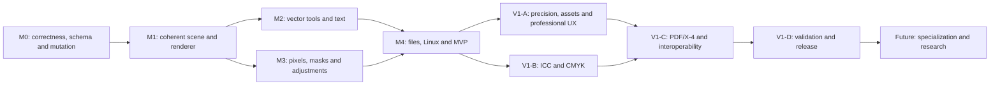

# Implementation roadmap — MVP, V1 and future releases

This proposal starts from baseline `73447647a34f5b4be209415c36e6965c5f71b9b9` and the [dossier’s](./audit-2026-09-30) 37 findings. It defines scope and sequence, not completed work. **MVP:** a genuinely usable vector/bitmap editor with its main tools. **V1:** personal and professional production, including **true ICC-managed CMYK and professional PDF**. **Future:** specialized features and differentiation after correctness, stability and actual use.

Linux is primary. Portability belongs in platform/resource contracts; other platforms should not consume the effort needed to finish Linux workflows. Keep Freya/Skia unless concrete testing shows an insurmountable blocker; avoid another preference-driven GUI migration.

## Implementation and evidence rules

1. All writes follow Action→Command→DocumentMutator→ChangeSet with atomic expected-revision commit and undo/redo. Gesture previews are not separately persisted documents. One confirmed gesture creates one history operation; Esc cancels without residue.
2. Documents/resources preserve editable sources. Effects, adjustments, masks and modifiers are ordered and persistent. Expand/Bake/Rasterize/Convert-to-Curves require explicit operations; preview or separate-layer painting never overwrites original images.
3. Define semantics and reference outputs before optimization. Preview, selection, bounds and SVG/PNG/PDF share evaluated scenes. Backends declare fidelity/capabilities and never hide losses.
4. Property, pixel and round-trip tests target actual invariants. Baseline probe assertions observe bugs: convert them into correct-behavior regressions rather than preserving the defect.
5. Bounded workers consume immutable snapshots and publish through expected-revision Commands. Cancellation, memory limits and atomic output are functional requirements.
6. Every delivery carries an owner, scope status, fixtures, applicable checks, en-US/pt-BR documentation, unavailable-capability diagnostics and human evidence for interaction changes. Rendering a panel or invoking a handler does not complete a tool.

Statuses: **Milestone Required (MVP)**; **V1 Required**; **Post-V1 Candidate**; **Research**; **Open ADR**. The proposal promotes ICC from current POST_V1 to V1 Required following the user’s request. Implementation must record the ADR and update Atlas/authority maps; this document does not silently change older active contracts.

## Dependencies and sequence

M2/M3 can proceed in parallel after M1 scene/resource contracts without duplicating storage/composition. Profile/licensing research can start early; CMYK delivery depends on color/resource contracts and PDF/X-4 depends on text, composition and ICC.

## MVP — complete main tools

MVP supports logos, simple illustration, digital posters, multiple-artboard layouts and basic bitmap painting/composition. Users must finish, save, reopen and export these tasks. Color scope is basic managed RGB with input/display profiles and honest diagnostics; typed profile-aware document data prepares for V1 CMYK. Never label current simulation ICC proofing.

| Delivery | Implementation/contracts | Dependency | Required acceptance | Findings |
| --- | --- | --- | --- | --- |
| **M0.1 · Reproduced fixes** | Revision-zero R-tree, flattened generations, A−∅, degenerate RDP, eraser, UTF-8 panic, double alpha and lost offset components | Baseline + focused regressions | Probes become correct-behavior tests, including read order/undo | F02, F03, F09, F11, F17–F20 |
| **M0.2 · Schema/validation** | Explicit GeometrySpace, legacy Path migration, valid IDs/references/trees, finiteness/limits, restrict direct writes | Geometry-frame decision | Created/legacy paths remain editable; invalid files diagnose instead of hanging | F01, F22 |
| **M0.3 · Transaction/history** | Expected revisions, atomic replay, COW/deltas, byte budgets/savepoints, ID indexes | M0.2 | Conflicts do not erase changes; undo failure preserves state; single gestures/cancellation and bounded memory | F23–F26 |
| **M1.1 · Canonical scene** | Immutable local/world geometry, typed paints, glyph runs, resources, groups, clips, visual bounds; dependency invalidation | M0.2–M0.3 | Camera/selection do not rebuild geometry; ancestor transforms invalidate descendants | F01, F03–F07, F25 |
| **M1.2 · Reference rendering** | Skia scene consumption, real coverage/antialias, gradients/strokes, blend/alpha, isolated groups/masks, basic effects | M1.1 | Approved pixel corpus; empty clips draw nothing; images/text/gradients match preview and PNG | F04–F07, F10–F11 |
| **M1.3 · Cache/workers** | Budgeted decoded/mip/font/geometry caches, bounded execution, real cancellation and Command publication | M0.3 + M1.1 | No unchanged-frame I/O/decode; large work preserves interaction; cancellation cannot become Completed | F06, F25, F27–F29 |
| **M2.1 · Vector editing** | Select/multiselect, move/scale/rotate, cusp/smooth nodes, pen/pencil, shapes, fills/strokes/gradients, booleans, groups/order/masks | M1 | Each tool passes create→edit→undo→save/reopen→export with zoom/transforms | F01–F05, F18–F21 |
| **M2.2 · Correct basic text** | Artistic/frame multiline text, family/size/weight/italic/alignment, clusters/graphemes/bidi/fallback, caret/IME, shared glyph runs | M1.1 + shaping decision | Posters with accents/ligatures/fallback/multiline; correct caret/selection; missing fonts diagnosed | F07, F32 |
| **M3.1 · Pixel layers/selection** | Persistent PixelLayer/MaskLayer/TileStore; brush/eraser, rectangle/ellipse/lasso, basic fill, crop and layer transforms | M0.3 + M1 | Actual masked/selected painting, atomic strokes, pixel round trips, preserved originals | F08–F10, F28 |
| **M3.2 · Nondestructive adjustments** | Levels/Curves, exposure/brightness/contrast, hue/saturation and basic blur/shadow in ordered chains; masks/toggles/reordering | M3.1 + M1.2 | Edit/toggle/reorder after reopening; matching preview/output; no source overwrite | F04, F06, F11 |
| **M4.1 · Files/output** | Binary-resource PTND, exclusive atomic saves/recovery; PNG/JPEG/RGB TIFF and declared SVG-subset import; selected-DPI PNG and scope-faithful SVG | M1–M3 | Failure preserves prior files; negative/distant origins work; no placeholder-rectangle export | F11, F14–F15, F27, F37 |
| **M4.2 · Linux/UX** | Wayland/X11, HiDPI, real pen pressure, keyboard/focus/IME, native clipboard/dialogs/portals, accessibility/l10n, capabilities | M2–M3 | Four MVP task fixtures, recorded hardware/backend evidence, no production UI simulation | F29, F32–F34 |
| **M4.3 · MVP gate/package** | Pinned tested toolchain, actual CI, visual/file corpus, limits/controlled benchmarks, Linux install smoke | All prior deliveries | MVP P0/P1 fixed or explicitly scoped out without compromising main tools; no successful stub claims | F34–F36 |

Professional PDF is V1 Required. If MVP offers simple PDF, first fix dimensions/selection and replace approximate rendering; declare actual subsets, preserved fonts/images and loss preflight. Otherwise keep the capability unavailable with a reason. An existing exporter does not justify enabling a faithful-output claim.

### Functional tool inventory

Every row requires integration with selection, history, persistence and applicable export. Preferences/controls are enabled only when they have actual effects.

| Family | MVP — Milestone Required | V1 Required | Post-V1 Candidate |
| --- | --- | --- | --- |
| Navigation/selection | Pan/zoom/fit, select/marquee, multiselect, lock/hide, order/layers | Attribute selection, search, advanced isolation/x-ray | Semantic/assisted selection |
| Geometry | Move/scale/rotate, numeric transforms, align/distribute, snapping/guides | Shear/perspective, reference points, advanced precision/measurement | Constraints/full parametric layout |
| Curves/shapes | Pen/pencil/nodes, rectangle/ellipse/polygon/star, boolean, explicit conversion | Knife/scissors, shape builder, robust contour, compound/holes, live boolean | Complex mesh/envelope, advanced calligraphic/vector brushes |
| Appearance | Solid/linear/radial gradients, stroke caps/joins/width/dashes, basic blend, group/mask, shadow/blur | Complete multiple fills/strokes, patterns/styles, basic variable width, advanced clipping | Mesh gradients, procedural paints/materials |
| Text | Artistic/frame, multiline/basic styles, correct shaping/IME | On-path, paragraph/character styles, OpenType, linked frames, tested variable-font scope | Long editorial and specialized linguistic composition |
| Pixels | Brush/eraser/fill, rectangle/ellipse/lasso, crop/mask/basic adjustments | Clone/heal, feather/refine, wand/channels/live filters, spacing/texture/tilt brushes | Liquify/smudge/wet painting, segmentation/advanced filters |
| Document | Multiple artboards, units/guides, save/reopen, undo/redo/recovery | Bleed/margins/pages, linked assets, real component/symbol instances and libraries | Editorial imposition, complex templates/data merge |
| Color | Basic managed RGB, typed swatches, faithful picker | Actual ICC/CMYK, Lab, proof/monitor/intents/BPC, spot/registration, separations/TAC | Specialized multichannel/spectral/DeviceN, HDR/OCIO |
| Interoperability | PTND, scoped SVG, PNG/JPEG/RGB TIFF input, PNG/SVG output | PDF/X-4, managed JPEG/TIFF 8/16-bit, CMYK TIFF, contract-scoped interoperable SVG, limited PDF/PSD import with reports | Broad AI/PSD/complex PDF import, cloud and specialized round trips |
| Productivity | Shortcuts/properties/context toolbar/layers, feedback, real export preview | Presets/macros/CLI batch, find/font/resource manager, templates/saved workspaces | Marketplace/collaboration/assisted automation |

### MVP exit gate

- Users complete four task projects—logo, poster, masked painting and multiple artboards—without developer intervention. Record errors/time and include keyboard/assistive-technology users.
- Every MVP tool preserves identity/editable effects across save/reopen, undo/redo and cancellation. Transformed/grouped fixtures match supported exports.
- PTND survives concurrent saves, disk-full, cancellation and interruption; recovery offers the last valid version without silently replacing originals.
- Measure performance/limits on declared hardware using planned scenarios; debug timing tests are not release benchmarks.
- Strict CI, synchronized docs and capability matrix distinguish integration from validation. Close every MVP P0; remaining P1 needs concrete scope/risk decisions without leaving main tools partly functional.

## V1 — personal/professional use, CMYK and PDF

### V1-A · Precision and professional workflows

Complete the V1 tool column: compound/holed paths and advanced editing, tested contour/knife/shape builder, multiple paints and consistent stroke/alignment, text styles/OpenType/on-path/linked frames, live brushes/filters, refined selections/channels, safe linked assets and actual editable symbol instances. Shape preset libraries are not component instances.

Extend format for fonts/resources/ICC with explicit migrations. Font management reports substitutions and embedding rights; preflight finds missing images, low effective resolution, overset text and incompatible profiles. Add presets/batch export with actual progress/cancellation. Plugins need quotas/isolation testing; interoperable MCP needs an independent client instead of only local ptnd.* methods.

Acceptance: real identity, poster, illustration, retouch and print projects; consistent shortcuts/panels, mixed multiselection, editable units, capability reasons and recoverable reports. **Findings:** F04–F07, F15, F20–F21, F28–F33.

### V1-B · True CMYK and ICC management

**Operational definition:** CMYK document data preserves C/M/Y/K channels and an actual profile; display/proofing are derived. Changing monitor, proof or zoom never changes stored ink values. DeviceCMYK PDF and RGB↔CMYK formulas do not satisfy this requirement.

1. **Model:** typed ColorValue + ProfileId/hash + ranges/units, process/spot/registration swatches and explicit channel formats including CMYK(A), Gray and RGB, with applicable 8/16-bit precision. Separate four ink channels from alpha and display representations. Do not persist every layer as RGBA.
2. **Profile registry:** load ICC v2/v4 bytes, validate space/channel compatibility and embed hashes/metadata. Profile distribution requires appropriate licenses; names are not profile files. Missing-profile opens offer Assign, Convert or preserved-unprofiled data with warning; no silent guesses.
3. **CMM:** evaluate LittleCMS and Rust alternatives by actual capabilities. Prefer validated existing engines to writing a CMM. Transform keys include source/destination/proof hashes, formats, intent/flags; budget caching, tile processing and proven thread policy. Use LittleCMS differential references with declared inputs/tolerances.
4. **Transforms:** D50 Lab/XYZ PCS, chromatic adaptation where required, four intents, BPC, assign versus convert, CMYK→CMYK and black preservation. Separation/GCR/UCR/TAC follows profile/DeviceLink/explicit policy rather than universal caps or 0.98 factors.
5. **Soft proof:** source→press→monitor, proof intent, paper white/black, gamut warnings and BPC. Linux needs monitor-profile acquisition/configuration and backend-specific documented behavior; software cannot make an uncalibrated screen a colorimetric reference.
6. **Separations/preflight:** inspect C/M/Y/K and spots, pure/rich black, destination TAC, overprint/knockout and registration. Preserve spot identity/ink values separately from preview colors.
7. **Validation:** chromatic patches, gradients, ink extremes, pure CMYK, black preservation, distinct profiles, assignment without channel changes, undo/reopen and export without RGB round trips. ΔE00 requires reference data/implementation; tolerances depend on precision/profile rather than an unexplained universal number.

**Gate:** measured differences against independent CMM; preserved CMYK/spot data; target-dependent proof; necessary profile embedding in TIFF/PDF/packages. **Findings:** F16–F17, F10, F13. **Dependencies:** M0 schema, M1 paints/composition, M3 resources, V1-A text/resources.

### V1-C · Professional PDF and interoperability

Prioritize **PDF/X-4** for transparency/color management. PDF/X-1a can follow as a restrictive, controlled-flattening preset when demanded; do not replace X-4 with unverified compatibility claims.

- One page per included surface: MediaBox/TrimBox/BleedBox/CropBox, units/local origins/bleed/margins and optional marks. Exclusion, order and metadata must be actual options.
- Evaluated geometry/appearance: full world transforms, fill rules, paints/gradients/strokes, clips, isolated groups and transparency/blend. Rasterize only unsupported faithful representations with explicit DPI/bounds/color/warnings; never substitute rectangles.
- Text: layout-identical glyph placement, embedded/subset fonts, checked licenses, ToUnicode and diagnosed fallback. Convert-to-curves is explicit; keep selectable text where possible.
- Images: actual embedding, effective resolution, clips/masks/alpha, compression policy/profile. Validate JPEG/TIFF/16-bit paths; never copy Straight pixels as Premul.
- Color: valid target ICC OutputIntent, preset-managed RGB/CMYK, spot/Separation and registration, overprint/knockout and correct separations. Specialized DeviceN can follow while V1 preserves required professional spot capabilities.
- Preflight: missing fonts/resources/profiles, overset, preset-disallowed RGB, TAC, resolution, bleed, transparency and losses. Block mandatory errors and disclose approximations before writing; reports match generated files.
- Independent validation: external page-box/font parsing, at least one renderer different from the exporter, visual differences and separation/RIP inspection. Successful pdfinfo parsing does not certify PDF/X-4: use a validator supporting this standard and record results. Testing with an authorized printer/profile establishes practical use.

**Gate:** multiple-page CMYK/spot/pure-black print piece with text/images/transparency/bleed, visual/channel/preflight fidelity; failed/cancelled export preserves prior files. **Findings:** F12–F17, F27, F37. Depends on V1-A/B.

### V1-D · Professional release

Versioned compatibility suites with authorized real files and synthetic fixtures; long sessions, large projects, batch exports, crash/recovery and Linux hardware performance. Finish applicable packaging/signing, SBOM/licenses for dependencies/fonts/profiles/assets, migration policy and install/update tests. Validate X11/Wayland, software fallback and representative GPUs, accessibility/l10n and pressure-sensitive tablets.

Exit gate: all V1 Required integrated/validated; no hidden CMYK/PDF approximations or demo tasks; reconciled docs/ADRs/Atlas and published limits; professionals finish representative projects. New defects reopen relevant gates instead of becoming PROVEN through dispatch-only tests.

## Future versions — deferred features and ideas

| Horizon/status | Features | Prerequisites/selection criteria |
| --- | --- | --- |
| **V1.x · Post-V1 Candidate** | Mesh gradients, mesh/envelope warps, blends/repeats, patterns, advanced vector brushes/smart guides/constraints | Correct rendering/editing, real project demand, live preservation and round trips |
| **V1.x · Post-V1 Candidate** | Smudge/liquify, advanced texture/rotation brushes, specialized frequency/retouch tools, additional filters/selections | Tile DAG/halos/undo/benchmarks; preserve sources/masks/parameters |
| **V2 · Post-V1 Candidate** | Full data merge, barcode/templates, multipage editorial/master pages/imposition | Stable text/resources/professional PDF, result preflight/licenses |
| **V2 · Post-V1 Candidate** | Expanded PSD/AI/PDF import, subset round trips, additional exports/print presets | Specifications/licenses/corpus; disclose editable/rasterized/unsupported content |
| **V2 · Research** | Compute-GPU renderer, virtual tiles, advanced tessellation/caching/SIMD | Measured bottlenecks, CPU-reference equality, fallback and VRAM budgets |
| **V2 · Research** | HDR/float, advanced wide gamut/OCIO, multichannel DeviceN/spectral | CMM/precision pipeline and hardware, explicit color/export criteria |
| **V2 · Post-V1 Candidate** | macOS/Windows, later mobile/tablet as demanded | Platform ports keep GUI-free domain; per-system IME/pen/accessibility gates |
| **V3 · Research** | Offline-first collaboration, sync/comments/versioning/shared components | Suitable operations/IDs/resources; evaluate CRDT/OT, geometry conflicts, authorization/privacy |
| **V3 · Post-V1 Candidate** | Plugin marketplace, stable API/SDK, visual macros, remote MCP/format extensions | Quotas, stable protocol/review, isolation and permission matrix |
| **Research** | Assisted tracing/segmentation, error-bounded node reduction, constraint recovery/accessibility assistance | Editable results, quality/error measurements, consent/licenses/local models where appropriate |
| **Research** | Deterministic recovery/replay, embedded performance profiler, machine-budget presets | Artwork/secret-free logs, measured overhead and useful user/developer workflows |

Future ideas never block MVP or remove CMYK/PDF from V1. Introduce them after validating the problem, cost, algorithm, licensing, live behavior, UX and acceptance criteria.

## Proposed performance and memory budgets

These are engineering targets to calibrate, not measured achievements. Declare CPU/GPU/driver/display/OS/release build, resolution/zoom/visible objects. Measure median/p95/p99 with warmup/sufficient samples, RSS/VRAM/allocations and concurrent-export impact.

| Scenario | Initial target | Limit/caveat |
| --- | --- | --- |
| 60 Hz interaction/preview | Frame p95 ≤16.7 ms; aim for UI work ≤8 ms | Separately measure input-to-paint; snapshots alone are not frames |
| Selection/move among 10,000 shapes | Hit/snapping p95 ≤8 ms; regional edits without full rebuild | 1%/100% visible, hierarchy/effects, before/after performance |
| Brush on 24 MP images | Visual feedback p95 ≤25 ms; no frame file reads | Actual pressure, multiple tiles, masks, concurrent preview/export |
| Cache/history | Initially configurable 512 MiB each; total process budget | Not an RSS guarantee; source/snapshots/intermediate buffers have separate budgets; eviction never removes artwork |
| Large projects | 10,000 paths + text; additional 100 MP partial-viewport raster | No OOM; controlled over-budget errors, spill/streaming where needed |
| Files/export | Responsive UI, progress/cancellation, predictable memory | Define format throughput after correctness; 300 DPI must not allocate empty pasteboard |

Minimum corpus: empty/degenerate, compound/holes, transformed groups, multiple paints/masks, partial alpha, offscreen blur/shadow, complex text, distinct profiles, 8/16-bit images, negative origins, invalid files and failing saves. Release benchmarks measure full paths separately from unit tests; do not rely on a debug 50 ms assertion.

## Initial backlog and delivery management

Start with small focused-regression PRs: **(1)** F02/F03; **(2)** F17/F18/F19; **(3)** F09/F10/F11; **(4)** F01/F22 with migration; **(5)** F23/F24/F37; then consolidate M1/tools. Contract changes update ADR/Atlas/mirrors together without introducing competing canonical documents.

Required responsibilities: domain/geometry; rendering/raster/performance; color/PDF/text; GUI/UX/Linux; QA/fixtures/integration. These are ownership roles, not a request to spawn agents. One person can cover multiple roles, but color/print and UX validation require representative users/equipment.

Estimate after concrete spikes: S for localized few-day fixes; M for known flows up to two weeks; L for multiweek subsystems; XL for fidelity/contracts/ICC/PixelLayer, decomposed before calendar estimates. This audit cannot justify a release date or mechanically sum sizes into one.

Every item records ID/findings, release/status, owner/dependencies, ADRs/files, visible result/invariants, consulted algorithms/references, fixtures/tests/performance, migration/i18n/accessibility, risks and evidence. Reassess scope with real projects after M1, MVP and V1-B; accommodate new priorities without weakening integrity/fidelity gates.
