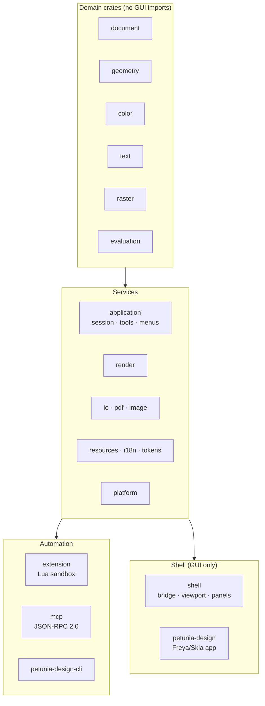
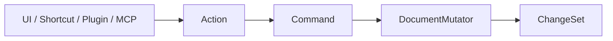

# Developers

Build on Petunia: architecture, local builds, testing strategy and the ADR record. Everything here is automation-first — if a workflow cannot run headless, it is a bug.

Current implementation status and remaining release gates: [execution ledger](/developers/implementation-progress), governed by [ADR-002](/developers/adr/ADR-002-local-path-and-integrity).

## Start here

| I want to… | Go to |
| ---------- | ----- |
| Understand crates, boundaries and the mutation pipeline | [Architecture](/developers/architecture) |
| Compile, run and test locally | [Build & test](/developers/build-test) |
| Review the 2026-09-30 baseline and release proposal | [Technical audit](/developers/audit-2026-09-30) · [MVP / V1 / future roadmap](/developers/implementation-roadmap-2026-09-30) |
| Learn why EffectChain exists | [ADR-001](/developers/adr/ADR-001-effect-chain) |
| Browse all decisions | [ADR index](/developers/adr/) |
| Open a PR or translate docs | [Guidelines](/contributing/guidelines) · [Translations](/contributing/translations) |

## The workspace in 30 seconds

16 domain/service crates, one shell crate, two apps (`petunia-design`, `petunia-design-cli`) and `xtask` as the repository task facade. The boundary is enforced in CI: `cargo run -p xtask -- architecture` fails on any domain → GUI import.

## The one pipeline

Nothing touches document storage directly. History (`History::execute`) wraps Commands so undo/redo, persistence and evaluation invalidation all observe the same `ChangeSet`.

## Quality bar (Definition of Done)

A feature is done only with: focused tests **plus** the applicable gauntlets, headless-first evidence, detach proof, token/a11y checks where UI is touched, and **EN + pt-BR docs** in the same change. Bare "later/planned" authorizes nothing — scope status is explicit (`V1 Required`, `Milestone Required`, `Post-V1 Candidate`, `Research`, `Open ADR`, `Historical`, `Out of Scope`).
