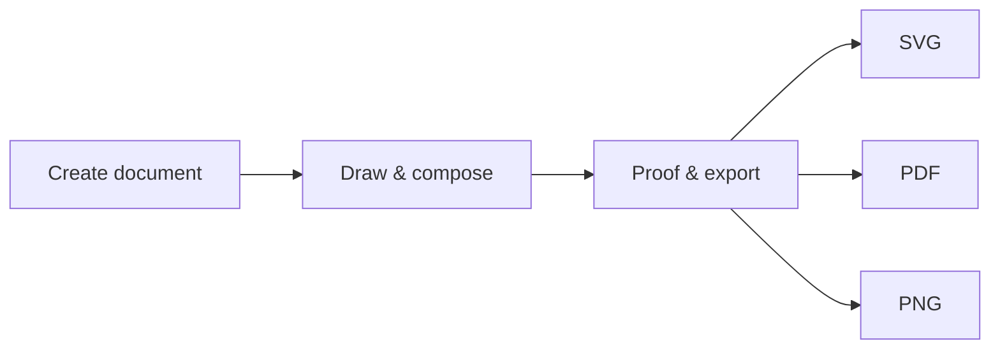

# Quickstart (15 min)

Create your first Petunia document, draw, combine, undo and export — all in about five minutes of hands-on time.

## 1. Create a surface

1. Launch the app (`cargo run -p petunia-design`).
2. Press ++a++ (Artboard tool), drag a 1280 × 720 frame — or accept the default first page.
3. The surface appears in the Layers panel as the root of the single document tree.

::: info One tree
There is no parallel "layers vs objects" hierarchy. A **Layer** is a container role in the one document tree. See [Glossary](/glossary).
:::

## 2. Draw two shapes

1. Press ++m++ (Rectangle), drag a rectangle.
2. Press ++m++ again, hold ++shift++ for a 1:1 constraint, drag a square overlapping the first.
3. Press ++v++ (Select), ++shift++.click both shapes to multi-select.

## 3. Combine them non-destructively

1. Open the Boolean / ShapeBuilder flow (see [Tool catalog](/tools/)).
2. Union the two shapes. The sources are preserved — undo restores them exactly.
3. Press ++ctrl+z++ / ++ctrl+y++ to walk history. Note the rule: **one gesture, one undo**.

## 4. Recolor with a semantic swatch

```bash
# The same operation the CLI performs headlessly: fill by token name, never a raw hex
cargo run -p petunia-design-cli
```

In the app, pick a swatch such as `ptnd.blue/500` from the Colour panel. Swatches are named tokens (`ptnd.<hue>/<step>`), so documents stay themeable.

## 5. Export real bytes

File → Export (wired to the real `export_service`: SVG / PDF / PNG with actual bytes, verified by smoke tests — never a fake dialog).



## Done — where next?

- [Manual](/manual/) — personas, panels, snapping, data merge.
- [Tool catalog](/tools/) — gestures, modifiers, shortcuts per tool.
- [Developers](/developers/) — drive the same flow from CLI, MCP or Lua plugins.
