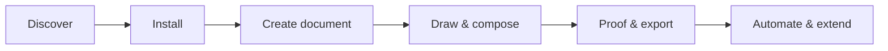

## The journey

One path from first install to automated studio:

| Step | You do | Start here |
| ---- | ------ | ---------- |
| Discover | Understand what Petunia is and is not | [Constitution](/bible/) |
| Install | Build the workspace and launch the app or CLI | [Installation](/getting-started/installation) |
| Create document | Open your first `.ptnd` surface | [Quickstart](/getting-started/quickstart) |
| Draw & compose | Master tools, panels and personas | [Manual](/manual/) · [Tools](/tools/) |
| Proof & export | Preflight, soft-proof and ship SVG/PDF/PNG | [Manual](/manual/) |
| Automate & extend | Drive Petunia from scripts, agents and plugins | [Developers](/developers/) |

## Canonical vocabulary

Petunia uses precise names: a **Surface** hosts composition, a **Layer** is a role in the single document tree (not a parallel hierarchy), a **Binding** links a property to variable-data. New terms are never invented silently — see the [Glossary](/glossary) (EN ↔ PT-BR) and [SPEC-001](/bible/SPEC-001).
