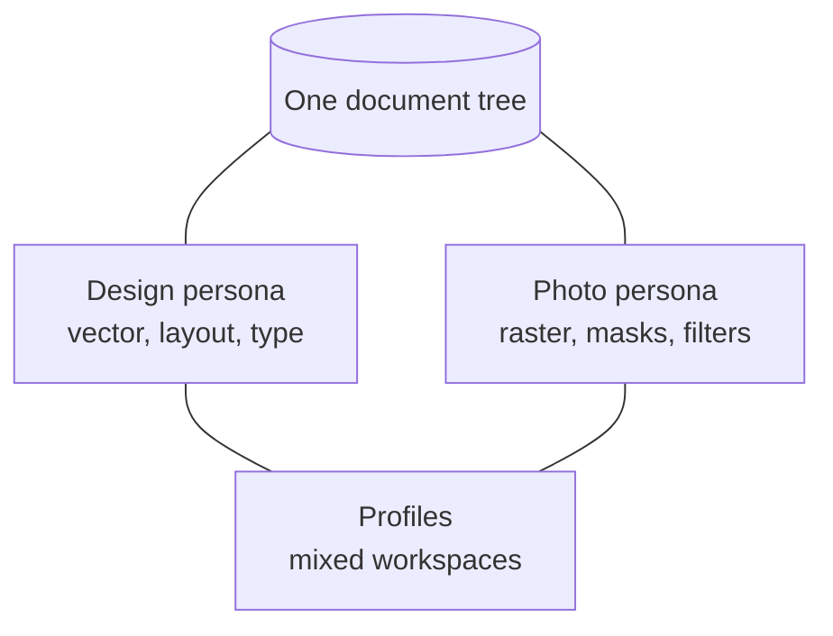
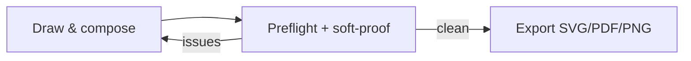

# Manual

How Petunia Design Studio feels in daily use: modules, personas, panels and the ergonomics that keep editing safe.

## Modules at a glance

| Module | What it does | Lives in |
| ------ | ------------ | -------- |
| Document | Canonical object graph, typed stable IDs, atomic `.ptnd` packages | `petunia_design_document` |
| Geometry | 2D vector paths, booleans, offsets, homography warps | `petunia_design_geometry` |
| Color | sRGB / CMYK / Lab / Spot + press-profile soft-proofing | `petunia_design_color` |
| Text | Stories, style runs, line breaking, hit-testing, on-path | `petunia_design_text` |
| Raster | Sparse 128×128 tiles, 8/16-bit, brushes, selection masks | `petunia_design_raster` |
| Render & I/O | 16 blend modes, offscreen planner, PDF/SVG/PNG export | `petunia_design_render`, `petunia_design_io` |
| Application | Session, undo history, tools registry, menus, data merge | `petunia_design_application` |
| Shell | Toolkit-neutral bridge, viewport, panels, overlays | `petunia_design_shell` |
| Resources | DTCG tokens, Light/Dark themes, en-US/pt-BR strings | `petunia_design_resources` |
| Automation | Lua plugin sandbox, capability broker, MCP server | `petunia_design_extension`, `petunia_design_mcp` |

Domain crates never import GUI toolkit types — the UI receives DTOs/view-models and sends `ActionRequest`/`CommandRequest` across the bridge. See [Architecture](/developers/architecture).

## Personas, not programs

- **Design persona** — pen, nodes, shapes, booleans, appearance stack, artboards, data merge.
- **Photo persona** — marquee/lasso/brush selections, paint, adjustments, live filters, channel mixer.
- **Profiles** — named mixed-workspace compositions referencing semantic IDs.

Switching persona recomposes tools/panels/actions; the document never forks.

## Everyday workflows

### Compose → proof → export

1. Draw with [tools](/tools/) (one gesture = one undo; ++ctrl+z++ always safe).
2. Run preflight (missing fonts, out-of-gamut, oversized raster) and soft-proof against SWOP/FOGRA press profiles.
3. Export. PDF preserves native sRGB/CMYK numbers per the numeric-preservation policy.

### Variable data (data merge)

1. Attach a CSV/TSV/JSON source in the Data Merge panel.
2. Create typed **Bindings** from fields to object properties (pure formatters only).
3. Preflight, then materialize one artboard per **Record**.

## Ergonomics you can rely on

- **Non-destructive by default** — transforms, corners, contours, transparency and warps are live modifiers; Bake/Expand/Rasterize are explicit user ops.
- **Viewport** — cursor-centered infinite zoom (0.1%–25600%), hysteresis snapping with visual guides.
- **Shortcuts** — ++v++ Select, ++a++ Node, ++p++ Pen, ++m++ Shapes, ++t++ Text, ++g++ Gradient, ++i++ Picker, ++k++ Command palette (++ctrl+k++), ++ctrl+z++ / ++ctrl+y++ history, ++1..4++ zoom presets.
- **No fake UI** — a missing capability renders disabled *with a reason*, never as a dead button. See the [Constitution](/bible/).
