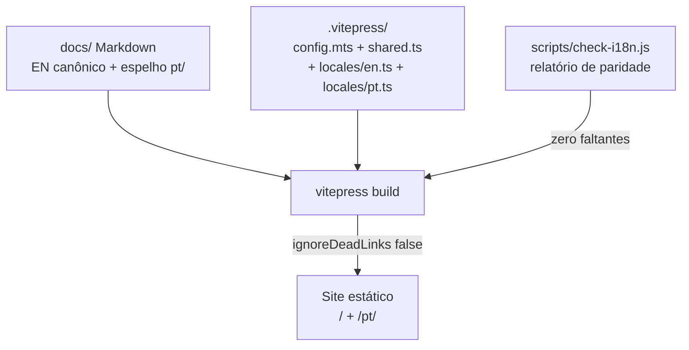

# SPEC-001: Pipeline de documentação viva

- **ID:** SPEC-001
- **Status:** Aceito
- **Escopo:** V1 Required
- **Responsável:** Arquiteto de documentação
- **Verifica:** Constituição §VI (docs mudam com contratos, zero drift)

## 1. Propósito

Esta especificação torna o pipeline de documentação viva imposto por build: o site VitePress, o verificador de paridade i18n e o portão de links quebrados juntos garantem que a documentação pública não apodreça em silêncio.

## 2. Requisitos

| ID | Requisito | Verificação |
| -- | --------- | ----------- |
| SPEC-001-R1 | Site gera com VitePress + Mermaid a partir de `docs/` | `cd docs && npm run build` verde |
| SPEC-001-R2 | Inglês em `/` é canônico; pt-BR espelha 1:1 sob `/pt/` | `node scripts/check-i18n.js` relata zero faltantes |
| SPEC-001-R3 | Novos idiomas registram-se via um `locales/<lang>.ts` + entrada em `config.mts` + árvore espelhada | Procedimento em 3 passos no [guia de Traduções](/pt/contributing/translations) |
| SPEC-001-R4 | Zero links quebrados em qualquer locale quebra o build | `cleanUrls: true`, `ignoreDeadLinks: false`, build verde |
| SPEC-001-R5 | Chaves técnicas de frontmatter, IDs/lógica Mermaid e comandos de código são preservados entre traduções | Checklist de revisão humana no guia de Traduções |
| SPEC-001-R6 | Páginas legadas de caderno na raiz de `docs/` ficam excluídas do roteamento e da checagem de links | `srcExclude` em `shared.ts`; build imune a elas |

## 3. Arquitetura

## 4. Critérios de aceite

1. `node scripts/check-i18n.js` sai 0 com cada página canônica espelhada em `docs/pt/` (também imposto por `cargo xtask docs`).
2. `cd docs && npm run build` sai 0 — sem links quebrados em EN nem PT (também imposto por `cargo xtask docs` quando as dependências de docs estão instaladas).
3. Remover qualquer página `docs/pt/**` faz o verificador falhar; quebrar qualquer link interno faz o build falhar.
4. Adicionar um idioma pelo guia de Traduções não exige mudar arquivos de locale existentes.

## 5. Histórico

| Data | Mudança |
| ---- | ------- |
| 2026-09-25 | Aceito. Lançamento bilíngue inicial (EN + pt-BR), 16 páginas por idioma. |
