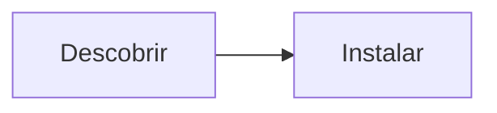

# Como traduzir a documentação para um novo idioma

Guia oficial em 3 passos. Adicionar espanhol, francês ou qualquer idioma segue exatamente o padrão usado do inglês para o português no lançamento.

## Passo 1 — Duplicar a árvore

```bash
# A partir da raiz do repo. Troque <lang> pelo código de locale do VitePress (es, fr, …)
mkdir -p docs/<lang>
# Espelhe cada arquivo canônico 1:1, preservando caminhos relativos:
#   docs/index.md                    -> docs/<lang>/index.md
#   docs/tools/index.md              -> docs/<lang>/tools/index.md
#   docs/developers/adr/ADR-001-*.md -> docs/<lang>/developers/adr/ADR-001-*.md
cp docs/index.md docs/<lang>/index.md
```

A paridade é estrita: para cada arquivo inglês na raiz deve haver réplica sob `<lang>/`. O verificador impõe:

```bash
# Relata páginas faltantes/sem tradução para cada locale configurado
node scripts/check-i18n.js
```

## Passo 2 — Registrar o locale

1. Copie `docs/.vitepress/locales/pt.ts` para `docs/.vitepress/locales/<lang>.ts`.
2. Traduza `nav`, `sidebar`, rodapé, busca e rótulos de UI (mantenha `editLink.pattern` apontando para `docs/:path`).
3. Importe e registre em `docs/.vitepress/config.mts`:

```ts
// Só este trecho muda quando um idioma é adicionado:
import { esConfig } from './locales/es'

export default withMermaid(
  defineConfig({
    ...shared,
    locales: {
      root: enConfig,
      pt: ptConfig,
      es: esConfig, // <-- novo idioma
    },
  }),
)
```

O seletor de idiomas da barra superior passa então a chavear a página atual para seu equivalente traduzido automaticamente.

## Passo 3 — Traduzir com preservação técnica

1. **Chaves de frontmatter ficam** — `layout: home`, `theme: brand` e outros valores técnicos nunca mudam; só títulos, textos e descrições são traduzidos.
2. **Mermaid: traduza rótulos, mantenha IDs e lógica** — ids de nós (`A`, `B`, `DOC`) e arestas ficam idênticos; só o texto visível muda:



vira rótulos no idioma-alvo com a mesma estrutura `A --> B`.

3. **Links relativos contextuais** — links em inglês apontam para caminhos canônicos (`[Quickstart](/getting-started/quickstart)`); páginas traduzidas apontam para o prefixo do idioma (`[Quickstart](/es/getting-started/quickstart)`).
4. **Snippets de código consistentes** — comandos de terminal e blocos de código são idênticos entre idiomas; só comentários explicativos são traduzidos.
5. **Nomes de produto e IDs nunca traduzem** — Petunia Design Studio, `.ptnd`, `ObjectId`, `ChangeSet`, `Gauntlet`, action ids.

## Verificação

```bash
# 1. O relatório de paridade deve mostrar zero páginas faltantes
node scripts/check-i18n.js

# 2. O build completo deve passar com zero links quebrados em TODOS os idiomas
cd docs && npm run build
```

`ignoreDeadLinks: false` é intencional: um link quebrado em qualquer idioma quebra o build.
