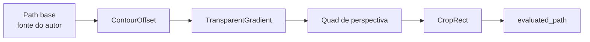

# ADR-001: Edição não destrutiva via EffectChain ordenada tipada

- **Status:** Aceito
- **Data:** 2026-09-22
- **Escopo:** V1 Required
- **Afeta:** `petunia_design_document`, `petunia_design_geometry`, todas as ferramentas de canvas, render/exportação/hit-test

## Contexto

O Petunia edita arte vetorial que precisa sobreviver a pré-voo de impressão, síntese booleana, texto em path e warps por homografia. Editar paths base no lugar destrói a fonte do autor a cada arrasto: cantos não podem ter o raio reajustado, offsets não podem ser reajustados, vetores de transparência não podem ser reorientados. Affinity, Photoshop e CorelDRAW convergem em ajustes vivos, reordenáveis e consolidáveis — o Petunia precisa da mesma fundação com a explicitude do Rust.

## Decisão

Todo `DocumentObject` carrega uma cadeia ordenada tipada de `ModifierKind` avaliada sobre geometria base imutável:

- **Identidade** — cada modificador tem id estável; **ordem = ordem do vec**; custo de avaliação linear.
- **Base vs. avaliado** — ferramentas editam `to_path()`; render, hit-test, seleção, booleanos e exportação leem `evaluated_path()`.
- **Serde default** — arquivos v1 abrem sem migração; a cadeia default é vazia.
- **Bake é explícito** — `bake_contour`, `bake_transparency`, `BakeGeometry` congelam modificadores na base; nunca há bake silencioso.

## Consequências

- Ferramentas (Canto, Contorno, Transparência, Perspectiva, Corte) entregam previews vivos com commits de um undo.
- A exportação segue honesta: onde falta infra de máscara, o exportador amostra o escalar documentado (`sampled_opacity`) e registra a degradação.
- A UI deve uma lista de cadeia (habilitar/desabilitar/remover/reordenar) — aceito como dívida conhecida com a API `SetModifiers` já pronta.
- Warps de malha (envelope) reutilizam `warp_path` + `Homography` depois, sem churn de modelo.

## Alternativas rejeitadas

- **Mutação in-place do path** — perde a fonte; rejeitada (destrutiva por padrão).
- **Pilhas paralelas por efeito** — ambiguidade de ordem entre domínios; rejeitada (um vec ordenado único).
- **Auto-bake implícito ao salvar** — viola a doutrina de bake explícito; rejeitada.
