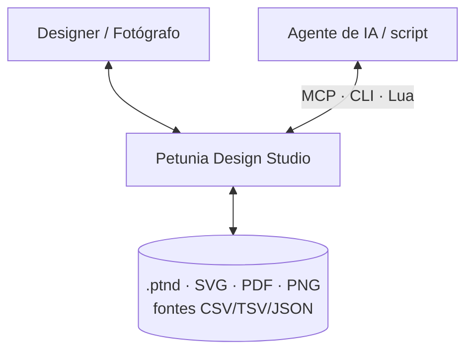
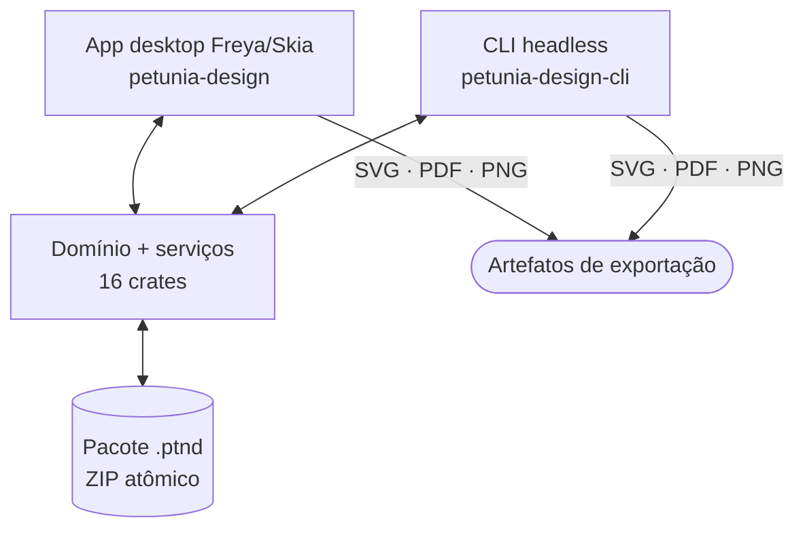
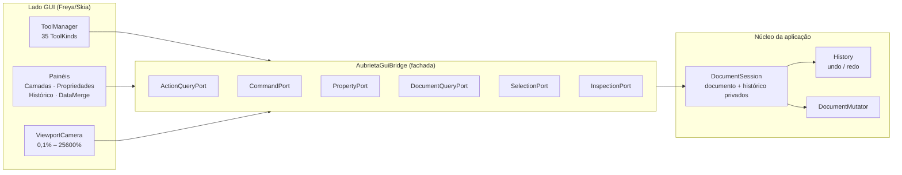

# Arquitetura

Visão estilo C4 do Petunia Design Studio: contextos, contêineres, componentes e o caminho de mutação no nível do código.

Contrato atual de persistência/publicação: [ADR-002](/pt/developers/adr/ADR-002-local-path-and-integrity), com [referência gerada de fontes/testes](/implementation/contracts.json). O [registro de execução](/pt/developers/implementation-progress) distingue correções implementadas de milestones pendentes.

Renderização/apresentação compartilhadas: [ADR-006](/pt/developers/adr/ADR-006-shaped-text-and-canvas-preview) conecta contornos de glifos e workers com fontes imutáveis ao canvas. Saída de pixels não validada; edição/estilos de texto, tiles e aceitação completa seguem abertos.

## Nível 1 — Contexto do sistema



Humanos dirigem a shell Freya/Skia; agentes e scripts dirigem a mesma superfície de capacidades via MCP, CLI e Lua — sem API privilegiada paralela.

## Nível 2 — Contêineres



## Nível 3 — Componentes (a fronteira da ponte)



Regras:

- **Via única de mutação** — `DocumentSession` detém `document`/`history` privados; a GUI nunca segura um handle mutável.
- **DTOs cruzam a ponte** — view-models e `TransformPreview` são neutros a toolkit; pixels de overlay nunca vazam tipos de domínio.
- **Registros de capacidade** — ferramentas, painéis, efeitos, importadores e fontes de dados compõem-se via registros; capacidade ausente é estado normal desabilitado com motivo, nunca pânico.

## Nível 4 — Caminho de um gesto no código

```ts
// Idêntico em todo binding de linguagem; comandos de terminal seguem iguais,
// só comentários são traduzidos (veja o guia de Traduções).
PointerDown  // hit-test, captura revisão, só preview
PointerMove  // atualiza DTO TransformPreview (sem escrita no histórico)
PointerUp    // transact: Ação -> Comando -> DocumentMutator -> ChangeSet
Undo         // History reverte o ChangeSet único (um gesto = um undo)
```

## Invariantes-chave

1. Crates de domínio nunca importam tipos de toolkit GUI (imposto em CI).
2. Só IDs estáveis tipados (`ObjectId`, `SurfaceId`, `ResourceId`…) — nunca índices de Vec ou ponteiros.
3. Base vs. avaliado: ferramentas editam paths base; render/hit/seleção leem `evaluated_path()` (EffectChain aplicada).
4. Sem UI falsa: comportamento não declarado é implementado, desabilitado-com-motivo, oculto ou marcado experimental.

Decisões por trás deste desenho: [Índice de ADRs](/pt/developers/adr/) · [ADR-001](/pt/developers/adr/ADR-001-effect-chain).

## Atualização do contrato em 2026-10-03

[ADR-010](/pt/developers/adr/ADR-010-text-histogram-icc-and-pdf) governa rascunhos de texto, histogramas da composição, recursos ICC imutáveis (schema 5), atribuição de perfis com precondições e o subconjunto fiel de PDF. A aceitação de impressão profissional e hardware permanece aberta.
