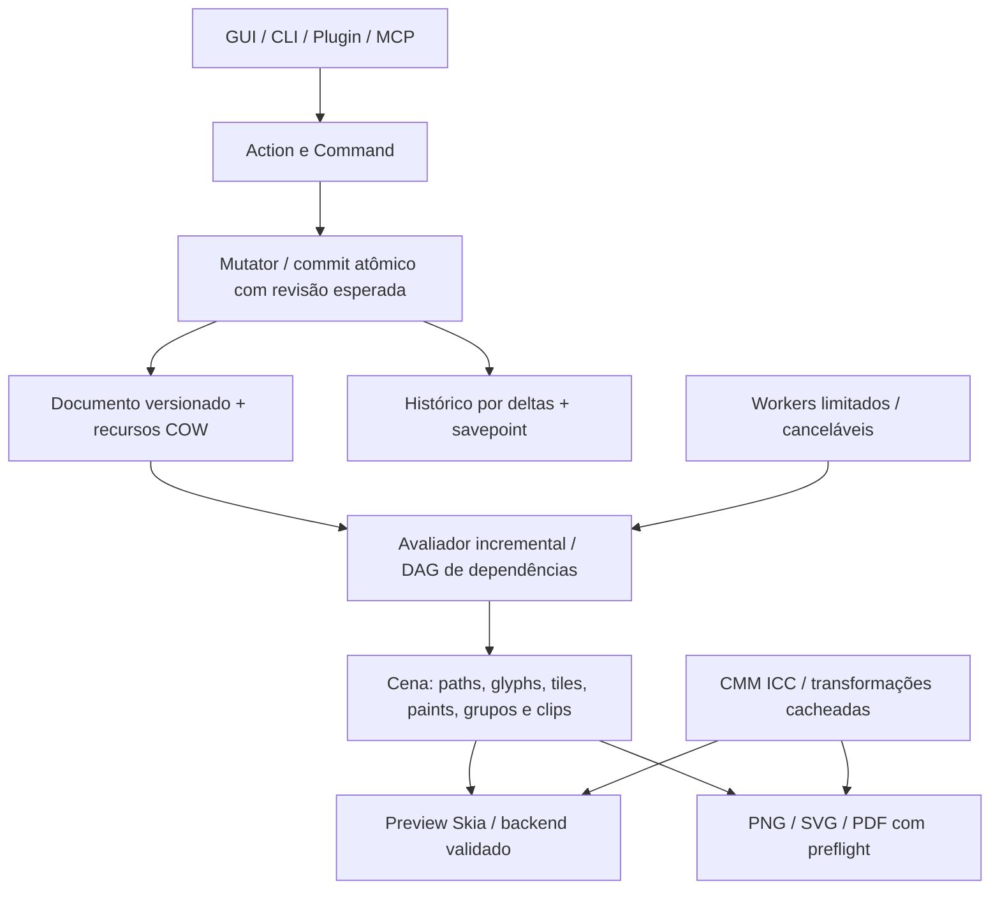

# Dossiê técnico independente — 30/09/2026

Auditoria iniciada em 30/09 e documentação concluída em 01/10/2026; a data no identificador fixa a baseline examinada.

O Petunia tem uma base Rust modular aproveitável, mas **a baseline auditada ainda não constitui um editor vetorial e bitmap funcional nem uma V1 para produção gráfica**. A distância principal está na correção e integração: a representação do documento não é interpretada igualmente pelo canvas, pelos exports e pelas ferramentas. Há caminhos invisíveis, pixels incorretos, operações raster não integradas e CMYK sem ICC real.

Este documento complementa e confronta as afirmações de `DOSSIER_V1_2026-09-30.md`, `ESTADO_ATUAL.md`, `PERF_REPORT_2026-09-23.md`, os atlas e ADRs. É uma auditoria da baseline, não um anúncio de funcionalidades concluídas nem uma alteração dos contratos ativos. O [plano de implementação](./implementation-roadmap-2026-09-30) transforma os achados em entregas MVP, V1 e futuras. CMYK verdadeiro e PDF profissional ficam explicitamente na V1 conforme a solicitação do usuário.

## Escopo, método e limites

- Repositório `raillen/petunia-design-studio`, commit `73447647a34f5b4be209415c36e6965c5f71b9b9`, solicitado a partir de main; checkout da plataforma na branch work. Inventário anterior a esta documentação: **679 arquivos rastreados; 169 Rust, 75.572 linhas, incluindo testes; 318 Markdown, 40.390 linhas**. São 152 Markdown sob docs, 129 no diretório exportado petunia-design-studio, além de raízes, arquivos de agente, artefatos e históricos. node_modules, target e código de dependências não entram nesses totais.
- Inventário e varredura de toda a árvore rastreada; análise transversal de símbolos, dependências, contratos, comentários, status e usos; leitura aprofundada dos caminhos críticos por subsistema; compilação, lint, testes, probes externos e inspeção de artefato PDF. A tabela abaixo registra todos os 20 membros e o [inventário com SHA-256](/audit/2026-09-30/inventory.json) permite fixar o escopo.
- Não equivale a revisão formal linha a linha de 75 mil linhas ou leitura semântica integral de todos os 318 Markdown. Não estabelece ausência de outros bugs, cobertura de todas as combinações de ferramentas ou teste manual de todas as telas. A documentação repetida/histórica foi catalogada e comparada em temas/contratos relevantes, não considerada autoridade apenas por existir.
- **Reproduzido:** probe demonstra o comportamento na baseline. **STATIC:** fluxo identificado por leitura; ainda requer teste focal de aceitação. **NOT VALIDATED:** integração/hardware ou UX não exercitados. P0 bloqueia a entrega indicada por perda, invisibilidade, falha de função principal ou promessa profissional incorreta; P1 corrige risco importante; P2 organiza dívida e evolução. Uma prioridade V1 não exige que todo recurso entre no MVP.
- O ambiente é Linux headless, 4 CPUs de quota e 32 GiB RAM, Rust 1.98.1. Freya/Skia compilaram; smoke tests GUI rodam com adaptador de teste. Não foi validada sessão gráfica real Wayland/X11, GPU, tablet, IME, impressão física, RIP ou monitor calibrado.
- A pesquisa consultou código e documentação públicos de Graphics Gems, One Euro Filter e LittleCMS por Git. A política de rede bloqueou vários sites de papers/especificações e documentação de produtos. Referências bibliográficas adicionais são identificadas como material a consultar; não alego ter lido textos integrais bloqueados ou conhecer código proprietário de Affinity/Adobe/Figma/Procreate.

## Verificação da baseline

| Verificação | Resultado | Interpretação |
| --- | --- | --- |
| cargo check --locked --workspace | Passou, incluindo app desktop | Compila; não prova fidelidade |
| cargo fmt --all --check | Passou | Formatação |
| xtask architecture | Passou | Fronteira domínio/GUI preservada no gate atual |
| xtask conformance | Passou | Save/reopen, undo/redo, export e automação exercitados; os probes mostram lacunas além desse gate |
| Testes headless de workspace, desktop excluído, --no-fail-fast | 555 passaram; 1 falhou; 0 ignorados | Falha no teste compositor_performance_with_many_objects_and_masks: limite de 50 ms em debug |
| Testes desktop: binário + click_smoke | 45 passaram (32 + 13) | Comportamento no harness Freya, não validação manual Linux |
| Mesmo teste de tempo, isolado em release | Passou | Exposição ao modo/hardware; não resolve a fragilidade do teste nem prova 60 fps |
| xtask verify / Clippy estrito | Falhou | Rust 1.98.1 reporta chunks_exact_to_as_chunks e large_enum_variant |
| Clippy completo sem -D warnings | Terminou; 10 locais únicos com warnings | 9 chunks_exact_to_as_chunks e 1 large_enum_variant; duplicatas lib/test não são novos achados |
| Docs e paridade i18n anteriores à auditoria | Passaram; 18 páginas canônicas espelhadas | Checker garante árvore simétrica e links/build, não equivalência semântica de tradução |
| Probes desta auditoria | 17 falhas/lacunas comportamentais reproduzidas + dimensão PDF confirmada | Asserts registram comportamento ruim atual; após correção devem ser convertidos em regressões do comportamento correto |

Os 600 testes aprovados acima são a soma dos dois conjuntos distintos; o teste release e os probes são verificações adicionais, não inflacionam esse total. Nenhum warning ou asserção foi desativado no repositório para obter resultado verde.

## Cobertura por subsistema

Arquivos e linhas incluem unit/integration tests. Cobertura abaixo é de inspeção e rastreio de contratos; não é percentual de cobertura executada.

| Membro | Rust | Linhas | Caminhos analisados | Achados relacionados |
| --- | ---: | ---: | --- | --- |
| foundation | 6 | 732 | IDs, namespaces, finitude e diagnósticos | F17, F22 |
| geometry | 12 | 3,122 | affine, Kurbo, booleans, cuts, offset, smooth, warp, measure | F18–F21 |
| color | 6 | 704 | valores, display, intent, proof, referências diferenciais | F16, F17, F36 |
| document | 13 | 8,028 | schema, hierarquia, mutator, changesets, appearance, modifiers, ajustes, dados | F01, F04, F22–F24, F37 |
| application | 24 | 10,923 | sessão, commands/actions, tools, caches, services, máscaras, merge | F02, F03, F14, F23–F27 |
| evaluation | 1 | 137 | resumo e fingerprint | F26 |
| raster | 4 | 555 | pixels, tiles, alpha e brush | F08–F10, F28 |
| render | 7 | 2,037 | blend, cena, composição, planner, compositor CPU | F05, F10, F11 |
| text | 7 | 1,640 | fontes, layout, story, on-path | F07 |
| io | 7 | 2,184 | package, image IO, PDF, SVG | F11–F15, F27, F37 |
| jobs | 4 | 264 | cancelamento e lifecycle | F29 |
| resources | 6 | 2,028 | packs, tokens, i18n e aliases | F17, F33, F34 |
| platform | 6 | 434 | clipboard, diálogos, ambiente e erros | F32 |
| extension | 5 | 716 | manifest, broker, host Lua | F30 |
| mcp | 4 | 889 | protocol e server interno | F31 |
| shell | 43 | 24,166 | bridge, snapshot, ferramentas, painéis, menus, overlays e snapping | F01–F08, F25, F32, F33 |
| testkit | 2 | 363 | fixtures e benchmark | F35 |
| petunia-design | 10 | 15,829 | Freya, pintura, docking, dialogs, actions, theme, smoke | F04, F06, F07, F29, F32, F33 |
| petunia-design-cli | 1 | 398 | conformance e integração headless | F35, F36 |
| xtask | 1 | 423 | verify, architecture, conformance, gates e CI | F35 |

## O que preservar e como reorganizar

A fronteira domínio/GUI, IDs estáveis, Action→Command→Mutator→ChangeSet, modificadores live, Kurbo/i_overlay, compartilhamento Arc, R-tree e testes headless são boas fundações. Não há evidência para justificar trocar Freya por outro toolkit, reescrever booleans do zero ou iniciar um renderer GPU próprio antes de acertar contratos e fidelidade.

A arquitetura recomendada tem um documento canônico versionado, recursos binários identificados por hash, índices por ID e uma cena avaliada incremental. A cena contém geometria local + matriz world, paints tipados, glyph runs, imagens/tiles, árvore de grupos, máscaras e bounds visuais. Preview e exports usam a mesma avaliação; cada backend declara o que preserva, rasteriza explicitamente ou não suporta. GPU acelera essa representação sem se tornar o armazenamento do documento.

Árvore de cena e DAG de dependências têm funções diferentes: uma descreve ordem/composição; o outro invalida resultados de geometria, recursos, ajustes e efeitos. Um cache deve declarar entrada, geração, tolerância, perfil, espaço de cor, precisão, região e orçamento. Mudar câmera ou seleção não deve obrigar a recalcular toda a geometria. Antes de SIMD ou GPU compute, corrigir alpha, clipping, topologia e origem da prancheta.

## Registro de achados

Os links de código apontam para o commit auditado, evitando que uma alteração posterior mude a evidência. Um achado pode agrupar sintomas com a mesma causa; os 37 registros não são uma contagem de CVEs nem todos são falhas reproduzidas.

### F01 · Caminhos explícitos ficam invisíveis

**P0 · MVP · PROBE-08** — [crates/petunia_design_document/src/document_object.rs:252](https://github.com/raillen/petunia-design-studio/blob/73447647a34f5b4be209415c36e6965c5f71b9b9/crates/petunia_design_document/src/document_object.rs#L252)

O contrato local rejeita todo ShapeKind::Path como AmbiguousPath. O cache transforma o erro em ausência de outline, e o painter não desenha caminhos sem outline. O probe abre um triângulo válido: existe um objeto no snapshot, mas nenhuma geometria desenhável. Caneta, lápis e operações que geram Path também dependem desse contrato. Persistir o espaço de coordenadas e a versão da geometria; migrar arquivos antigos explicitamente; atualizar todos os produtores e consumidores. Aceite: criar, editar, transformar, agrupar, salvar, reabrir e exportar caminhos com pixels e hit test equivalentes, incluindo dados legados.

### F02 · Documento reaberto inicia com índice espacial vazio

**P0 · MVP · PROBE-12** — [crates/petunia_design_application/src/spatial_index.rs:72](https://github.com/raillen/petunia-design-studio/blob/73447647a34f5b4be209415c36e6965c5f71b9b9/crates/petunia_design_application/src/spatial_index.rs#L72)

Um índice novo e um documento restaurado têm revisão zero. A igualdade é interpretada como cache válido, embora a árvore esteja vazia. A consulta no centro de uma elipse retorna zero candidatos antes da primeira mutação. Separar índice não inicializado de índice vazio válido, usando Option de geração ou marcador explícito. Aceite: hit test e seleção funcionam imediatamente após abrir/importar, com árvore vazia, undo/redo e troca de sessão.

### F03 · Caches derivados aceitam polígonos de uma revisão anterior

**P1 · MVP · PROBE-04** — [crates/petunia_design_application/src/geo_cache.rs:258](https://github.com/raillen/petunia-design-studio/blob/73447647a34f5b4be209415c36e6965c5f71b9b9/crates/petunia_design_application/src/geo_cache.rs#L258)

Após mover uma forma de x=10 para x=100, consultar bounds renova a entrada principal, mas não invalida os polígonos por tolerância. A próxima consulta devolve a geometria antiga porque verifica a revisão de outra entrada. Usar chaves com geração da geometria e tolerância, ou invalidar flats e world_flats atomicamente ao renovar a entrada. Aceite: permutações das consultas bounds/path/polygons, transformação de ancestrais, undo/redo e múltiplas tolerâncias não alteram o resultado.

### F04 · A pilha de aparência não chega completa ao canvas

**P0 · MVP · STATIC** — [crates/petunia_design_shell/src/canvas/snapshot.rs:213](https://github.com/raillen/petunia-design-studio/blob/73447647a34f5b4be209415c36e6965c5f71b9b9/crates/petunia_design_shell/src/canvas/snapshot.rs#L213)

O snapshot transfere fill/stroke legados, e não a pilha completa de paints, opacidades e blends. sync_legacy_from_stack remove o fill legado para gradientes; o painter não implementa shaders de gradiente dessa pilha. Há stroke sólido implementado: o problema é perder a semântica moderna, fills/strokes secundários e aparência por entrada. Criar DTO de cena derivado da AppearanceStack, sem estado visual paralelo. Aceite: fixtures de gradientes, múltiplos fills/strokes, dash, alinhamento, opacidade e blend são iguais em preview e saída.

### F05 · Clipping vazio e composição de grupos não têm contrato único

**P1 · MVP · PROBE-14 + STATIC** — [crates/petunia_design_render/src/composition.rs:98](https://github.com/raillen/petunia-design-studio/blob/73447647a34f5b4be209415c36e6965c5f71b9b9/crates/petunia_design_render/src/composition.rs#L98)

Dois clips disjuntos geram None, que também significa sem clipping. Esse helper é atualmente desconectado dos caminhos de produção: a falha reproduzida é latente, não prova que toda tela já a executa. O snapshot plano também não transporta uma árvore completa de isolamento, máscaras e visibilidade ancestral. Introduzir Clip::Unbounded/Empty/Shape e renderizar grupos isolados em superfícies intermediárias. Aceite: clips disjuntos produzem zero pixels; esconder um grupo esconde seus filhos; opacidade de grupo não é aplicada individualmente aos filhos sobrepostos.

### F06 · Imagens são decodificadas durante a pintura e ignoram propriedades

**P1 · MVP · STATIC** — [apps/petunia-design/src/canvas_paint.rs:1343](https://github.com/raillen/petunia-design-studio/blob/73447647a34f5b4be209415c36e6965c5f71b9b9/apps/petunia-design/src/canvas_paint.rs#L1343)

Cada pintura copia bytes e decodifica a imagem, ou lê o arquivo externo. _opacity não é usada, a geometria desenhada é um retângulo de tela sem aplicar a matriz completa e há mínimo de 10 pixels, alterando imagens pequenas. Ajustes e prova não passam por esse caminho. Resolver recursos fora do frame, cachear imagem decodificada por hash/perfil, usar matriz e opacity reais e gerar mipmaps sob orçamento. Aceite: rotação, escala, opacidade, ajustes e reabertura equivalentes; zero leitura/decodificação em frames de imagem inalterada.

### F07 · Layout, edição e pintura de texto divergem

**P0 · MVP · STATIC** — [apps/petunia-design/src/canvas_paint.rs:460](https://github.com/raillen/petunia-design-studio/blob/73447647a34f5b4be209415c36e6965c5f71b9b9/apps/petunia-design/src/canvas_paint.rs#L460)

O painter usa Font::default e draw_str, não a família, as linhas e os glyph runs calculados pelo domínio; há tamanho mínimo de tela. O layout usa shaping Basic e quebra por escalares, apesar de existir caminho Advanced. Peso/itálico no cache não bastam se não chegam aos atributos de shaping. Usar um resultado único de shaping com clusters, bidi, fallback, métricas e posicionamento; caret/seleção por grafemas e IME. Aceite: português com acentos combinantes, ligaturas, árabe, emoji e CJK, multilinha, texto no caminho, zoom e PDF mantêm layout e cursor coerentes.

### F08 · O pipeline de pixels ainda não é uma camada editável persistente

**P0 · MVP · STATIC** — [crates/petunia_design_shell/src/canvas/snapshot.rs:233](https://github.com/raillen/petunia-design-studio/blob/73447647a34f5b4be209415c36e6965c5f71b9b9/crates/petunia_design_shell/src/canvas/snapshot.rs#L233)

O snapshot sempre envia raster_tiles vazio. A ferramenta Photo recusa brush/eraser antes do gesto por falta de camada de pixels canônica. TileMap e pintura de tiles existem, mas isso não estabelece edição bitmap integrada, salvamento ou undo. Implementar PixelLayer e MaskLayer como recursos do documento com comandos de diferenças de tiles; ligar gesto, preview, histórico, pacote e export. Aceite: pincel, borracha, seleção e máscara alteram pixels reais; undo de um stroke restaura os mesmos tiles; fechar/reabrir preserva o resultado.

### F09 · A borracha não apaga

**P0 · MVP · PROBE-01** — [crates/petunia_design_raster/src/brush.rs:118](https://github.com/raillen/petunia-design-studio/blob/73447647a34f5b4be209415c36e6965c5f71b9b9/crates/petunia_design_raster/src/brush.rs#L118)

eraser_dab usa alpha zero, e stamp_onto ignora a contribuição com alpha zero. Um pixel vermelho opaco permanece idêntico. Apagar exige DestinationOut: multiplicar cor premultiplicada e alpha de destino por (1-cobertura), independentemente da cor da borracha. Aceite: apagar parcial/total, pressão, dureza, máscara/seleção, Rgba8/Rgba16, coordenadas negativas e undo; comparar contra um compositor de referência.

### F10 · Blending e convenção de alpha estão duplicados

**P1 · MVP · PROBE-02 + STATIC** — [crates/petunia_design_raster/src/brush.rs:30](https://github.com/raillen/petunia-design-studio/blob/73447647a34f5b4be209415c36e6965c5f71b9b9/crates/petunia_design_raster/src/brush.rs#L30)

Multiply de vermelho opaco sobre preto transparente retorna preto opaco no raster; o compositor de render retorna vermelho. Há implementações duplicadas e conversões que não preservam AlphaMode. O adaptador Skia declara Premul: bytes Straight precisam ser convertidos corretamente. Consolidar blending com Porter–Duff, explicitar associação de alpha e espaço linear/perceptual por operação. Aceite: vetores de referência com alpha 0/0,5/1, todos os modos suportados, ida/volta 8/16 bits e bordas sem halos.

### F11 · O PNG usa retângulos e aplica opacidade duas vezes

**P0 · MVP · PROBE-13, PROBE-16** — [crates/petunia_design_render/src/pixel_compositor.rs:517](https://github.com/raillen/petunia-design-studio/blob/73447647a34f5b4be209415c36e6965c5f71b9b9/crates/petunia_design_render/src/pixel_compositor.rs#L517)

O compositor usado pela exportação pinta bounds, não cobertura do caminho. Um pixel fora de um triângulo fica vermelho. fill_color incorpora a opacidade, e fill_rect recebe a mesma opacidade novamente: objeto 50% gera alpha 64, aproximadamente 25%. Gradientes viram amostras centrais; imagens/texto também não têm fidelidade completa nesse motor. Compartilhar cena avaliada e implementar cobertura/antialias, paints e alpha uma única vez. Aceite: PNG comparado pixel a pixel com uma referência aprovada para shapes, texto, imagens, masks e efeitos.

### F12 · PDF ignora tamanho real e exclusão da prancheta

**P0 · MVP / V1 · PROBE-10, PROBE-15** — [crates/petunia_design_io/src/pdf.rs:140](https://github.com/raillen/petunia-design-studio/blob/73447647a34f5b4be209415c36e6965c5f71b9b9/crates/petunia_design_io/src/pdf.rs#L140)

Uma superfície 800×600 gera página A4 595,28×841,89 pt; uma superfície com export_enabled=false também é exportada. MediaBox, origem, seleção e paginação precisam derivar das superfícies incluídas. Separar fallback para documento sem superfície de dimensões explicitamente definidas. Aceite: várias pranchetas, origem negativa, dimensões arbitrárias, exclusão e ordem; na V1 adicionar TrimBox/BleedBox/CropBox com unidades e sangria validadas.

### F13 · PDF não preserva conteúdo profissional

**P0 · V1 · STATIC** — [crates/petunia_design_io/src/pdf.rs:240](https://github.com/raillen/petunia-design-studio/blob/73447647a34f5b4be209415c36e6965c5f71b9b9/crates/petunia_design_io/src/pdf.rs#L240)

Texto/imagens sem outline caem em retângulos substitutos; a exportação usa geometria legada e rotação própria, sem toda a transformação ancestral do canvas. Gradientes centrais, efeitos omitidos, blend normal e aparência primária não preservam o projeto. DeviceCMYK quantizado não significa CMYK gerenciado; não há OutputIntent ICC nesse caminho. Implementar glyphs/font embedding/subsetting, imagens reais, transforms, grupos e paints. Aceite V1: PDF/X-4 com perfil, fontes e transparência, preflight e comparação por renderizador independente; substitutos nunca devem passar silenciosamente.

### F14 · Relatórios e gravação de exportação transmitem confiança excessiva

**P1 · MVP · STATIC** — [crates/petunia_design_io/src/pdf.rs:120](https://github.com/raillen/petunia-design-studio/blob/73447647a34f5b4be209415c36e6965c5f71b9b9/crates/petunia_design_io/src/pdf.rs#L120)

allow_degradations=false bloqueia apenas classes destrutivas/unsupported, não toda aproximação visual. Token desconhecido pode virar cinza com grau EquivalentAppearance; relatório passed não prova fidelidade. ExportService usa defaults permissivos e grava diretamente com fs::write. Definir fidelidade por capacidade e evidência, propagar opções da UI e usar escrita temporária/rename para saídas. Aceite: cada aproximação exige política explícita, perdas são listadas antes da exportação e falha/cancelamento preservam o arquivo anterior.

### F15 · SVG é um subconjunto estreito com perda e XML frágil

**P1 · MVP · PROBE-19 + STATIC** — [crates/petunia_design_io/src/svg.rs:36](https://github.com/raillen/petunia-design-studio/blob/73447647a34f5b4be209415c36e6965c5f71b9b9/crates/petunia_design_io/src/svg.rs#L36)

O parser rejeita SVG válido compacto M0,0L10,20Z, não suporta arcos e repetições implícitas, e Close não restabelece o ponto inicial para relativas subsequentes. A saída fixa viewBox 1920×1080, amostra gradientes, substitui texto e perde transforms ancestrais. textPath inclui xlink:href sem declarar xmlns:xlink; comentários com nomes contendo -- também precisam de tratamento XML. Adotar parser SVG estabelecido e escopo de importação explícito, defs de paints, geometria e serializer XML. Aceite: corpus real, coordenadas fracionárias sem arredondamento destrutivo e validação por parser/renderizador independente.

### F16 · CMYK verdadeiro e prova ICC ainda não existem

**P0 · V1 · PROBE-07 + STATIC** — [crates/petunia_design_color/src/transform.rs:25](https://github.com/raillen/petunia-design-studio/blob/73447647a34f5b4be209415c36e6965c5f71b9b9/crates/petunia_design_color/src/transform.rs#L25)

transform_via_profile retorna CapabilityUnavailable. Perfis SWOP e FOGRA produzem a mesma heurística; nomes substituem leitura de ICC, intenção é ignorada no display, TAC é uniforme e distância RGB não é ΔE00. Lab é descrito como D50 mas exibido via constantes D65 sem adaptação explícita. O usuário exige ICC na V1, contrariando o POST_V1 atual. Propor ADR de mudança de escopo e um CMM validado: perfis por bytes/hash, PCS, intents, BPC, proof, monitor, preservação de preto e DeviceLink quando aplicável. Aceite: preservar canais CMYK, comparar com LittleCMS, casos cromáticos D50/D65, spots/separações e PDF com OutputIntent correto.

### F17 · Parsing de cor pode causar panic e substituir valores

**P0 · MVP · PROBE-11 + STATIC** — [crates/petunia_design_document/src/appearance.rs:119](https://github.com/raillen/petunia-design-studio/blob/73447647a34f5b4be209415c36e6965c5f71b9b9/crates/petunia_design_document/src/appearance.rs#L119)

O token #€abc passa pelo comprimento em bytes e é fatiado no meio de UTF-8, causando panic. Parsers duplicados entre documento, UI e PDF interpretam valores de forma diferente; tokens desconhecidos viram cinza. ColorValue tipado existe, mas paints persistem strings e não um contrato gerenciado completo. Separar cor literal, referência de swatch e erro; migrar para representação tipada com perfil sem converter o original para display. Aceite: entrada malformada nunca causa panic, fuzz limitado, diagnósticos consistentes e round trip sem perda de identidade.

### F18 · Diferença booleana com operando vazio destrói A

**P1 · MVP · PROBE-03** — [crates/petunia_design_geometry/src/boolean.rs:84](https://github.com/raillen/petunia-design-studio/blob/73447647a34f5b4be209415c36e6965c5f71b9b9/crates/petunia_design_geometry/src/boolean.rs#L84)

A−∅ retorna vazio, embora deva retornar A. Tratar os elementos neutros/absorventes antes do motor e definir orientação, holes e fill rule. Aceite: identidades algébricas com vazios, degenerados, auto-interseções, contatos tangenciais, holes e coordenadas em escalas diferentes; verificar área/topologia e não apenas quantidade de pontos.

### F19 · Simplificação perde excursões com extremos coincidentes

**P1 · MVP · PROBE-06** — [crates/petunia_design_geometry/src/smooth.rs:18](https://github.com/raillen/petunia-design-studio/blob/73447647a34f5b4be209415c36e6965c5f71b9b9/crates/petunia_design_geometry/src/smooth.rs#L18)

A sequência (0,0)→(20,0)→(0,0), tolerância 0,1, perde o ponto distante. Quando a corda tem comprimento zero, a distância não pode ser considerada zero para todos os pontos. Corrigir segmento degenerado e separar simplificação de polylines de ajuste de Bézier. Para lápis, considerar Schneider com erro geométrico limitado e One Euro com timestamp, preservando cantos e pressão. Aceite: extremos coincidentes, laços, cuspides, zoom e taxa de amostragem variável; bound do erro medido, não apenas redução de nós.

### F20 · Offset descarta componentes desconectados

**P1 · MVP · PROBE-17** — [crates/petunia_design_geometry/src/offset.rs:80](https://github.com/raillen/petunia-design-studio/blob/73447647a34f5b4be209415c36e6965c5f71b9b9/crates/petunia_design_geometry/src/offset.rs#L80)

A expansão escolhe apenas o maior contorno de um stroke band. Duas caixas desconectadas viram um único componente. Isso não representa offset geral de caminhos compostos e holes. Usar união/erosão topológica sobre todos os componentes, com fill rule, joins/caps e tolerância explícitos; preservar o original como modificador live. Aceite: componentes separados, anéis, concavidades, colapso no inset e caminhos abertos; expansão não pode apagar partes válidas.

### F21 · Precisão geométrica precisa de orçamento e corpus

**P2 · MVP / V1 · STATIC + CHECK-18** — [crates/petunia_design_geometry/src/warp.rs:48](https://github.com/raillen/petunia-design-studio/blob/73447647a34f5b4be209415c36e6965c5f71b9b9/crates/petunia_design_geometry/src/warp.rs#L48)

Há tolerâncias absolutas fixas, flattening para cortes/warp e solução de homografia sem normalização explícita de escala. Isso exige testes de condicionamento e documentação de erro, não reescrita indiscriminada do Kurbo/i_overlay. A hipótese de que um segmento distante cortava uma caixa foi testada e rejeitada (CHECK-18). Definir tolerância em documento e pixels, limites numéricos e predicates robustos onde necessário. Aceite: escalas extremas, near-collinear, vanishing line, paths com holes; distinguir operações destrutivas explícitas de modificadores live.

### F22 · Carga de documento aceita hierarquia inválida

**P0 · MVP · PROBE-09 + STATIC** — [crates/petunia_design_document/src/document.rs:421](https://github.com/raillen/petunia-design-studio/blob/73447647a34f5b4be209415c36e6965c5f71b9b9/crates/petunia_design_document/src/document.rs#L421)

Um objeto cujo parent é ele próprio passa pelo decoder; world_transform_checked rejeita depois, mas is_descendant percorre pais sem visited. Validação tardia não protege todos os consumidores. O modelo público também permite surface_mut/find_object_mut contornando Mutator e revisão. Validar unicidade de IDs, referências, ciclos, finitude, bounds, formatos/tamanhos e recursos no ingresso; restringir mutações em produção. Aceite: nenhum arquivo aceito viola invariantes; erro indica o objeto; consumidores não travam com dados inválidos; migração tem fixtures.

### F23 · Commit de transação pode substituir uma alteração intermediária

**P0 · MVP · PROBE-05** — [crates/petunia_design_application/src/transaction.rs:73](https://github.com/raillen/petunia-design-studio/blob/73447647a34f5b4be209415c36e6965c5f71b9b9/crates/petunia_design_application/src/transaction.rs#L73)

Transaction clona o documento e commit o substitui sem checar revisão/base. Uma mutação válida feita entre begin e commit desaparece. O fluxo síncrono atual reduz a exposição a concorrência; o risco é concreto na API pública e se torna crítico ao adicionar workers/plugins. Adotar commit com revisão esperada e mudanças validadas atomicamente; preview separado com COW/deltas e cancelamento sem efeitos. Aceite: commit desatualizado é rejeitado ou rebaseado explicitamente, um gesto gera uma entrada de undo e falha deixa documento/histórico intactos.

### F24 · Histórico sem orçamento e replay falível ameaçam sessões longas

**P1 · MVP · STATIC** — [crates/petunia_design_application/src/session.rs:165](https://github.com/raillen/petunia-design-studio/blob/73447647a34f5b4be209415c36e6965c5f71b9b9/crates/petunia_design_application/src/session.rs#L165)

Sessões usam histórico ilimitado. Changesets podem carregar clones de objetos/geometrias/imagens, transações clonam o documento inteiro e histórico limitado usa remoção no início de Vec. Undo/redo retiram a entrada antes de replay falível; faltam garantias de rollback completo. A revisão monotônica usada para dirty também não representa voltar ao conteúdo salvo. Usar COW/deltas, orçamento em bytes, VecDeque e replay atômico; savepoint por estado do histórico/conteúdo. Aceite: 10 mil gestos sob orçamento, undo com erro injetado conserva pilhas/estado e voltar ao savepoint limpa dirty.

### F25 · Consultas lineares e rebuild de cena elevam o custo de cache miss

**P1 · MVP · STATIC + BENCH** — [crates/petunia_design_document/src/document.rs:227](https://github.com/raillen/petunia-design-studio/blob/73447647a34f5b4be209415c36e6965c5f71b9b9/crates/petunia_design_document/src/document.rs#L227)

find_object procura linearmente; transforms percorrem ancestrais com novas buscas. Construir todas as entradas pode ter componente quadrático; várias leituras clonam GeoCacheEntry/GPath. O snapshot recompõe a cena por revisão/seleção e filtra todas as projeções mesmo em cache hit. Preservar os bons Arc e R-tree existentes; acrescentar índice ID→localização, gerações por objeto/dependência e estado de seleção separado. Aceite: medir cold/warm, objetos visíveis/totais e edição de um objeto; custo depende da região afetada e não de serializar/reavaliar toda a cena.

### F26 · O avaliador serializa o documento antes de reconhecer cache hit

**P2 · MVP · STATIC** — [crates/petunia_design_evaluation/src/lib.rs:81](https://github.com/raillen/petunia-design-studio/blob/73447647a34f5b4be209415c36e6965c5f71b9b9/crates/petunia_design_evaluation/src/lib.rs#L81)

Fingerprint usa JSON pretty e percorre todos os bytes a cada evaluate. Mesmo cache hit aloca e percorre o documento. Esse caminho é de resumo/avaliação, não foi provado como custo em todo frame GUI. Usar revisão estrutural confiável ou hashes incrementais, com validação contra mutações fora do pipeline. Aceite: resumo repetido sem mudança não serializa, alteração relevante invalida, e o resultado é igual ao cálculo completo.

### F27 · Exportar prancheta distante aloca o espaço até sua origem

**P1 · MVP · STATIC** — [crates/petunia_design_application/src/export_service.rs:265](https://github.com/raillen/petunia-design-studio/blob/73447647a34f5b4be209415c36e6965c5f71b9b9/crates/petunia_design_application/src/export_service.rs#L265)

PNG aloca (max(origem,0)+dimensão) e recorta depois. Uma prancheta pequena muito distante pode exigir enorme buffer; origem negativa também perde conteúdo. O caminho usa 1 pixel por ponto e não estabelece DPI selecionável. Multiplicações de buffers precisam de overflow e orçamento explícitos. Renderizar no sistema local da prancheta, escalar por DPI/72, fazer checked arithmetic e dividir em tiles quando necessário. Aceite: origens ±10⁶, mesma arte em 72/150/300 DPI, limites de memória, erro controlado e cancelamento.

### F28 · Tiles não têm orçamento, persistência incremental e contrato portátil completo

**P1 · MVP / V1 · STATIC** — [crates/petunia_design_raster/src/tile.rs:243](https://github.com/raillen/petunia-design-studio/blob/73447647a34f5b4be209415c36e6965c5f71b9b9/crates/petunia_design_raster/src/tile.rs#L243)

TileMap não fornece orçamento com eviction/spill; stamping consulta mapa por pixel e commit visita os tiles. Dados 16-bit e alpha precisam de representação persistida com endian explícito; coordenadas/extensões e raio de brush precisam de limites. Usar acesso por tile/scanline, lista de tiles dirty, COW e armazenamento de recursos por hash. SIMD vem depois de correção e profiling, com caminho escalar de referência. Aceite: imagem grande em zoom parcial sem decodificar tudo, dirty proporcional ao stroke, round trip entre plataformas e cancelamento sob memória limitada.

### F29 · Tarefas de fundo são registros, não um executor conectado

**P1 · MVP · STATIC** — [crates/petunia_design_jobs/src/manager.rs:65](https://github.com/raillen/petunia-design-studio/blob/73447647a34f5b4be209415c36e6965c5f71b9b9/crates/petunia_design_jobs/src/manager.rs#L65)

spawn_job marca Running e registra estado, sem executar trabalho. O painel tem + Simular, PDF 300 DPI e progresso 65 sintéticos. Import/export e decodificação síncronos podem bloquear a UI; complete_job pode sobrescrever Cancelled. Implementar executor limitado por CPU/memória, estados válidos, progresso real e publicação por revisão esperada/Command. Aceite: operação grande mantém interação, cancelamento não escreve saída parcial nem muda documento, job cancelado não vira sucesso e demo fica somente em exemplos/testes.

### F30 · Sandbox Lua limita bibliotecas, mas não CPU e memória

**P1 · V1 · STATIC** — [crates/petunia_design_extension/src/host.rs:96](https://github.com/raillen/petunia-design-studio/blob/73447647a34f5b4be209415c36e6965c5f71b9b9/crates/petunia_design_extension/src/host.rs#L96)

O host restringe OS/IO/package/debug e usa broker de permissões, escolhas boas. Não há orçamento de instruções, deadline nem limite de memória configurado; init/action executam de modo síncrono. Script autorizado ainda pode travar ou consumir memória. Não executei loop infinito para testar. Configurar hooks/quotas, isolamento em worker, cancelamento, limites de logs e rollback de permissões ao falhar load. Aceite: scripts adversariais terminam em erro limitado sem congelar GUI; nenhuma escrita contorna Command.

### F31 · Servidor JSON-RPC interno não comprova interoperabilidade MCP

**P2 · V1 / Future · STATIC** — [crates/petunia_design_mcp/src/server.rs:14](https://github.com/raillen/petunia-design-studio/blob/73447647a34f5b4be209415c36e6965c5f71b9b9/crates/petunia_design_mcp/src/server.rs#L14)

Métodos ptnd.* e testes internos não equivalem ao handshake initialize, tools/list, tools/call e transporte padrão MCP. Não identifiquei servidor de rede exposto nesse caminho: não há base para afirmar vulnerabilidade remota em produção. Manter API de domínio e adicionar adaptador de protocolo versionado, autenticação quando houver transporte remoto e revisão esperada obrigatória para writes concorrentes. Aceite: cliente MCP independente descobre e chama tools; limites, cancelamento e diagnósticos funcionam. Automação básica CLI pode ficar no MVP.

### F32 · Linux exige validação real de pen, IME, clipboard e acessibilidade

**P1 · MVP · STATIC / NOT VALIDATED** — [crates/petunia_design_application/src/interaction.rs:59](https://github.com/raillen/petunia-design-studio/blob/73447647a34f5b4be209415c36e6965c5f71b9b9/crates/petunia_design_application/src/interaction.rs#L59)

A estrutura aceita pressão, mas eventos GUI inspecionados usam construtores normalizados sem aquisição de pressão/tilt/timestamp de tablet. Serviços headless de clipboard/dialog não provam integração nativa. Smoke tests Freya não verificam Wayland/X11, AT-SPI/Orca, IME ou portal em sandbox. Implementar adaptadores com capabilities e testar máquina Linux real: escala fracionária, múltiplos monitores, fallback software, clipboard SVG/bitmap, IME e tablet. Aceite: evidência por backend/dispositivo e limitação visível quando ausente; manter domínio independente da GUI.

### F33 · Painéis extensos e estados silenciosos comprometem usabilidade

**P1 · MVP · STATIC / NOT VALIDATED** — [apps/petunia-design/src/dock.rs:2004](https://github.com/raillen/petunia-design-studio/blob/73447647a34f5b4be209415c36e6965c5f71b9b9/apps/petunia-design/src/dock.rs#L2004)

Há muitos textos literais pt/en fora do catálogo, erros de comandos descartados com let _, controles demonstrativos e grande concentração de lógica nos arquivos dock/main/canvas_paint. Presença do painel não demonstra fluxo utilizável. Separar view-model/command feedback, foco/captura de pointer, estado misto de multisseleção, unidades, atalhos e reasons de capability. Não presumir que todos os atalhos/diálogos falham: falta evidência humana. Aceite: completar cinco projetos de teste sem workaround, navegação por teclado e leitores de tela, mensagens recuperáveis e zero ação silenciosamente ignorada.

### F34 · Documentação ativa contradiz stack e capacidade real

**P1 · MVP · STATIC** — [docs/developers/index.md:41](https://github.com/raillen/petunia-design-studio/blob/73447647a34f5b4be209415c36e6965c5f71b9b9/docs/developers/index.md#L41)

A documentação living descreve Slint, o código usa Freya/Skia, e AUTHORITY_MAP ainda marca páginas GPUI como canonical. O diretório petunia-design-studio contém 129 Markdown adicionais exportados, além de docs e históricos. Status Wired/PROVEN pode demonstrar dispatch ou painel, mas não fidelidade de pixels, ICC ou exportação. Eleger autoridade única por contrato, registrar migrações/ADRs e distinguir implementado, integrado, validado e indisponível. Aceite: cada requisito aponta para dono, implementação, teste, versão e limitação; paridade de arquivos i18n não é alegada como tradução semântica.

### F35 · Gates verdes não medem fidelidade e o verify atual falha

**P1 · MVP · CHECKS** — [xtask/src/main.rs:21](https://github.com/raillen/petunia-design-studio/blob/73447647a34f5b4be209415c36e6965c5f71b9b9/xtask/src/main.rs#L21)

architecture e conformance passam, mas as falhas acima também. verify falha em Clippy -D warnings no Rust 1.98.1; o stable flutuante torna a baseline variável. Uma asserção de tempo <50 ms falha em debug e passa isolada em release, sem provar desempenho de frames. ui-gauntlet/fuzz-smoke são stubs e security pode usar só manifest backstop se cargo-audit faltar. canvas_benchmark ignora argumentos enviados por xtask e mede snapshot, não pintura. Fixar toolchain testado e implantar gates reais de pixels, arquivos, fuzz limitado, dependências e UX; não desligar warnings/asserts para anunciar sucesso.

### F36 · Código desconectado precisa de decisão de destino

**P2 · MVP · STATIC** — [crates/petunia_design_color/src/transform.rs:30](https://github.com/raillen/petunia-design-studio/blob/73447647a34f5b4be209415c36e6965c5f71b9b9/crates/petunia_design_color/src/transform.rs#L30)

IsolationGroup/EffectiveContext só têm uso local/tests e reexport; raster_tiles vazio desconecta o painter de tiles; brush aparece em CLI/teste, não em PixelLayer persistente; moxcms é dependência normal, mas seu adaptador atual é cfg(test). Isso identifica candidatos, não prova que toda API pública é inútil. Para cada candidato decidir conectar, mover para dev/example, depreciar ou remover, verificando API pública e detach. Aceite: inventário com proprietário e teste do fluxo; nenhuma remoção apenas porque rg não encontrou chamada.

### F37 · Pacote nativo tem rename atômico, mas falta durabilidade e limites

**P1 · MVP · STATIC** — [crates/petunia_design_io/src/package.rs:258](https://github.com/raillen/petunia-design-studio/blob/73447647a34f5b4be209415c36e6965c5f71b9b9/crates/petunia_design_io/src/package.rs#L258)

Salvar em temporário no mesmo diretório e rename é uma base boa. O nome fixo .tmp conflita em saves concorrentes e não usa criação exclusiva; não há sync_all do arquivo/diretório nem journal de recuperação nesse caminho. Abrir ZIP lê JSON descomprimido sem orçamento explícito. Artwork embutida em JSON também multiplica buffers/clones. Usar temporário exclusivo, flush/fsync e publicação conforme plataforma, limites de entries/tamanho/ratio e recursos binários separados com hashes. Aceite: queda/falta de disco/falha de rename, saves simultâneos, ZIP adversarial e recuperação preservam último documento válido.

## Desempenho: evidência e decisões

O probe usa 500 e 2.000 retângulos iguais, todos visíveis, uma chamada cold e média de 50 chamadas warm de canvas_snapshot. Criação do documento fica fora do cronômetro. Não mede pintura Skia, latência de input, upload GPU, memória ou exportação. Logs [debug](/audit/2026-09-30/probes-debug.txt) e [release](/audit/2026-09-30/probes-release.txt) registram os valores e modo. É diagnóstico sintético de invalidação, sem isolamento estatístico; não deve virar promessa de FPS. O salto cold motivou F25, junto com a evidência de buscas lineares.

| Objetos visíveis | Release: snapshot cold | Release: média warm (50 chamadas) |
| ---: | ---: | ---: |
| 500 | 1,853 ms | 52,830 µs |
| 2.000 | 11,476 ms | 208,591 µs |

Uma única amostra cold por cenário não comprova uma curva assintótica; a leitura do algoritmo e um benchmark controlado precisam confirmar a causa e o ganho de qualquer mudança.

Otimização deve seguir esta ordem: corrigir resultado → medir caso real → remover serialização/clone/I/O do caminho → indexar e invalidar somente dependências afetadas → cachear por orçamento → processar tiles/scanlines → considerar SIMD e GPU. Não usar aproximação visual silenciosa para ganhar desempenho. Effects precisam de bounds expandidos, dirty rects e tiles de halo; culling só por bounds geométricos pode retirar um blur/sombra ainda visível.

| Área | Estratégia | Medição exigida |
| --- | --- | --- |
| Geometria | IDs indexados, geração por objeto/ancestral, tolerância proporcional ao zoom | Cold/warm, alteração de 1/100/10.000 objetos, hit test e snapping p95/p99 |
| Cena | Geometria imutável compartilhada, seleção/overlays separados, região visível indexada | Tempo de construção, alocações, custo com 1%/100% visível |
| Raster | Tiles COW, dirty regional, decoded/mip cache limitado, scanline/SIMD validado | MP/s, bytes por stroke, RSS/VRAM, eviction, latência durante export |
| Texto | Shape/layout compartilhado, invalidar runs afetados, cache LRU por bytes | Story longa, font fallback, edição de grafema, consistência com PDF |
| Cor | Transform ICC cacheado por hashes + formatos + intent/flags | Precisão contra referência, throughput por tile e invalidar perfil |
| Histórico/IO | Deltas, blobs separados, streaming, checkpoint/recovery | Tamanho do projeto/histórico, saves grandes, erro/cancelamento |

## Código morto, órfão e duplicação

F36 registra usos desconectados confirmados por busca, com ressalva sobre APIs públicas. Outras duplicações a eliminar após regressões: parsers de cor, BlendMode raster/render, estado legacy vs AppearanceStack e avaliações próprias dos exporters. Helpers marcados allow(dead_code), APIs exportadas, adapters de teste e código POST_V1 não devem ser removidos automaticamente. Decisões: conectar composição e tiles no MVP; manter a interface ICC mas substituir a indisponibilidade na V1; mover dependência apenas de referência para dev quando isso for compatível; retirar demonstrações da UI de produção. Cada remoção requer dono, análise de uso externo e prova de capability detach.

## Usabilidade e comparação com referências

Affinity/Illustrator/Inkscape sugerem expectativas de nós, handles, composição e precisão; Krita/GIMP/Photoshop sugerem layers, masks, tiles, ajustes e cor; Figma sugere alinhamento, componentes e onboarding; Procreate sugere latência e ergonomia de pen. São referências de comportamento público. Não transferir uma arquitetura suposta desses produtos para o Petunia.

Testar tarefas: (1) logo com curvas/booleans e SVG; (2) cartaz com texto multilinha e imagem; (3) pintura com brush/eraser/seleção/máscara e undo; (4) peça multiprancheta com PNG em DPI escolhido; (5) na V1, arquivo CMYK com preto puro, spot, sangria e PDF/X-4. Medir conclusão, erros, cancelamento, descoberta de capability, keyboard/focus/IME, legibilidade 100–200%, multisseleção e acessibilidade. Uma ferramenta indisponível deve informar motivo; um botão habilitado deve concluir sua tarefa de ponta a ponta.

## Pesquisa e referências

| Fonte | Acesso nesta auditoria | Uso correto |
| --- | --- | --- |
| [Schneider, An Algorithm for Automatically Fitting Digitized Curves, Graphics Gems, 1990](https://github.com/erich666/GraphicsGems/blob/ca4898517a93b6b45444a9cda5fd50132694b864/gems/FitCurves.c) | Código consultado; commit fixo | Ajuste cúbico por least squares, reparametrização e subdivisão por erro; avaliar para pencil, sem copiar política de erro automaticamente |
| [Casiez, Roussel, Vogel, 1 € Filter, CHI 2012](https://doi.org/10.1145/2207676.2208639) · [implementação](https://github.com/casiez/OneEuroFilter/tree/d78925584245597f2aa9c4c01a802eb0f0b77fb9) | README/citação e implementação consultados | Filtro adaptativo por velocidade e tempo; comparar jitter/lag, não substitui fitting nem inferência de pressão |
| [LittleCMS](https://github.com/mm2/Little-CMS/tree/35cef8775e0ab46f0dda0b46aae1e69d27524432/doc) | Tutorial 2.19 e código/repositório consultados | Perfis reais, transform/proof de três perfis, intents, BPC, black-preserving, CMYK; motor/referência diferencial, não correção ad hoc por nome |
| [Porter e Duff, Compositing Digital Images, 1984](https://doi.org/10.1145/800031.808606) | Referência bibliográfica; texto integral não consultado nesta sessão | Alpha e operadores; implementar vetores de referência e conferir [Compositing and Blending Level 1](https://www.w3.org/TR/compositing-1/) |
| [Guttman, R-Trees, 1984](https://doi.org/10.1145/602259.602266) | Referência bibliográfica para aprofundamento | Indexação espacial já usa rstar; medir bulk load/updates e bounds de efeitos antes de substituir |
| [Shewchuk, Adaptive Precision Floating-Point Arithmetic and Fast Robust Geometric Predicates, 1997](https://doi.org/10.1007/PL00009321) | Referência bibliográfica para aprofundamento | Predicates robustos onde o corpus demonstra instabilidade; não resolver todo caso só elevando epsilon |
| [Sharma, Wu, Dalal, The CIEDE2000 Color-Difference Formula, 2005](https://doi.org/10.1002/col.20070) | Referência bibliográfica para aprofundamento | ΔE00 com dados de referência; distância RGB não deve usar esse nome |
| ICC v4 / ISO 15076-1; PDF ISO 32000; PDF/X-4 ISO 15930-7; Unicode UAX #9/#14/#29 | Requisitos normativos a consultar e validar na implementação; especificações completas não verificadas aqui | CMM/PCS/perfis, PDF e preflight, bidi/line breaking/graphemes; não anunciar conformidade sem teste independente |

LittleCMS demonstra que preservar preto não é multiplicar canais por 0,98: há tradeoffs colorimétricos e intents próprios. ICC pode carregar separação/GCR no perfil ou DeviceLink; TAC depende do destino. PDF profissional exige gerenciar isso com OutputIntent e sem converter CMYK original para RGB durante edição. Escolher CMM por prova de capacidades/licença e vetores de teste, não por preferência genérica por Rust ou C.

## Evidência reutilizável e próximas decisões

Disponíveis: [achados estruturados](/audit/2026-09-30/findings.json), [inventário](/audit/2026-09-30/inventory.json), [probes Rust](/audit/2026-09-30/probes.rs.txt), [runner externo](/audit/2026-09-30/run-probes.sh.txt), [checks](/audit/2026-09-30/checks.json). O runner cria crate temporário fora do workspace, usa dependências locais e não altera manifests/locks do projeto; executar `bash docs/public/audit/2026-09-30/run-probes.sh` com ferramentas/dependências instaladas. `--release` seleciona compilação otimizada. Cargo pode atualizar somente o lock temporário; `--offline` exige cache. pdfinfo é opcional. PROBE-10 confirma dimensões por inspeção PDF; CHECK-18 é controle positivo, não achado.

No ambiente configurado, `source /workspace/.petunia-tools/activate.sh` ativa o toolchain e caches. O draft de instalação/instruções de início foi salvo; publicação do ambiente pertence à interface de onboarding. Logs integrais de compilação/testes estão em `/workspace/.petunia-cache`; os anexos persistidos não contêm artwork ou credenciais.

Decisões propostas, sem alterar contratos neste relatório: geometry frame/schema; cena e composição comuns; mutação/transação atômica; PixelLayer/MaskLayer e recursos; orçamento de cache/histórico; ICC/CMYK na V1; PDF/X-4 e política de fidelidade; adaptadores Linux; matriz de capacidades e autoridade documental. A sequência e os gates estão no [plano](./implementation-roadmap-2026-09-30).
