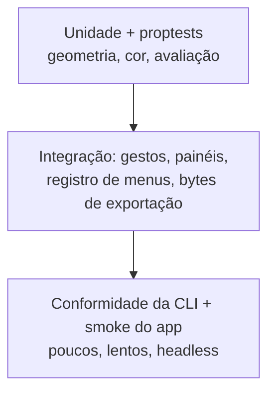

# Compilar e testar

Compilações locais reproduzíveis e a estratégia de testes, de um teste focado ao gauntlet completo.

## Toolchain

```bash
# Verifique a formatação primeiro (xtask verify roda fmt --check)
cargo fmt --all
```

| Ferramenta | Comando | O que prova |
| ---------- | ------- | ----------- |
| Formatação | `cargo fmt --all -- --check` | Árvore formatada |
| Lint | `cargo clippy --workspace --all-targets -- -D warnings` | Zero avisos |
| Unidade + integração | `cargo test --workspace` | ~300 testes verdes |
| Arquitetura | `cargo run -p xtask -- architecture` | Sem arestas proibidas domínio→GUI |
| Portão completo | `cargo run -p xtask -- verify` | fmt + clippy + teste + arch |
| Gauntlet | `cargo run -p xtask -- gauntlet` | Conformidade + fixtures + checagens de docs |

## Loops focados

```bash
# Um crate, um arquivo de teste: o loop interno do trabalho em ferramentas
cargo test -p petunia_design_shell --test tools_test

# Um teste só, pelo nome
cargo test -p petunia_design_shell --test tools_test select_tool_click_and_toggle_selection

# Testes de contrato do app Slint
cargo test -p petunia-design
```

::: tip Diretórios target compartilhados entre worktrees
Worktrees paralelas com um só `target/` envenenam fingerprints. Isole-os:

```bash
# Use um diretório target privado por worktree
CARGO_TARGET_DIR=/tmp/petunia-tools-target cargo test -p petunia_design_shell
```

:::

## Estratégia de testes (pirâmide)



- **Unidade** — política numérica da geometria, conversão de cor, invalidação da avaliação, identidade booleana.
- **Integração** — cada gesto de ferramenta (Down/Move/Up, cancelamento, rejeição de revisão obsoleta), portas da ponte, paridade menu/paleta de comandos, exportação produz bytes reais.
- **E2E** — fluxo `petunia-design-cli` (criar → desenhar → recolorir → undo/redo → salvar/reabrir → resumo de exportação) e gauntlet headless `MockGuiAdapter` (8 invariantes de conformidade).
- **Determinismo** — fixtures do compositor de pixels em software para RGBA8/RGBA16; projetos dourados para migração de formato e recuperação de corrupção.

## O que "verde" significa

`xtask verify` verde = formatado, lint limpo, testes passando, fronteiras íntegras. `gauntlet` verde adiciona conformidade, fixtures e paridade de docs. Teste pulado nunca é passe: use `BLOCKED_EXTERNAL` com o motivo do ambiente e registre a evidência.
