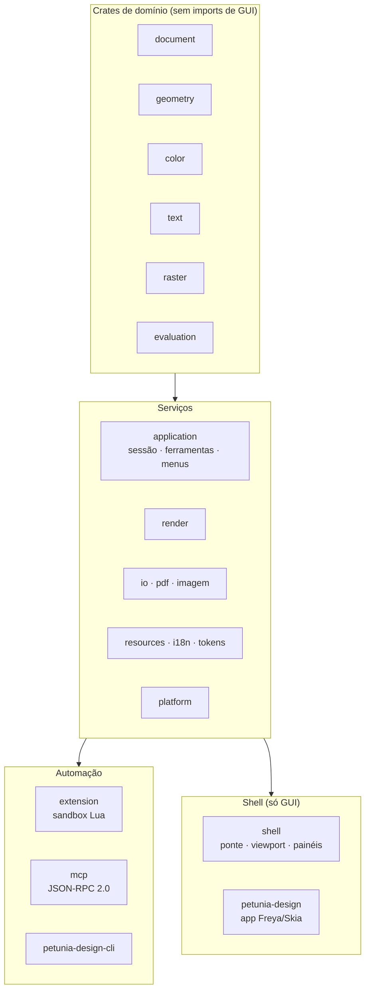
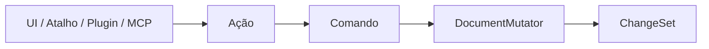

# Desenvolvedores

Construa sobre o Petunia: arquitetura, compilações locais, estratégia de testes e o registro de ADRs. Tudo aqui é automação primeiro — se um fluxo não roda headless, é bug.

Status de implementação e gates pendentes de release: [registro de execução](/pt/developers/implementation-progress), regido pelo [ADR-002](/pt/developers/adr/ADR-002-local-path-and-integrity).

## Comece aqui

| Quero… | Vá para |
| ------ | ------- |
| Entender crates, fronteiras e o pipeline de mutação | [Arquitetura](/pt/developers/architecture) |
| Compilar, rodar e testar localmente | [Compilar e testar](/pt/developers/build-test) |
| Revisar a baseline de 30/09/2026 e o plano de versões | [Dossiê técnico](/pt/developers/audit-2026-09-30) · [Plano MVP / V1 / futuras](/pt/developers/implementation-roadmap-2026-09-30) |
| Entender por que a EffectChain existe | [ADR-001](/pt/developers/adr/ADR-001-effect-chain) |
| Ver todas as decisões | [Índice de ADRs](/pt/developers/adr/) |
| Abrir um PR ou traduzir docs | [Diretrizes](/pt/contributing/guidelines) · [Traduções](/pt/contributing/translations) |

## O workspace em 30 segundos

16 crates de domínio/serviços, um crate de shell, dois apps (`petunia-design`, `petunia-design-cli`) e o `xtask` como fachada de tarefas do repositório. A fronteira é imposta em CI: `cargo run -p xtask -- architecture` falha em qualquer import domínio → GUI.

## O pipeline único

Nada toca o armazenamento do documento diretamente. O histórico (`History::execute`) envolve Comandos para que undo/redo, persistência e invalidação da avaliação observem o mesmo `ChangeSet`.

## Barra de qualidade (Definição de Pronto)

Feature só está pronta com: testes focados **mais** os gauntlets aplicáveis, evidência headless-first, prova de detach, verificações de token/a11y onde há UI, e **docs EN + pt-BR** na mesma mudança. "Futuro/planejado" sozinho não autoriza nada — o status de escopo é explícito (`V1 Required`, `Milestone Required`, `Post-V1 Candidate`, `Research`, `Open ADR`, `Historical`, `Out of Scope`).
