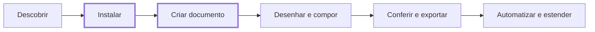

# Primeiros passos

Bem-vindo ao Petunia Design Studio. Este guia leva você do zero a um documento funcional em cerca de 15 minutos.

## O caminho de 15 minutos

1. **[Instalação](/pt/getting-started/installation)** (~10 min) — instala o Rust, clona o repositório, verifica com `cargo run -p xtask -- verify`.
2. **[Início rápido](/pt/getting-started/quickstart)** (~5 min) — cria uma superfície, desenha duas formas, combina-as, desfaz e exporta SVG/PDF/PNG.

## O que você precisa

- Uma máquina 64-bit Linux, macOS ou Windows com **Rust stable** (veja [Instalação](/pt/getting-started/installation)).
- Sem GPU obrigatória: a CLI headless e as suítes de `cargo test` rodam sem display.
- Cerca de 4 GB livres em disco para a primeira compilação do workspace.

## Para onde ir depois

- Vai diagramar, ilustrar ou tratar fotos? Continue com o [Manual](/pt/manual/).
- Quer a referência completa de comandos? Abra o [Catálogo de ferramentas](/pt/tools/).
- Vai automatizar ou contribuir? Vá para [Desenvolvedores](/pt/developers/) e a [Constituição](/pt/bible/).
