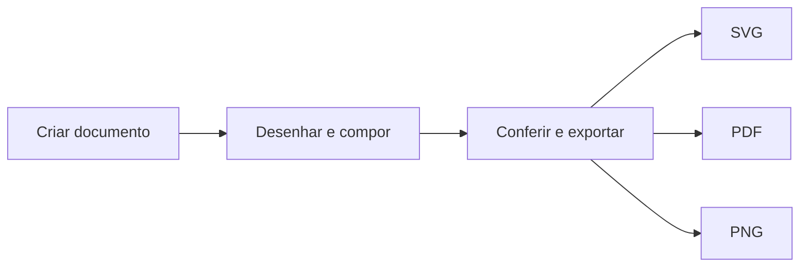

# Início rápido (15 min)

Crie seu primeiro documento Petunia, desenhe, combine, desfaça e exporte — tudo em cerca de cinco minutos de prática.

## 1. Criar uma superfície

1. Abra o app (`cargo run -p petunia-design`).
2. Pressione ++a++ (ferramenta Prancheta), arraste um quadro 1280 × 720 — ou aceite a primeira página padrão.
3. A superfície aparece no painel Camadas como raiz da árvore única de documento.

::: info Uma árvore só
Não há hierarquia paralela "camadas vs. objetos". **Camada** é um papel de contêiner na árvore única. Veja o [Glossário](/pt/glossary).
:::

## 2. Desenhar duas formas

1. Pressione ++m++ (Retângulo), arraste um retângulo.
2. Pressione ++m++ de novo, segure ++shift++ para a restrição 1:1, arraste um quadrado sobreposto ao primeiro.
3. Pressione ++v++ (Seleção), ++shift++.clique nas duas formas para multisseleção.

## 3. Combiná-las de forma não destrutiva

1. Abra o fluxo Booleano / ShapeBuilder (veja [Catálogo de ferramentas](/pt/tools/)).
2. Una as duas formas. As fontes são preservadas — desfazer restaura tudo exatamente.
3. Pressione ++ctrl+z++ / ++ctrl+y++ para navegar no histórico. Note a regra: **um gesto, um undo**.

## 4. Recolorir com uma amostra semântica

```bash
# A mesma operação que a CLI executa headless: preenchimento por nome de token, nunca hex bruto
cargo run -p petunia-design-cli
```

No app, escolha uma amostra como `ptnd.blue/500` no painel Cor. Amostras são tokens nomeados (`ptnd.<matiz>/<etapa>`), então os documentos seguem tematizáveis.

## 5. Exportar bytes reais

Arquivo → Exportar (ligado ao `export_service` real: SVG / PDF / PNG com bytes de verdade, verificados por smoke tests — nunca um diálogo falso).



## Pronto — próximos passos?

- [Manual](/pt/manual/) — personas, painéis, snapping, data merge.
- [Catálogo de ferramentas](/pt/tools/) — gestos, modificadores, atalhos por ferramenta.
- [Desenvolvedores](/pt/developers/) — o mesmo fluxo via CLI, MCP ou plugins Lua.
