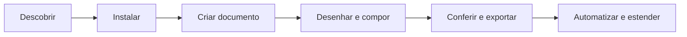

## A jornada

Um caminho da primeira instalação ao estúdio automatizado:

| Etapa | Você faz | Comece aqui |
| ----- | -------- | ----------- |
| Descobrir | Entende o que o Petunia é — e o que não é | [Constituição](/pt/bible/) |
| Instalar | Compila o workspace e abre o app ou a CLI | [Instalação](/pt/getting-started/installation) |
| Criar documento | Abre sua primeira superfície `.ptnd` | [Início rápido](/pt/getting-started/quickstart) |
| Desenhar e compor | Domina ferramentas, painéis e personas | [Manual](/pt/manual/) · [Ferramentas](/pt/tools/) |
| Conferir e exportar | Pré-voo, prova de cor e exportação SVG/PDF/PNG | [Manual](/pt/manual/) |
| Automatizar e estender | Controla o Petunia via scripts, agentes e plugins | [Desenvolvedores](/pt/developers/) |

## Vocabulário canônico

O Petunia usa nomes precisos: **Superfície** hospeda a composição, **Camada** é um papel na árvore única de documento (não uma hierarquia paralela), **Vínculo** liga uma propriedade a um dado variável. Termos novos nunca são inventados em silêncio — veja o [Glossário](/pt/glossary) (EN ↔ PT-BR) e a [SPEC-001](/pt/bible/SPEC-001).
