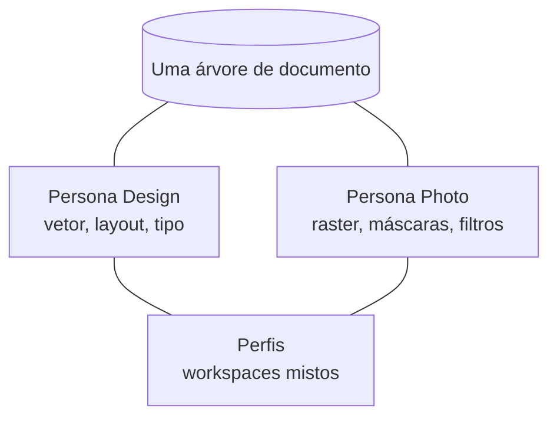
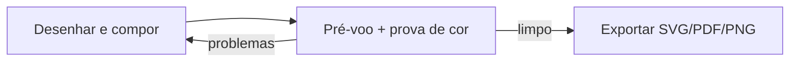

# Manual

Como é usar o Petunia Design Studio no dia a dia: módulos, personas, painéis e a ergonomia que mantém a edição segura.

## Módulos em resumo

| Módulo | O que faz | Vive em |
| ------ | --------- | ------- |
| Documento | Grafo de objetos canônico, IDs estáveis tipados, pacotes `.ptnd` atômicos | `petunia_design_document` |
| Geometria | Paths vetoriais 2D, booleanos, offsets, warps por homografia | `petunia_design_geometry` |
| Cor | sRGB / CMYK / Lab / Spot + prova de cor com perfis de prensa | `petunia_design_color` |
| Texto | Histórias, corridas de estilo, quebra de linha, hit-testing, texto em path | `petunia_design_text` |
| Raster | Tiles esparsos 128×128, 8/16-bit, pincéis, máscaras de seleção | `petunia_design_raster` |
| Render e I/O | 16 blend modes, planejador offscreen, exportação PDF/SVG/PNG | `petunia_design_render`, `petunia_design_io` |
| Aplicação | Sessão, histórico de undo, registro de ferramentas, menus, data merge | `petunia_design_application` |
| Shell | Ponte neutra a toolkit, viewport, painéis, overlays | `petunia_design_shell` |
| Recursos | Tokens DTCG, temas Claro/Escuro, strings en-US/pt-BR | `petunia_design_resources` |
| Automação | Sandbox Lua, broker de capacidades, servidor MCP | `petunia_design_extension`, `petunia_design_mcp` |

Crates de domínio nunca importam tipos de toolkit GUI — a UI recebe DTOs/view-models e envia `ActionRequest`/`CommandRequest` pela ponte. Veja [Arquitetura](/pt/developers/architecture).

## Personas, não programas

- **Persona Design** — caneta, nós, formas, booleanos, pilha de aparência, pranchetas, data merge.
- **Persona Photo** — seleções marquee/lasso/pincel, pintura, ajustes, filtros vivos, mixer de canais.
- **Perfis** — composições nomeadas de workspace misto referenciando IDs semânticos.

Trocar de persona recompõe ferramentas/painéis/ações; o documento nunca bifurca.

## Fluxos de todos os dias

### Compor → conferir → exportar

1. Desenhe com as [ferramentas](/pt/tools/) (um gesto = um undo; ++ctrl+z++ sempre seguro).
2. Rode o pré-voo (fontes ausentes, fora de gama, raster estourado) e a prova de cor contra perfis SWOP/FOGRA.
3. Exporte. O PDF preserva números sRGB/CMYK nativos pela política de preservação numérica.

### Dados variáveis (data merge)

1. Anexe uma fonte CSV/TSV/JSON no painel Data Merge.
2. Crie **Vínculos** tipados dos campos para propriedades dos objetos (só formatadores puros).
3. Pré-voo, depois materialize uma prancheta por **Registro**.

## Ergonomia em que dá para confiar

- **Não destrutivo por padrão** — transformações, cantos, contornos, transparência e warps são modificadores vivos; Consolidar/Expandir/Rasterizar são operações explícitas.
- **Viewport** — zoom infinito centrado no cursor (0,1%–25600%), snapping com histerese e guias visuais.
- **Atalhos** — ++v++ Seleção, ++a++ Nó, ++p++ Caneta, ++m++ Formas, ++t++ Texto, ++g++ Gradiente, ++i++ Conta-gotas, ++k++ Paleta de comandos (++ctrl+k++), ++ctrl+z++ / ++ctrl+y++ histórico, ++1..4++ presets de zoom.
- **Sem UI falsa** — capacidade ausente aparece desabilitada *com motivo*, nunca como botão morto. Veja a [Constituição](/pt/bible/).
